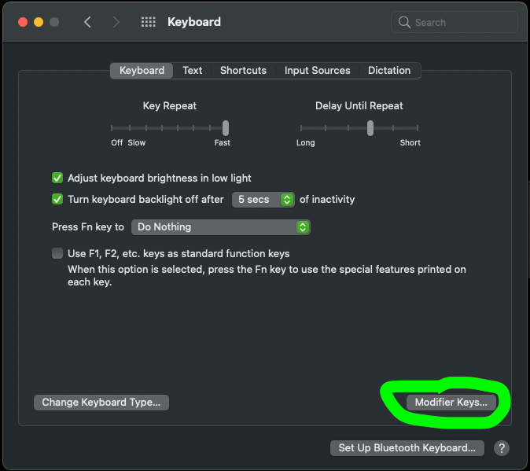
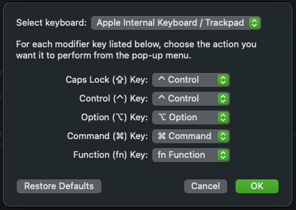

Raphael Nogueira on Unsplash" alt="" >}}

I’ve been using the Happy Hacking Keyboard (HHKB) for a few years now, and it’s been a game-changer. One of its standout 
features is replacing the Caps Lock key with a Control key, a small change that makes a huge difference for my workflow.

The problem? Switching to my MacBook keyboard always felt jarring because the Control key wasn’t in the same place. 
But there’s good news: macOS lets you remap keys natively, and it’s super easy to do.

Here’s how you can remap the Caps Lock key to Control on macOS:

1. Open System Preferences and click on Keyboard.
2. Click on Modifier Keys… in the bottom-right corner.
3. For the Caps Lock (⇪) Key, choose ^ Control from the dropdown menu.
4. Click OK to save your changes.

That’s it! Now your Mac keyboard will behave just like your HHKB, keeping things consistent and ergonomic.

