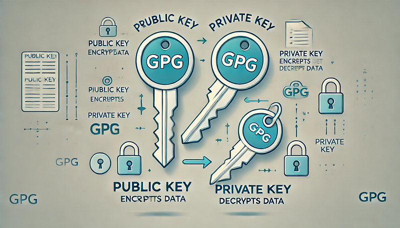

In the digital age, safeguarding your data and verifying your identity online are more critical than ever. GNU Privacy Guard (GPG) offers a robust solution for these needs through encryption and digital signing. This article explores the foundational concepts of GPG keys, their practical applications, and how to enhance their usability by securely storing passphrases in KDE Wallet.

### What Are GPG Keys?

GPG, or GNU Privacy Guard, is an implementation of the
OpenPGP standard, designed to provide encryption and 
digital signing capabilities. Developed as a free and open-source alternative to PGP (Pretty Good Privacy), GPG 
enables users to encrypt sensitive data, verify the integrity of files, and authenticate their digital identities.

At its core, GPG employs public-key cryptography, where a key pair — comprising a public key and a private key — is used. The public key can be freely shared to enable others to encrypt messages or verify signatures, while the private key remains confidential and is used to decrypt data or sign digital communications.

### Why Use GPG Keys?

The versatility of GPG keys makes them indispensable for a wide range of security tasks:

1. **Signing Git Commits:** Developers can use GPG keys to sign Git commits, ensuring the authenticity and integrity of their contributions to repositories.
2. **Encrypting Emails:** By encrypting emails with GPG keys, users can protect sensitive communications from prying eyes.
3. **Securing Files:** GPG keys can encrypt files, providing an additional layer of security for personal and professional data.

By integrating GPG into your workflow, you can enhance trust and security in your digital interactions.

### Overview of KDE Wallet Integration

Managing GPG keys securely involves protecting the passphrases that unlock them. KDE Wallet offers a convenient and secure method for storing these passphrases, reducing the need for repeated manual entry while maintaining high security standards.

KDE Wallet is a password management system built into the KDE Plasma desktop environment. It allows users to securely store credentials, including GPG key passphrases, and automatically retrieves them when needed. By configuring GPG to use KDE Wallet, users can streamline their workflow without compromising security.

This integration not only enhances usability but also ensures that sensitive passphrases are encrypted and stored safely, aligning with best practices for digital security.

### What Are GPG Keys and Why Should You Use Them?

At the heart of GPG is public-key cryptography, a method that relies on two distinct yet mathematically linked keys: a public key and a private key. The public key is openly shared and allows others to encrypt messages or verify digital signatures. Conversely, the private key is kept secret by its owner and is used to decrypt received messages or create digital signatures.

This dual-key mechanism ensures that encrypted messages can only be decrypted by the intended recipient and that digital signatures provide undeniable proof of authenticity. Public-key cryptography eliminates the need to share sensitive keys over insecure channels, making it a cornerstone of modern security practices.

#### Benefits of Using GPG Keys for Security and Identity

GPG keys offer several advantages for individuals and organizations:

1. **Enhanced Security:** By encrypting data with GPG keys, you ensure that only authorized recipients can access sensitive information.
2. **Digital Integrity:** Signing data with your private key allows recipients to verify that the information has not been tampered with.
3. **Authentication:** GPG keys can serve as a digital identity, confirming that messages and actions originate from a trusted source.

These features make GPG a powerful tool for safeguarding privacy and maintaining trust in digital communications.

#### Real-World Applications of GPG Keys

One of the most notable uses of GPG keys is in software development, particularly for signing Git commits. By signing commits with a GPG key, developers can:

- **Prove Authorship:** Ensure that the commit was made by the stated author.
- **Prevent Tampering:** Verify that the commit has not been altered since it was signed.
- **Enhance Collaboration:** Build trust within teams and communities by demonstrating accountability.

Beyond Git, GPG keys are widely used for encrypting emails, securing files, and even verifying software packages. Their versatility and robust security make them an essential tool in the digital world.

### Creating Your First GPG Key

Getting started with GPG requires creating a key pair. Follow these steps to generate your first GPG key.

#### Install GPG Tools

On most Linux distributions, GPG tools can be installed via the package manager:

```bash
sudo pacman -S --needed gnupg
```

For other operating systems, download the latest version from the [GPG official website](https://www.gnupg.org/download/).

#### **Generate a GPG Key**

If you are using GPG version 2.1.17 or greater, run the following command.

```bash
gpg --full-generate-key
```

For older versions, use

```bash
gpg --default-new-key-algo rsa4096 --gen-key
```

**Configure Key Parameters**

- Specify the key type (e.g., `RSA and RSA` or `ECC (sign and encrypt)`).
- Choose the key size (e.g., 4096 bits for better security with RSA or Curve 25519 for ECC).
- Set an expiration date (730 for two years), or press Enter to select “no expiration.”
- Confirm your selections.
- Provide your name and email address when prompted.
- Optionally add a comment (e.g., “Main GPG Key”).
- Confirm your selections.
- Choose a passphrase to protect your private key. Ensure it is strong and unique.

**Command Examples and Outputs**

Here’s what the process might look like in your terminal:

```bash
$ gpg --full-generate-key
Please select what kind of key you want:
   (1) RSA and RSA
   (2) DSA and Elgamal
   (3) DSA (sign only)
   (4) RSA (sign only)
   (9) ECC (sign and encrypt) *default*
  (10) ECC (sign only)
  (14) Existing key from card
Your selection? 9
Please select which elliptic curve you want:
   (1) Curve 25519 *default*
   (4) NIST P-384
   (6) Brainpool P-256
Your selection? 1
Please specify how long the key should be valid.
         0 = key does not expire
      <n>  = key expires in n days
      <n>w = key expires in n weeks
      <n>m = key expires in n months
      <n>y = key expires in n years
Key is valid for? (0) 730
Key expires at Mi 30 Dez 2026 21:15:34 CET
Is this correct? (y/N) y

GnuPG needs to construct a user ID to identify your key.

Real name: John Doe
Email address: johndoe@example.com
Comment: Main GPG Key
You selected this USER-ID:
    "John Doe (Main GPG Key) <johndoe@example.com>"
Change (N)ame, (C)omment, (E)mail, or (O)kay/(Q)uit? O

We need to generate a lot of random bytes. It is a good idea to perform
some other action (type on the keyboard, move the mouse, utilize the
disks) during the prime generation; this gives the random number
generator a better chance to gain enough entropy.
We need to generate a lot of random bytes. It is a good idea to perform
some other action (type on the keyboard, move the mouse, utilize the
disks) during the prime generation; this gives the random number
generator a better chance to gain enough entropy.
```

Once the process completes, your key pair will be ready for use. You can list your keys with

```bash
gpg --list-keys
```

### Using GPG Keys for Git Commit Signing

Signing Git commits with GPG keys ensures that your commits are verified and trusted. To configure Git with your GPG key, follow these steps

**Find Your GPG Key ID**

Use the following command to list your keys and identify the key ID

```bash
gpg --list-secret-keys --keyid-format=long
```

The key ID is a long string, such as `ABCD1234EF567890`.

**Set Up Git to use your Information**

```bash
git config --global user.email johndoe@example.com
git config --global user.name John
```

**Set Up Git to use your GPG Key**

Configure Git globally to use your GPG key

```bash
git config --global user.signingkey <key-id>
```

**Enable Commit Signing**

To enable commit signing globally

```bash
git config --global commit.gpgsign true
```

**Adding Your GPG Key to Git Platforms**

To verify your commits against your Git repository, you need to add your public GPG key to your account on platforms like GitHub, GitLab, Codeberg, or others. Follow these steps

Export your public GPG key in an ASCII-armored format by running the following command in your terminal:

```bash
gpg --armor --export <key-id>
```

1. Copy the output of the command, which is your public GPG key.
2. Log in to your Git hosting platform (e.g., GitHub, GitLab, Codeberg).
3. Navigate to your profile settings, find the GPG keys or SSH and GPG keys section, and add your key.

By completing these steps, your commits signed with the corresponding GPG key will be verified and trusted by the repository.

#### Signing Commits and Verifying Signatures

**Sign a Commit**

Add changes to your Git repository and commit them with a signature

```bash
git add .
git commit -S -m "Your commit message"
```

The `-S` flag ensures the commit is signed.

**Verify a Signed Commit**

To verify a signed commit

```bash
git log --show-signature
```

#### Command Examples

Here’s an example workflow

```bash
$ gpg --list-secret-keys --keyid-format=long
/home/johndoe/.gnupg/secring.gpg
---------------------------------
sec   4096R/ABCD1234EF567890 2024-01-01 [expires: 2026-01-01]
      Key fingerprint = 1234 5678 9ABC DEF0 1234 5678 9ABC DEF0 1234 5678
uid                  John Doe (Main GPG Key) <johndoe@example.com>
sub   4096R/0987EFABCD456123 2024-01-01 [expires: 2026-01-01]

$ git config --global user.signingkey ABCD1234EF567890
$ git config --global commit.gpgsign true
$ git add .
$ git commit -S -m "Initial commit"
[master (root-commit) abcdef1] Initial commit
$ git log --show-signature
commit abcdef1234567890abcdef1234567890abcdef12 (HEAD -> master)
GPG: Signature made Tue Jan 01 12:34:56 2024 CET
GPG:                using RSA key ABCD1234EF567890
GPG: Good signature from "John Doe (Main GPG Key) <johndoe@example.com>"
```

### Backing Up and Restoring GPG Keys

Your GPG keys are essential for maintaining access to encrypted data and verifying your digital identity. Losing your private key means losing access to encrypted messages, signed files, and repositories where the key is required for authentication. Regular backups ensure that you can recover your keys and avoid potentially irreversible data loss.

### Exporting Public and Private Keys

To back up your keys, export both your public and private keys. Use the following commands

**Export Public Keys**

```bash
gpg -a --export > mypubkeys.asc
```

This creates a file named `mypubkeys.asc` containing your public keys in an ASCII-armored format

**Export Private Keys**

```bash
gpg -a --export-secret-keys > myprivatekeys.asc
```

This creates a file named `myprivatekeys.asc` containing your private keys in an encrypted ASCII-armored format. Handle this file with care.

#### Exporting the Trust Database

Optionally, export the trust database to retain the trust levels you’ve assigned to other keys

```bash
gpg --export-ownertrust > otrust.txt
```

#### Restoring Keys on a New System

To restore your keys and trust database on a new system, follow these steps

**Import Public and Private Keys**

```bash
gpg --import mypubkeys.asc
gpg --import myprivatekeys.asc
```

**Import the Trust Database**

```bash
gpg --import-ownertrust otrust.txt
```

**Verify Imported Keys**

Check that your keys were successfully imported

```bash
gpg -k  # List public keys
gpg -K  # List private keys
```

By regularly backing up and properly restoring your GPG keys, you ensure seamless access to your encrypted data and maintain your digital identity.

### Storing GPG Key Passphrases in KDE Wallet

KDE Wallet provides a secure and user-friendly way to manage GPG key passphrases. It encrypts stored credentials, making them accessible only with proper authentication. By integrating KDE Wallet with GPG, users can avoid repeatedly entering passphrases, streamlining workflows while maintaining high security standards.

#### Configuring GPG to Use KDE Wallet

To enable GPG passphrase storage in KDE Wallet, follow these configuration steps

**Set Pinentry to Use pinentry-qt**

Modify the GPG configuration file (`~/.gnupg/gpg-agent.conf`) to use `pinentry-qt` for graphical passphrase prompts

```bash
pinentry-program /usr/bin/pinentry-qt
```

Restart the GPG agent to apply the changes

```bash
gpgconf --kill gpg-agent
```

**Enable the Secret Service API in KDE Wallet**

Open KDE System Settings, navigate to KDE Wallet, and enable the option “Use KWallet for the Secret Service interface.”

Alternatively, edit the KDE Wallet configuration file (`~/.config/kwalletrc`) directly:

```ini
[org.freedesktop.secrets]
apiEnabled=true
```

#### Limitations and Alternatives
While KDE Wallet provides a robust way to manage GPG passphrases, there is a known limitation when using `pinentry-qt`. 
Unfortunately, the graphical passphrase prompt does not display a checkbox to save the passphrase for future use.

##### Workaround: Use `pinentry-kwallet`

To overcome this limitation, you can use pinentry-kwallet, which integrates seamlessly with KDE Wallet and provides the 
expected functionality. This requires installing the kwalletcli package. Follow these steps:
1. Install the kwalletcli package:
   ```bash
   sudo pacman -S kwalletcli
   ```
2. Update your GPG configuration file (`~/.gnupg/gpg-agent.conf`) to use `pinentry-kwallet`:
   ```ini
   pinentry-program /usr/bin/pinentry-kwallet
   ```
3. Restart the GPG agent to apply the changes:
   ```bash
   gpgconf --kill gpg-agent
   gpgconf --launch gpg-agent
   ```

With this configuration, KDE Wallet should fully manage your GPG passphrases as expected, including the ability to save them for future use.

For further details, you can refer to the Arch Wiki: GnuPG , 
which provides additional context and troubleshooting tips.

#### Testing the Setup

To verify that KDE Wallet integration is working:

1. Attempt to perform an operation requiring GPG passphrase entry (e.g., decrypt a file or sign a message).
2. Ensure that KDE Wallet prompts for the passphrase and stores it for future use.

If everything is configured correctly, KDE Wallet will manage your GPG passphrases seamlessly, combining convenience with robust security.

### Best Practices for GPG Key Management

#### Regularly Update and Rotate Keys

Periodically updating and rotating your GPG keys ensures that your encryption practices remain secure. Set expiration dates for your keys to enforce regular updates and reduce the risk of outdated keys being compromised.

#### Use Strong, Unique Passphrases

Always protect your private keys with strong, unique passphrases. A secure passphrase is a mix of letters, numbers, and symbols, making it difficult for attackers to guess or brute force. Avoid reusing passphrases from other accounts or systems.

#### Leverage KDE Wallet for Secure Management

Integrate KDE Wallet into your workflow to manage GPG passphrases securely and conveniently. KDE Wallet encrypts and stores your passphrases, eliminating the need to manually enter them each time while maintaining high security standards.

By following these best practices, you can ensure the integrity, security, and usability of your GPG keys in both personal and professional contexts.

### Troubleshooting Common Issues

Even with a well-configured setup, issues can arise when working with GPG keys and KDE Wallet. This section addresses common problems, provides solutions, and highlights useful tools and commands for debugging.

#### Problems with GPG Key Generation or Configuration

**GPG Key Generation Fails**  
**Issue:** The `gpg --full-generate-key` command hangs or does not complete.  
**Solution:** GPG requires sufficient entropy to generate keys. Perform actions like typing on the keyboard, moving the mouse, or running disk-intensive tasks to increase entropy.

```bash
cat /dev/random > /dev/null
```

Alternatively, install an entropy-generating daemon like `haveged`

```bash
sudo pacman -S --needed haveged
sudo systemctl start haveged
```

**Incorrect Key Parameters**  
**Issue:** GPG keys are generated with unintended configurations (e.g., wrong key size).  
**Solution:** Double-check all parameters during key creation. If the key is already created, export and regenerate it with the correct settings.

**Key Not Found for Git Signing**  
**Issue:** Git cannot find the GPG key for signing commits.  
**Solution:** Ensure the signing key is correctly configured in Git

```bash
git config --global user.signingkey <key-id>
```

Verify the key’s presence with

```bash
gpg --list-keys
```

#### KDE Wallet Integration Issues and Fixes

**KDE Wallet Does Not Store Passphrases**  
**Issue:** Passphrases are not saved in KDE Wallet despite configuration.  
**Solution:** Ensure `pinentry-qt` is installed and set as the default pinentry program.

```bash
sudo pacman -S --needed pinentry
cat ~/.gnupg/gpg-agent.conf
echo "pinentry-program /usr/bin/pinentry-qt" >> ~/.gnupg/gpg-agent.conf
gpgconf --reload gpg-agent
```

Verify that the KDE Wallet Secret Service API is enabled.

#### Useful Logs and Debugging Commands

**Checking GPG Logs**  
Enable verbose logging to diagnose issues

```bash
gpg --verbose --list-keys
```

**Testing GPG Agent**  
Verify the GPG agent is running and responsive

```bash
gpg-connect-agent /bye
gpg-agent --daemon
```

**KDE Wallet Logs**  
Check KDE Wallet logs for errors

```bash
journalctl --user-unit kwalletd6.service
```

**Reinitializing GPG Configuration**  
Reset GPG to default settings

```bash
mv ~/.gnupg ~/.gnupg.bak
gpg --list-keys
```

By following these steps, most common GPG and KDE Wallet issues can be resolved, ensuring a smoother and more secure workflow.

### Conclusion

Incorporating GPG keys into your digital workflow offers significant security and convenience benefits. By leveraging GPG for encryption, signing, and identity verification, you can protect sensitive data, ensure the authenticity of your communications, and build trust within your professional and personal networks.

Integrating KDE Wallet further enhances this experience by securely storing and managing your GPG key passphrases. This seamless integration minimizes friction while maintaining the highest security standards.

Adopting these practices not only strengthens your security posture but also empowers you to take control of your digital identity. Whether you’re signing Git commits, encrypting emails, or safeguarding files, GPG keys and KDE Wallet provide a robust and user-friendly solution. Start exploring these tools today to elevate your digital security and efficiency.

### Sources

1. GNU Privacy Guard (GPG) Official Website
2. Arch Linux Wiki: KDE Wallet
3. Red Hat Knowledgebase: GPG Key Configuration
4. Git Documentation: Signing Commits with GPG
5. Ubuntu: Installing and Configuring GPG
6. GPG Manual: Command-Line Options

### Don‘t trust me

The author is not responsible for any errors or damages resulting from the use of this information.

If you have any questions or suggestions for improvement, please feel free to reach out.
