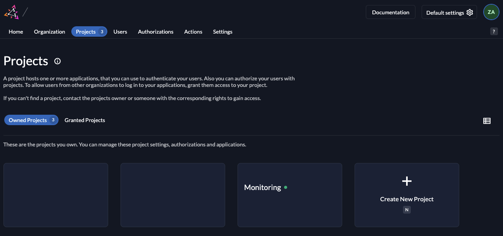
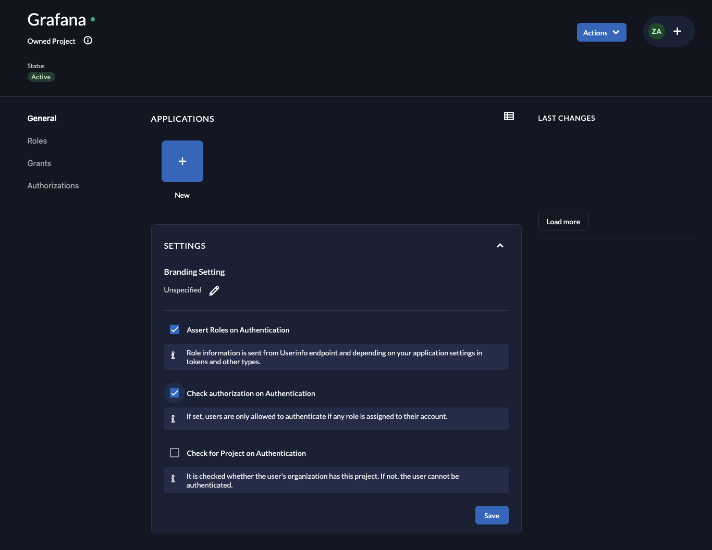
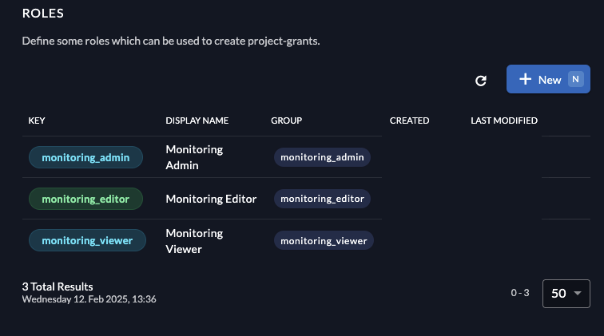

+++
title = 'Integrating Zitadel as an OIDC Provider in Grafana'
subtitle = 'Improve your Grafana authentication flow with Zitadel’s OpenID Connect integration'
author = "0hlov3"
date = 2025-02-06T20:00:00-00:00
draft = false
image = "luke-chesser-JKUTrJ4vK00-unsplash.jpg"
tags = ['YubiKey','Security Keys','Two-Factor Authentication (2FA)','FIDO2/WebAuthn','Passwordless Authentication']
+++
Luke Chesser on Unsplash" alt="Speedcurve Performance Analytics - Grafana Dashboard" >}}



Yesterday, I decided to secure my Grafana instance using Zitadel as an OpenID Connect (OIDC) provider. While setting up the integration, I encountered a few challenges and learned a lot along the way. Since there isn’t much documentation on connecting Grafana with Zitadel, I want to share my experience to help others who might be looking for a similar setup.

***What is Grafana?***
Grafana is an open-source platform for monitoring and observability, widely used to visualize and analyze time-series data from various sources like Prometheus, InfluxDB, and Loki. It provides a powerful dashboarding interface, making it a popular choice for DevOps teams, SREs, and developers.

***What is Zitadel?***
Zitadel is an identity and access management (IAM) system that provides authentication, authorization, and user management solutions based on OpenID Connect (OIDC). It is designed for modern cloud-native applications, offering multi-tenancy, fine-grained access control, and self-hosted or managed deployment options.

***Why Use Zitadel as an OIDC Provider for Grafana?***
By integrating Zitadel as an OIDC provider, you can enable secure authentication for Grafana users, leveraging features like Single Sign-On (SSO), multi-factor authentication (MFA), and role-based access control. This setup enhances security, simplifies user management, and aligns with modern identity standards.

## Configuring Zitadel
Before we can connect Grafana to Zitadel, we need to configure Zitadel as an OIDC provider. This involves creating an application, setting up the necessary permissions, and obtaining authentication credentials.

### 1. Creating an Application in Zitadel
To enable Grafana to authenticate users via Zitadel, we need to register Grafana as an application within Zitadel and configure its authentication settings.
1. Log in to your Zitadel instance or the hosted version at zitadel.cloud.
2. Navigate to Projects → Create Project and give it a meaningful name (e.g. `Grafana OIDC`, `Grafana` or `Monitoring`).


3. Inside the project settings, enable the following two options to ensure that only users with specific roles can authenticate:
   - Assert Roles on Authentication
   - Check authorization on Authentication


4. Define user roles that will be used to control access levels within Grafana. For example:
   - monitoring_admin – Full administrator access
   - monitoring_editor – Edit dashboards but no admin permissions
   - monitoring_viewer – Read-only access


5.Inside the project, go to Applications and click `New` to create an Application.
  - Enter a name for the application, e.g. `Grafana`.
  - Select WEB as the application type.
  - Choose PKCE as the authentication method.
  - Specify the Redirect URI, which tells Zitadel where to send users after authentication:
    ```shell
    https://your-grafana-domain.com/login/generic_oauth
    ```
    If running Grafana locally, use:
    ```shell
    http://localhost:3000/login/generic_oauth
    ```

6. Save and Secure Your Credentials
   - Write down the generated Client ID in a secure location, as it will be needed later.
   - Note the Issuer URL, typically one of the following:
     ```shell
     https://your-zitadel-instance.com
     ```
     or
     ```shell
     https://accounts.zitadel.cloud
     ```


Now that Zitadel is configured, we can proceed to setting up Grafana to use Zitadel as its OIDC provider.

## Configuring Grafana for OIDC

Now that Zitadel is set up as an OIDC provider, we need to configure Grafana to authenticate users via Zitadel. This involves modifying the grafana.ini configuration file, setting up the OIDC authentication options, and enabling login through Zitadel.

### Configuring Grafana through kube-prometheus-stack helm chart
If you have already deployed the kube-prometheus-stack  in your Kubernetes cluster, you can configure Grafana to use Zitadel for authentication by modifying its configuration.

#### 1. Storing OIDC Secrets in Kubernetes
To avoid storing secrets directly in configuration files, I chose to create a Kubernetes Secret for my OIDC-related credentials. However, you can also define non-sensitive values in the grafana.ini configuration and store only the actual secrets separately.

Create the Kubernetes secret with the required Zitadel OIDC credentials:
```bash
kubectl create secret generic zitadel-secret \
  --from-literal "GF_AUTH_GENERIC_OAUTH_API_URL=https://your-zitadel-instance.com/oidc/v1/userinfo" \
  --from-literal "GF_AUTH_GENERIC_OAUTH_AUTH_URL=https://your-zitadel-instance.com/oauth/v2/authorize" \
  --from-literal "GF_AUTH_GENERIC_OAUTH_CLIENT_ID:${CLIENTID_FROM_Creating_an_Application_in_Zitadel}" \
  --from-literal "GF_AUTH_GENERIC_OAUTH_EMAIL_ATTRIBUTE_PATH=email" \
  --from-literal "GF_AUTH_GENERIC_OAUTH_ENABLED=true" \
  --from-literal "GF_AUTH_GENERIC_OAUTH_LOGIN_ATTRIBUTE_PATH=preferred_username" \
  --from-literal "GF_AUTH_GENERIC_OAUTH_NAME=Zitadel" \
  --from-literal "GF_AUTH_GENERIC_OAUTH_NAME_ATTRIBUTE_PATH=name" \
  --from-literal "GF_AUTH_GENERIC_OAUTH_SCOPES=openid email profile offline_access roles" \
  --from-literal "GF_AUTH_GENERIC_OAUTH_TOKEN_URL=https://your-zitadel-instance.com/oauth/v2/token" \
  --from-literal "GF_AUTH_GENERIC_OAUTH_USE_PKCE=true" \
  --from-literal "GF_AUTH_GENERIC_OAUTH_USE_REFRESH_TOKEN=true"
```

This secret will store all the OIDC-related environment variables that Grafana needs for authentication.
#### 2. Customizing values.yaml for Helm Deployment
After creating the secret, we need to update our values.yaml configuration for kube-prometheus-stack to use Zitadel authentication. Below is a `snippet` of the required changes—make sure to integrate this into your own `values.yaml`.
```yaml
grafana:
  envFromSecret: "zitadel-secret" # Load secrets from the Kubernetes Secret
  ingress:
    enabled: true
    ingressClassName: nginx-internal
    hosts:
      - your-grafana-domain.com # CHANGE this to your domain
    pathType: ImplementationSpecific
    tls:
    - hosts:
      - your-grafana-domain.com # CHANGE this to your domain
      secretName: tls-grafana-general
  grafana.ini:
    server:
      domain: "{{ if (and .Values.ingress.enabled .Values.ingress.hosts) }}{{ tpl (.Values.ingress.hosts | first) . }}{{ else }}''{{ end }}"
      root_url: https://your-grafana-domain.com
    auth.generic_oauth:
      role_attribute_strict: true
      role_attribute_path: contains(groups[*], 'monitoring_admin') && 'GrafanaAdmin' || contains(groups[*], 'monitoring_editor') && 'Editor' || 'Viewer'
```
Explanation of the Configuration
- `envFromSecret: "zitadel-secret"`

  This loads the Zitadel OIDC secrets as environment variables inside the Grafana instance. 
- `root_url` in `grafana.ini`
  
  This setting is important because Grafana, by default, may append the port number to the redirect URL (e.g., https://your-grafana-domain.com:3000). Setting root_url ensures that Grafana redirects users correctly.
- `role_attribute_path` Mapping
  
  This expression maps Zitadel user groups to Grafana roles:
  - Users in the monitoring_admin group become Grafana Admins.
  - Users in the monitoring_editor group become Editors.
  - Everyone else defaults to Viewer.

Once you have modified your values.yaml file, apply the changes by upgrading your Helm release.

### Configuring local deployt Grafana for OIDC

### 1. Editing the Grafana Configuration (grafana.ini)
Grafana’s authentication settings are configured in the `grafana.ini` file. Open the file and locate the `[auth.generic_oauth]` section. If the section doesn’t exist, add it manually.
```ini
[auth.generic_oauth]
enabled = true
allow_sign_up = true
auto_login = false
name = Zitadel
client_id = <YOUR_ZITADEL_CLIENT_ID>
scopes = openid email profile offline_access roles
auth_url = https://YOUR-ZITADEL-INSTANCE.com/oauth/v2/authorize
token_url = https://YOUR-ZITADEL-INSTANCE.com/oauth/v2/token
api_url = https://YOUR-ZITADEL-INSTANCE.com/oauth/v2/userinfo
use_pkce = true
use_refresh_token = true
login_attribute_path = preferred_username
email_attribute_path = email
role_attribute_path = contains(groups[*], 'monitoring_admin') && 'GrafanaAdmin' || contains(groups[*], 'monitoring_editor') && 'Editor' || 'Viewer'
```
Replace the placeholders (`YOUR_ZITADEL_CLIENT_ID` and `YOUR-ZITADEL-INSTANCE.com`) with the actual values obtained from your Zitadel instance.

### 2. Setting Up the OIDC Authentication Options
A few important options in the [auth.generic_oauth] section determine how authentication works:
- `enabled = true`: Enables OIDC authentication.
- `allow_sign_up = true`: Allows new users to sign up via Zitadel. If disabled, only pre-configured users can log in.
- `scopes = openid email profile offline_access roles`: Requests necessary user information from Zitadel.
- `auth_url`: Zitadel’s authorization endpoint for handling login.
- `token_url`: Zitadel’s endpoint for exchanging authorization codes for tokens.
- `api_url`: Zitadel’s endpoint for retrieving user information.
- `use_pkce` = true Set to true to use Proof Key for Code Exchange (PKCE). Grafana uses the SHA256 based S256 challenge method and a 128 bytes (base64url encoded) code verifier.
- `use_refresh_token` = true Set to true to use refresh token and check access token expiration.
- `login_attribute_path`: Specifies which user attribute to use for login (preferred_username is a common choice).
- `email_attribute_path`: Maps the user's email from Zitadel to Grafana.
- `role_attribute_path`: (Optional) If using roles, this maps Zitadel roles to Grafana.

### 3. Enabling Login with Zitadel
Once the configuration is in place, restart Grafana to apply the changes:
```shell
sudo systemctl restart grafana
```
or if running Grafana via Docker:
```shell
docker restart grafana
```
After restarting, go to the Grafana login page. You should now see an option to log in with Zitadel. Clicking it will redirect you to Zitadel’s authentication flow, where you can log in with your credentials.

If everything is configured correctly, you’ll be redirected back to Grafana as an authenticated user.

### Additional Configuration Options
After setting up Zitadel as an OIDC provider for Grafana, you may want to fine-tune some authentication settings based on your Zitadel configuration and security preferences.
####  Configuring `role_attribute_path`
Depending on your Zitadel configuration and version, you may need to define the role attribute path explicitly. This setting ensures that user roles from Zitadel are correctly mapped to Grafana roles.
```shell
role_attribute_path = contains('"user-roles[*]"', 'monitoring_admin') && 'GrafanaAdmin' || contains('"user-roles[*]"', 'monitoring_editor') && 'Editor' || 'Viewer'
```

Ensure that the role names match the ones defined in your Zitadel application.

#### Enabling Auto Login (`auto_login = true`)
By default, users must manually click the "Log in with Zitadel" button on the Grafana login page. If you want to bypass this screen and automatically authenticate users via Zitadel, enable auto-login:
```ini
auto_login = true
```
Note: This setting is ignored if you configure multiple authentication providers in Grafana with auto-login enabled.

#### Disabling Direct Login and Enforcing OIDC Authentication
To enhance security and enforce authentication exclusively via Zitadel, you may want to:
- Remove the login form to prevent local user authentication.
- Disable HTTP Basic Authentication to block direct username/password logins.

Modify your `values.yaml` (if using Helm) or `grafana.ini` (if configuring manually) as follows:
```ini
grafana.ini:
  auth:
    # remove the login form from the sign-in page 
    disable_login_form: true
  
  auth.basic:
    # disable HTTP Basic Authentication
    enabled: false

  auth.oauth_generic:
    auto_login: true
```
With this configuration:

- Users will only be able to log in via Zitadel.
- The standard username/password login form will be hidden.
- HTTP Basic Authentication will be disabled, preventing direct API authentication with local credentials.

#### Changing the Default Admin Password
For security reasons, it's recommended to change the default admin password in Grafana. If you're using the `kube-prometheus-stack` Helm chart, you can store the new admin credentials securely in a Kubernetes Secret instead of hardcoding them in the configuration.

##### Create a Kubernetes Secret for the Admin Credentials
Run the following command to generate a secure random admin username and password and store them in a Kubernetes Secret:
```bash
kubectl create secret generic grafana-user-pass \
  --from-literal admin-user="$(openssl rand -hex 16)" \
  --from-literal admin-password="$(openssl rand -hex 16)"
```
- Generates a random 16-character hex string for both the admin username and password.
- Creates a Kubernetes Secret named grafana-user-pass to securely store the credentials.

##### Reference the Secret in the Helm `values.yaml` Configuration
```yaml
grafana:
  admin:
    ## Reference the Kubernetes secret containing the admin credentials
    existingSecret: "grafana-user-pass"
    userKey: admin-user
    passwordKey: admin-password
```
- existingSecret: "grafana-user-pass" → Tells Grafana to use the grafana-user-pass secret.
- userKey: admin-user → Specifies the key in the secret that holds the admin username.
- passwordKey: admin-password → Specifies the key in the secret that holds the admin password.

Once you apply these changes and upgrade your Helm release, Grafana will use the credentials stored in the Kubernetes Secret, making the setup more secure and avoiding plaintext passwords in configuration files.

## Testing the Integration
Now that Grafana is configured to use Zitadel as an OIDC provider, it’s time to test the authentication flow and troubleshoot any potential issues.
### 1. Logging into Grafana with Zitadel
To verify that Zitadel authentication is working correctly:
1. Open your Grafana instance in a browser:
```shell
https://your-grafana-domain.com
```
or, if running locally:
```shell
http://localhost:3000
```
2. On the login page, you should see a Log in with Zitadel button (or the custom name you set in grafana.ini).
3. Click the button. This will redirect you to Zitadel’s authentication page.
4. Enter your Zitadel login credentials and complete any multi-factor authentication (if enabled).
5. Upon successful authentication, you should be redirected back to Grafana, now logged in.

If you can successfully log in, congratulations! 🎉 Your Grafana-Zitadel integration is working. If not, let’s go through some common issues.

## Debugging Common Issues
If something goes wrong during authentication, here are some common problems and how to fix them:

- ***Issue***:

  Redirect Loop or "Too Many Redirects" Error

  ***Solution***:
  -  Ensure the redirect URI in Zitadel matches exactly with what Grafana expects (/login/generic_oauth).
  -  Double-check that Zitadel is returning the correct issuer URL in grafana.ini.

- ***Issue***:
  
  "Invalid Client ID or Secret"
  
  ***Solution***:
  - Make sure you copied the Client ID and Client Secret correctly from Zitadel.
  - Verify that you are using the correct Zitadel authentication endpoints (auth_url, token_url, and api_url).

- ***Issue***: 
  
  Users Can’t Log In Due to Missing Permissions
  
  ***Solution***:
  - Ensure that Zitadel users have the necessary roles and that role_attribute_path is correctly configured in grafana.ini.
  - If needed, manually assign roles in Zitadel to users who need access.

- **Issue**: 
  
  "User Email Not Found" Error
  
  **Solution** :
  - Check if the email scope is included in Zitadel’s OIDC configuration.
  - Ensure email_attribute_path = email is correctly set in grafana.ini.

## Conclusion
Integrating Zitadel as an OIDC provider for Grafana offers a seamless and secure authentication experience. By leveraging Zitadel’s identity management capabilities, you can centralize user authentication, enforce security policies, and simplify access control across your monitoring stack.
### Benefits of Using Zitadel for Authentication in Grafana
- Single Sign-On (SSO): Users can log in to Grafana with the same credentials they use across other Zitadel-integrated applications, reducing password fatigue and improving user experience.
- Enhanced Security: Zitadel provides built-in support for Multi-Factor Authentication (MFA), ensuring that only authorized users can access Grafana.
- Role-Based Access Control (RBAC): By mapping Zitadel roles to Grafana, you can grant fine-grained permissions to users based on their responsibilities.
- Scalability & Flexibility: Whether self-hosted or cloud-managed, Zitadel scales effortlessly, making it a suitable choice for growing infrastructures.
- Standards-Based Integration: Zitadel’s support for OpenID Connect (OIDC) ensures compatibility with a wide range of applications beyond Grafana.
### Further Security Considerations
While Zitadel strengthens authentication in Grafana, there are additional best practices to enhance security further:
- Enable Multi-Factor Authentication (MFA): Enforcing MFA in Zitadel adds an extra layer of security for Grafana users.
- Restrict Access Based on Roles: Define and enforce user roles within Zitadel to limit access based on the principle of least privilege.
- Use HTTPS for Secure Communication: Ensure that both Grafana and Zitadel instances use HTTPS to encrypt authentication traffic.
- Monitor Authentication Logs: Regularly review Zitadel’s logs to detect any unusual login activity or failed authentication attempts.
- Keep Zitadel and Grafana Updated: Security patches and updates help mitigate vulnerabilities and keep your authentication stack secure.

By following these best practices, you can create a more resilient and secure Grafana setup while benefiting from Zitadel’s modern identity management features.

Now your Grafana instance is secured with Zitadel authentication! Happy monitoring!

## Sources & Further Reading
- Grafana Documentation:
  - Grafana Authentication using Generic OAuth
  - Grafana Configuration (grafana.ini)
- Zitadel Documentation:
  - Zitadel OIDC Authentication
  - Managing Applications in Zitadel
  - Zitadel API Reference
- OpenID Connect (OIDC) Resources:
  - Introduction to OpenID Connect
- Security Best Practices:
  - OWASP Authentication Cheat Sheet
  - Best Practices for OAuth 2.0
## Don’t Trust Me — Seriously

The author takes no responsibility for any mishaps, broken servers, or existential crises caused by following this information.

If you spot a mistake, have a better way of doing things, or just want to chat about tech, feel free to reach out.

Also, this isn’t an ad — unless my enthusiasm and advocacy for cool stuff count as advertising.