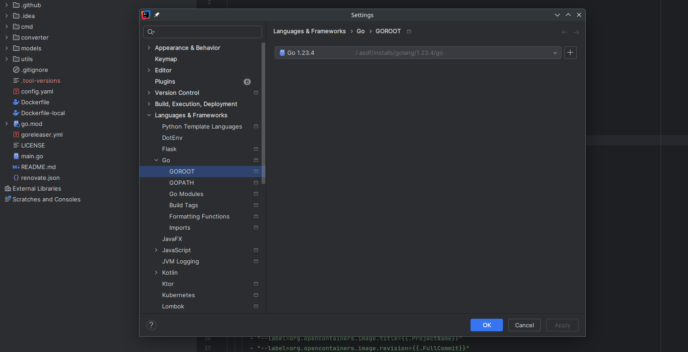

+++
title = 'Managing Multiple Tool Versions with asdf'
subtitle = 'A DevOps Essential'
author = "0hlov3"
date = 2025-02-20T16:00:00
draft = false
image = "dan-cristian-padure-noOXRT9gfQ8-unsplash.jpg"
tags = ['DevOps Tools','Version Management','GoLang','Terraform','Productivity Hacks']
+++
Dan Cristian Pădureț on Unsplash" alt="assorted color plastic tools on gray wooden table" >}}

As a DevOps engineer, working across multiple projects often means juggling different versions of programming languages, infrastructure tools, and CLIs. Using system-wide installations can quickly lead to version conflicts. Enter `asdf` (Another Shell Development Framework), a powerful version manager that simplifies this process by managing multiple tool versions per project.

In this article, we’ll cover:

- Why `asdf` is useful
- Installing `asdf`
- Managing Go and Terraform versions
- Automating `asdf install` when entering a Git repository

## Why Use `asdf`?
There are several tools like nvm for Node.js, pyenv or poetry for Python, and gvm or goenv for Go. However, asdf offers a unified approach:

- Single tool for multiple languages and CLIs (Go, Terraform, Ansible, Node.js, Python, etc.)
- Project-specific version management via a .tool-versions file
- Lightweight and portable—works on macOS, Linux, and WSL
- Plugin-based architecture—supports a wide range of tools via plugins
- Easy version switching—switch between different versions per project or globally

## What are common Use Cases?

asdf shines in environments where multiple projects depend on different versions of programming languages or tools. Here are some common use cases:

1. Microservices Architecture

When working with microservices, each service might require a different version of Go or Node.js. With asdf, you can specify the required version per project using a `.tool-versions` file. This prevents version conflicts and ensures consistent builds.

2. Legacy Projects

Maintaining legacy applications often requires using outdated versions of tools. `asdf` allows you to easily switch to the necessary version without affecting newer projects.

3. CI/CD Pipelines

In CI/CD workflows, consistent environments are crucial. By defining versions in a `.tool-versions` file, developers and CI pipelines use the same tool versions, reducing the 'it works on my machine' issue.

4. Open Source Contributions

Contributing to open-source projects often means adhering to specific versions listed in `.tool-versions`. `asdf` makes it easy to switch between versions, facilitating a smoother development experience.

5. Multi-Cloud Infrastructure Automation

For DevOps engineers working with Terraform, different cloud environments may require different provider versions. `asdf` allows you to manage these versions effortlessly, avoiding provider version conflicts.

By addressing these use cases, `asdf` ensures consistency, reduces conflicts, and enhances productivity for both developers and DevOps engineers.

## Installing asdf
Before using asdf, install it on your system.

macOS (with Homebrew)
```bash
brew install asdf
```

Linux
```shell
git clone https://github.com/asdf-vm/asdf.git ~/.asdf --branch v0.12.0
echo '. $HOME/.asdf/asdf.sh' >> ~/.bashrc
source ~/.bashrc  # or 'source ~/.zshrc' if using zsh
```

Archlinux
```bash
# Use an aur helper
yay asdf-vm
```

for other ways installing `asdf` you need to read the doc Install asdf.

### Configure asdf
This section is adapted from the `asdf` getting started guide. For more detailed information, please refer to the documentation.
#### Bash Configuration
If you are using macOS Catalina or newer, the default shell has changed to ZSH. If you prefer to continue using Bash, follow these steps:

If you're on a system using Pacman (e.g., Arch Linux), make sure `bash-completion` is installed for completions to work properly.

To add the shims directory to your path (required), add the following to your `~/.bash_profile`:
```bash
export PATH="${ASDF_DATA_DIR:-$HOME/.asdf}/shims:$PATH"
```

**Custom Data Directory (Optional)** If you want to use a custom data directory, add the following line above the one you just added:
```bash
export ASDF_DATA_DIR="/your/custom/data/dir"
```

### ZSH
For ZSH users, add the following to your `~/.zshrc`:
```zsh
export PATH="${ASDF_DATA_DIR:-$HOME/.asdf}/shims:$PATH"
```
**Custom Data Directory (Optional)** To specify a custom data directory in ZSH, add the following above the previous line:
```zsh
export ASDF_DATA_DIR="/your/custom/data/dir"
```

This setup ensures that `asdf` shims are prioritized in your PATH, enabling seamless version management.

Before using asdf, install it on your system.

## Managing Go and Terraform with asdf
asdf offers first-party plugins and a large community of contributors, you can take a look into the asdf-community plugins. If you don’t find a plugin for your use case, consider creating your own Plugin from the asdf-plugin-template.

### Install the Required Plugins
To manage different versions of Go, Terraform, add their plugins:
```bash
asdf plugin add golang                                                                                      
asdf plugin add terraform https://github.com/asdf-community/asdf-hashicorp.git
```

### Install Latest Versions
After adding plugins, you can install the latest versions.
```shell
asdf install golang latest
asdf install terraform latest
```

### Install Specific Versions
Now install the versions needed for your projects.
```shell
asdf install golang 1.23.4
asdf install terraform 1.10.0
```
To set a global default version:
```shell
asdf set -u golang latest
asdf set -u terraform latest
```
this will create a file in your home directory, which holds the global versions:
```bash
❯ cat ~/.tool-versions
golang 1.24.0                                              
terraform 1.10.5
```
To set a project-specific version, run the following inside a project folder:
```shell
asdf set golang 1.23.4
```
This creates a .tool-versions file in the directory, ensuring the correct versions are used when working inside the project.

### IDEs
Some IDEs, like IntelliJ IDEA, can detect `.tool-versions` and automatically use the version specified by `asdf`. This integration ensures consistency between your terminal and IDE without manually configuring versions.

By leveraging `asdf` with your IDE, you avoid the hassle of downloading and managing multiple versions within the IDE itself. This approach keeps your environment clean, ensuring your terminal and IDE are always in sync with the right versions.



### Verify Installed Versions
To check which version is currently active in your home directory:
```shell
❯ cd ~
❯ cat .tool-versions
golang 1.24.0
terraform 1.10.5
❯ go version
go version go1.24.0 linux/amd64
❯ terraform version
Terraform v1.10.5
on linux_amd64
```
To check which version is currently active in your project directory:
```shell
❯ cd gofrommediumtohugo
❯ cat .tool-versions
golang 1.23.4
❯ go version
go version go1.23.4 linux/amd64
```

## Automating asdf install When Entering a Git Repository (not recommended)
If you frequently switch between projects, you can automatically install the required versions whenever you `cd` into a Git repository.
### Add the Following Function to
```zsh
cd() {
    builtin cd "$@" || return
    
    if git rev-parse --is-inside-work-tree &>/dev/null; then
        if [ -f .tool-versions ]; then
            echo "🔍 Detected .tool-versions file. Running asdf install..."
            asdf install
        fi
    fi
}
```
### Reload Your Shell
```shell
source ~/.zshrc
```
### How It Works
- Every time you use cd, the function checks if the directory is inside a Git repository.
- If a .tool-versions file is found, asdf install runs automatically to ensure all necessary versions are installed.
- This eliminates manual intervention when switching projects!

## Keeping asdf and Plugins Updated

To keep asdf and all installed plugins up to date, run:
Upgrading asdf via asdf update is no longer supported. Please use your OS
package manager (Homebrew, APT, etc...) to upgrade asdf or download the
latest asdf binary manually from the asdf website.

Please visit https://asdf-vm.com/ or https://github.com/asdf-vm/asdf for more
details.


```bash
asdf plugin update --all
```

## Troubleshooting and Clearing Cache
If you encounter issues with `asdf`, such as plugins not working correctly or version conflicts, clearing the cache and updating plugins can often resolve the problem.

### Common Issues
- Command Not Found: Occurs when shims are outdated or missing.
- Version Conflicts: Happens when switching between multiple projects with different tool versions.
- Plugin Failures: Sometimes a plugin may not work as expected due to outdated files or dependencies.

### How to Clear Cache and Reshim
To resolve these issues, follow these steps:
1. Update All Plugins 
   
   Keep all plugins up to date to ensure compatibility and stability:
   ```shell
   asdf plugin update --all
   ```
2. Clear Cache and Reshim

   After updating plugins, regenerate the shims to ensure correct version mappings:
   ```shell
   asdf reshim
   ```
   This step rebuilds all executable shims and fixes any broken links, ensuring that the correct version is used in your terminal.

### Best Practices
- Run `asdf plugin-update --all` regularly to keep plugins up to date.
- Always follow up with `asdf reshim` after installing or updating versions.
- If issues persist, try reinstalling the specific version or clearing the shims directory manually:

```shell
rm -rf ~/.asdf/shims/*
asdf reshim
```

These steps should help you maintain a smooth workflow with `asdf`, minimizing version conflicts and ensuring consistent behavior across all projects.

## Conclusion

asdf is a nice-to-have tool for DevOps engineers and developers who work with multiple tools and languages. It simplifies version management, avoids conflicts, and ensures project consistency across machines.

Why Choose `asdf`?

- One tool for multiple runtimes (Go, Terraform, Ansible, and more!)
- Per-project version management
- Easy installation and updates
- Automation-friendly

With the automated installation function for Git repositories, you can focus on coding instead of managing versions manually.

Try `asdf` today and make your DevOps workflow more efficient!

## Sources & Further Reading
- Official `asdf` documentation
- List of available plugins

## Don’t Trust Me — Seriously

The author takes no responsibility for any mishaps, broken servers, or existential crises caused by following this information.

If you spot a mistake, have a better way of doing things, or just want to chat about tech, feel free to reach out.

Also, this isn’t an ad — unless my enthusiasm and advocacy for cool stuff count as advertising.