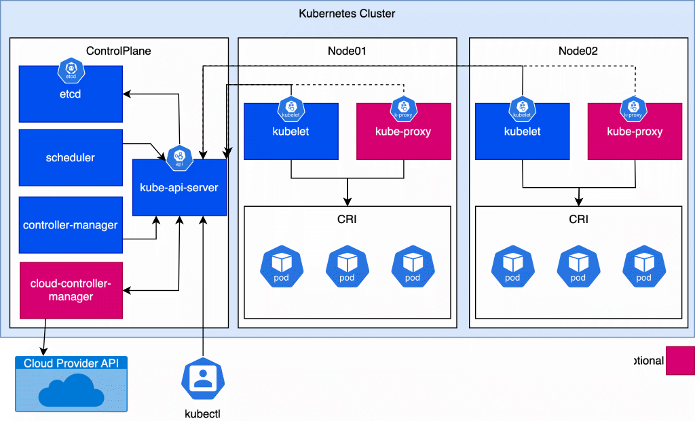
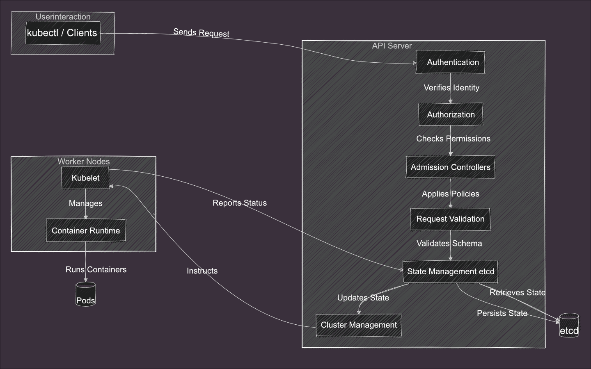
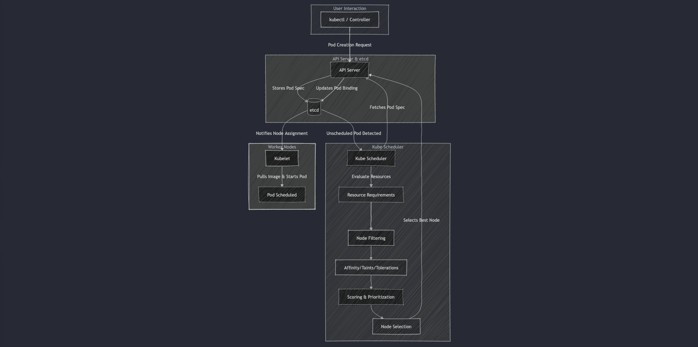
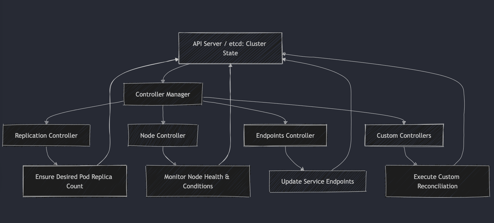
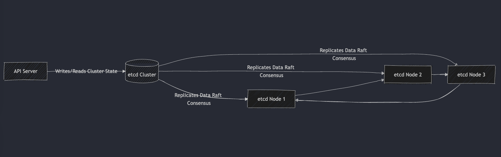
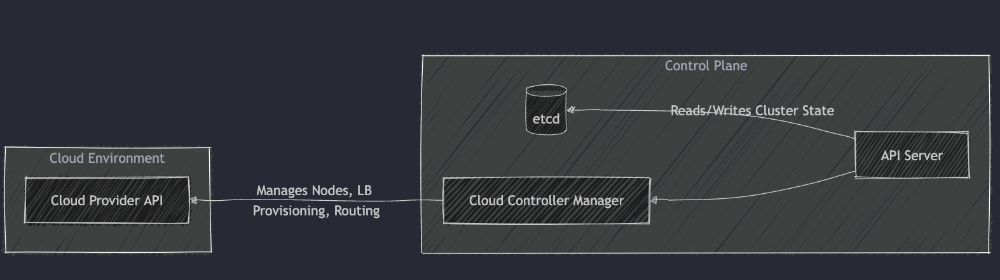
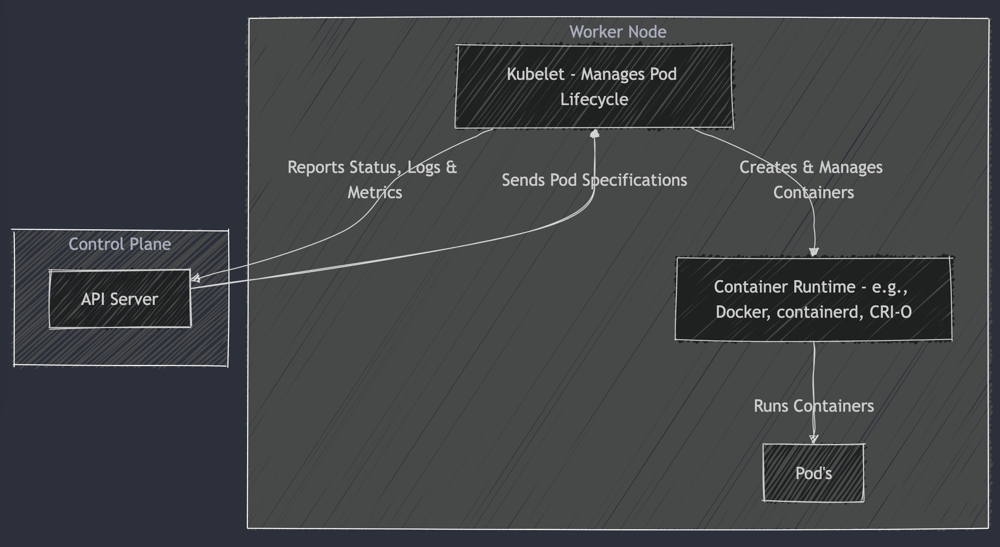
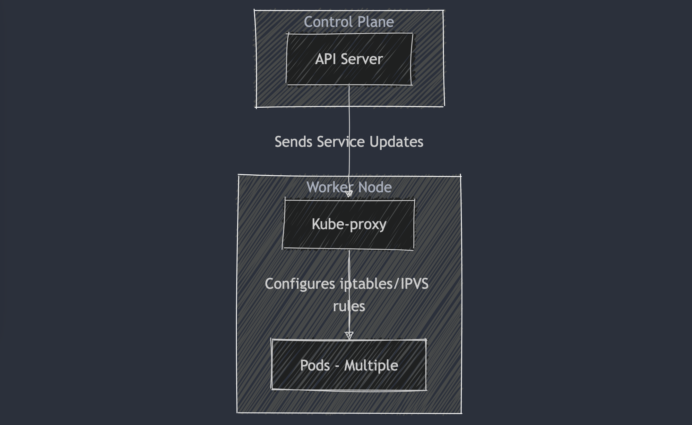
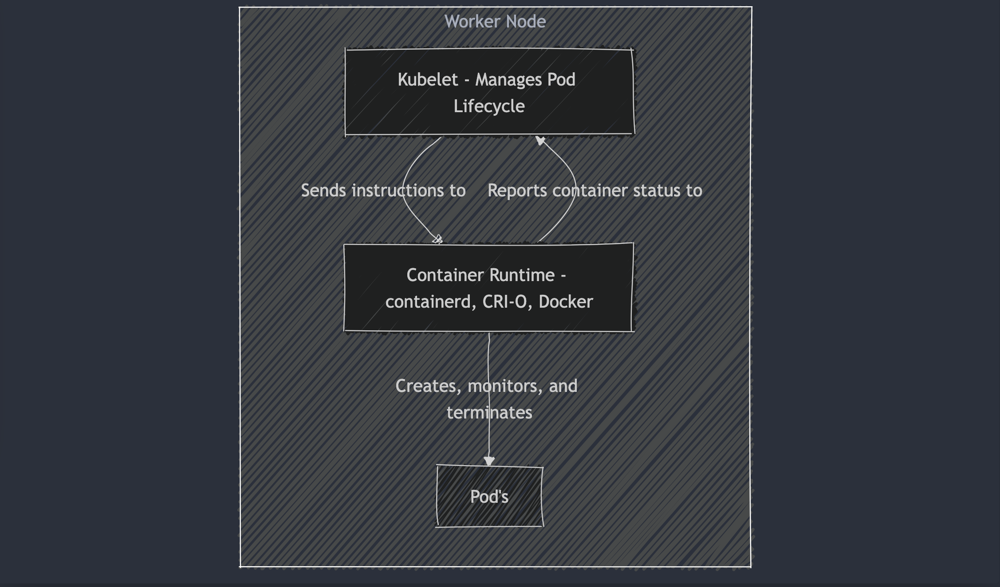

+++
title = 'Understanding the Components of Kubernetes'
subtitle = 'Understanding the Basics Part 2'
author = "0hlov3"
date = 2025-02-26T16:00:00
draft = false
image = "kubernetes-architecture.png"
tags = ['Kubernetes', 'Container Orchestration', 'DevOps', 'Cloud Native', 'Open Source']
+++



Kubernetes is renowned for its ability to orchestrate containerized applications at scale. To fully appreciate how it works, it’s important to understand the key components that make up its architecture. In this article, we’ll dive into the core building blocks of Kubernetes, the Control Plane and the Worker Nodes, explaining their roles and how they work together to deliver a resilient, scalable system.

## The Kubernetes Control Plane

The control plane acts as the “brain” of a Kubernetes cluster. It is responsible for managing the overall state of the cluster, ensuring that the current state aligns with the user-defined desired state. Let’s explore its main components.

----

### API Server

The API Server is the cornerstone of the Kubernetes control plane. It is the central hub through which all interactions with the cluster occur. Every configuration change, deployment, or scaling operation is processed by the API Server, making it a critical component for maintaining the desired state of your Kubernetes environment.

#### Role

The API Server serves as the main gateway for all communications with the cluster. It exposes the Kubernetes API, handling RESTful requests from users, internal controllers, and external clients. This makes it the "front door" for cluster management, ensuring that every action is validated, authenticated, and recorded.

#### Key Functions

- **Processing and Validating Requests:**  
  When a request to create, update, or delete an object (such as a pod or service) is received, the API Server performs thorough validations. It checks the request against the API schema and business rules to ensure the data is correct and complies with cluster policies.

- **Admission Control:**  
  Before any change is persisted, the API Server runs the request through a series of admission controllers. These plugins enforce additional policies—for example, resource quotas, security constraints, or custom business logic—to determine whether the request should be allowed.

- **State Management and Persistence:**  
  The API Server communicates with etcd, the cluster’s distributed key-value store, to save and retrieve cluster state. Every validated request results in an update to etcd, ensuring that the cluster's current state is always available and consistent across all components.

- **Authentication and Authorization:**  
  Security is integral to cluster operations. The API Server handles authentication by verifying the identity of the requestor—be it a human user or a service account. It then applies authorization checks (often using Role-Based Access Control, or RBAC) to ensure the requestor has the proper permissions to perform the requested operation.

- **API Aggregation and Extensibility:**  
  The API Server supports the addition of new APIs through API aggregation. This means you can extend Kubernetes’ functionality with custom resources and controllers without modifying the core server, making it highly extensible.

- **High Availability and Scalability:**  
  To ensure continuous operation, the API Server is designed to be stateless and can be scaled horizontally. Running multiple replicas in a high-availability setup prevents a single point of failure, ensuring that the cluster remains responsive even under heavy load.

- **Centralized Cluster Management:**  
  By serving as the unified entry point for all cluster interactions, the API Server simplifies management. Whether the commands come from the command-line tool `kubectl`, automated controllers, or other internal components, the API Server handles them consistently, maintaining the overall integrity of the cluster state.

#### API Versioning and Backward Compatibility:
In addition to its core functions, the API Server is designed with versioning in mind. Each API resource is maintained with version labels (e.g., v1, v1beta1), allowing Kubernetes to introduce new features and improvements without disrupting existing clients. This versioning strategy ensures backward compatibility, clients built against an older API version continue to function reliably even as newer versions are rolled out. In essence, API versioning provides a smooth upgrade path while maintaining the stability and consistency of the cluster.

#### Conclusion

The Kubernetes API Server is more than just an endpoint—it is the linchpin that holds the entire orchestration system together. By validating requests, enforcing security policies, managing state through etcd, and offering extensibility via custom APIs, it ensures that your cluster operates in a secure, scalable, and consistent manner. Understanding these functions is essential for anyone looking to master Kubernetes at a deeper level.

----

### Scheduler

The Kubernetes Scheduler plays a pivotal role in ensuring that your workloads are distributed optimally across your cluster. It is the component responsible for making decisions about where (on which worker node) each pod should run, based on a variety of factors and policies.

#### Role

The Scheduler’s primary responsibility is to assign unscheduled pods to the most appropriate worker nodes. It constantly monitors the cluster state and ensures that each pod is placed on a node that can satisfy its resource requirements and policy constraints.

#### Key Functions

- **Resource Evaluation and Node Capacity:**  
  The Scheduler examines the resource requirements of each pod (such as CPU, memory, and storage) and compares them with the available resources on each node. This evaluation helps to ensure that a pod is only scheduled on a node that has sufficient capacity.

- **Policy Considerations:**

    - **Affinity and Anti-Affinity Rules:**
      The Scheduler respects user-defined affinity rules (to co-locate pods) and anti-affinity rules (to separate pods), which can help optimize for performance, reliability, or compliance requirements.

    - **Taints and Tolerations:**
      Nodes can be “tainted” to repel certain pods, and pods can declare “tolerations” to override these taints. This mechanism helps ensure that pods are only scheduled on nodes that are appropriate for them.

- **Filtering and Prioritization:**  
  The scheduling process is typically broken into two phases:

    1. **Filtering:**
       The Scheduler filters out nodes that do not meet the basic requirements of a pod—such as lacking sufficient resources or not matching specific scheduling constraints.

    2. **Scoring/Prioritization:**
       Among the remaining candidate nodes, the Scheduler assigns scores based on various factors, such as resource availability, current load, and user-defined preferences. The node with the highest score is selected as the best fit for the pod.

- **Optimizing Cluster Utilization:**  
  By carefully matching pods to nodes, the Scheduler ensures efficient use of cluster resources. It helps maintain balance across nodes, preventing resource contention and reducing the likelihood of overloading any single node.

- **Extensibility and Customization:**  
  Kubernetes’ Scheduler is designed to be extensible. Users can define custom scheduling policies or extend the default behavior using scheduler extenders. This flexibility allows organizations to tailor scheduling decisions to their specific workloads and performance requirements.

- **High Availability:**  
  In production environments, the Scheduler is typically deployed in a highly available configuration, with multiple replicas running concurrently. This redundancy ensures that scheduling decisions continue seamlessly, even if one instance fails.

#### Custom Scheduler Extenders and Plugins:
For advanced use cases, Kubernetes allows the integration of custom scheduler extenders and plugins. These extensions enable you to implement specialized scheduling policies beyond the default behavior. For example, if your workloads require unique resource allocation, custom priority scoring, or specialized handling of non-containerized workloads, you can extend the Scheduler to meet these needs. This flexibility empowers teams to tailor the scheduling process to their specific operational requirements while maintaining optimal cluster performance.

#### Conclusion

The Kubernetes Scheduler is integral to the platform's ability to run containerized applications efficiently. By evaluating resource needs, respecting policy constraints, and optimizing the distribution of workloads across the cluster, it ensures that your applications can scale and perform reliably. A deep understanding of the Scheduler's functions is crucial for tuning your cluster and for troubleshooting performance issues in large-scale environments.

----

### Controller Manager

The Controller Manager is a vital component of the Kubernetes control plane. It orchestrates a suite of controllers that continuously monitor the cluster’s state, ensuring that it remains in sync with the desired configuration specified by the user. By automating various operational tasks, the Controller Manager plays a central role in maintaining the health, scalability, and self-healing nature of a Kubernetes cluster.

#### Role

The Controller Manager is responsible for running multiple controllers that manage different aspects of the cluster. Each controller is dedicated to a specific task—such as managing replicas, monitoring node health, or updating service endpoints. Together, these controllers work to reconcile the actual state of the cluster with the desired state defined by Kubernetes objects.

#### Key Functions

- **Monitoring and Reconciliation:**  
  The Controller Manager continuously observes the cluster state. Whenever it detects discrepancies between the actual state and the desired configuration, it triggers corrective actions. This reconciliation process is fundamental to Kubernetes’ self-healing capabilities.

- **Replication Controller:**  
  One of the primary controllers ensures that the correct number of pod replicas is running at any given time. If a pod fails or is deleted, the replication controller automatically creates a replacement, maintaining the specified replica count.

- **Node Controller:**  
  The Node Controller keeps track of the health and availability of nodes. If a node becomes unreachable or fails to report its status, the Node Controller marks it as unschedulable and, if necessary, initiates processes to reassign its workloads.

- **Endpoints Controller:**  
  This controller manages the network endpoints for services, ensuring that they point to the correct, healthy pod instances. It dynamically updates endpoints based on changes in pod status, facilitating reliable service discovery and load balancing.

- **Scaling and Failure Recovery:**  
  Beyond basic replication, the Controller Manager supports more advanced scenarios such as dynamic scaling of deployments in response to changing load and automatic recovery actions when components fail. This helps maintain a resilient and high-performing cluster.

- **Extensibility with Custom Controllers:**  
  The architecture of the Controller Manager allows for custom controllers to be integrated. This extensibility means that organizations can implement additional controllers tailored to their specific operational needs or business logic, further enhancing Kubernetes’ capabilities.

####  Custom Controllers and Extensibility:
Developers can leverage Kubernetes client libraries, such as client-go, to build custom controllers that monitor and manage specific aspects of the cluster. Additionally, frameworks like Operator SDK and Kubebuilder provide powerful scaffolding and abstractions to simplify the development of Kubernetes operators and custom controllers. These tools streamline the process of implementing advanced workflows, enforcing unique policies, or automating complex operational tasks, further emphasizing the extensibility and flexibility of Kubernetes.

In practical deployments, custom controllers can dramatically improve operational efficiency. For example, they can automatically adjust resource allocations or scale services in response to real-time metrics from external monitoring systems. Additionally, custom controllers can proactively remediate issues, such as restarting failing pods or updating configurations based on external triggers—without manual intervention. These capabilities help maintain service reliability and optimize resource usage in dynamic, large-scale environments.

#### Conclusion

The Kubernetes Controller Manager is essential for maintaining a consistent and healthy cluster. By running a variety of controllers, it automates the process of ensuring that the actual state of the system matches the desired state—whether that’s through managing replicas, monitoring node status, or updating service endpoints. This continuous reconciliation not only enhances the reliability and scalability of your applications but also embodies the self-healing ethos that makes Kubernetes so powerful.

----

### etcd

etcd is a highly available, distributed key-value store that serves as the backbone of a Kubernetes cluster. It is where all cluster data is stored, making it the single source of truth for the entire system. Understanding etcd is key to appreciating how Kubernetes maintains consistency and resilience across its control plane.

#### Role

etcd is responsible for storing every configuration detail and piece of state information for the Kubernetes cluster. This includes data about nodes, pods, services, and all other Kubernetes objects. Its design emphasizes high availability, strong consistency, and fault tolerance—qualities that are essential for the robust operation of the cluster.

#### Key Functions

- **Maintaining a Consistent and Reliable Record of Configuration Data:**  
  etcd uses consensus algorithms (such as Raft) to ensure that any data written to the store is consistently replicated across all etcd nodes. This mechanism guarantees that every client accessing etcd sees the same, up-to-date state, even in the event of node failures or network issues.

- **Providing a Centralized Data Source for the Control Plane:**  
  The Kubernetes API Server reads from and writes to etcd, making it the central repository for all cluster state. All changes in the cluster—whether they are updates to pod configurations, service definitions, or scaling directives—are stored in etcd, ensuring that every control plane component can access the latest information.

- **Acting as the Single Source of Truth:**  
  Because etcd holds the entire state of the cluster, it is the definitive record for recovery, scaling, and rollback operations. In the event of failures or during cluster initialization, etcd's data allows Kubernetes to reestablish the desired state reliably.

- **Ensuring High Availability and Fault Tolerance:**  
  etcd is designed to be resilient. By replicating data across multiple nodes and employing leader election, it can withstand individual node failures without losing critical state information. This high availability is crucial for maintaining the overall health and stability of the Kubernetes control plane.

#### Additional etcd Aspects:
While this article focuses on the core role of etcd in maintaining cluster state with strong consistency via the Raft consensus algorithm, there are many other important topics, such as backup and recovery strategies, that are critical to understanding its full impact on cluster reliability. We'll cover these advanced aspects of etcd in a separate article.

#### Conclusion

etcd is not just a data store—it is the linchpin of Kubernetes’ operational integrity. By ensuring that every component in the control plane has access to a consistent and reliable source of configuration data, etcd enables Kubernetes to deliver on its promises of automation, scalability, and resilience. Understanding etcd’s role is essential for grasping how Kubernetes achieves its self-healing and highly available architecture.

----

### Cloud Controller Manager

The Cloud Controller Manager is an integral part of the Kubernetes control plane when running in cloud environments. It bridges the gap between Kubernetes and the underlying cloud provider’s infrastructure, handling cloud-specific tasks that are not relevant in bare metal deployments.

#### Role

When Kubernetes is deployed in a cloud environment, the Cloud Controller Manager interfaces directly with the cloud provider’s APIs. This integration allows Kubernetes to manage and automate cloud-specific operations, ensuring that the cluster remains in sync with the cloud infrastructure.

#### Key Functions

- **Node Management:**  
  The Cloud Controller Manager monitors the state of cloud instances and manages their lifecycle. For example, if a cloud node becomes unhealthy, it can signal to Kubernetes to reschedule its workloads or replace the node.

- **Load Balancer Provisioning:**  
  It automates the creation and configuration of cloud load balancers. This ensures that services exposed outside the cluster are properly balanced and accessible, without requiring manual intervention.

- **Routing Configurations:**  
  By handling routing rules and network policies, the Cloud Controller Manager ensures that traffic flows efficiently between external clients and the services running in the cluster.

- **Decoupling Cloud-Specific Logic:**  
  One of the key design benefits is modularity. By offloading cloud-specific tasks from the core controllers, Kubernetes remains flexible and portable. This separation means that when running on bare metal or in environments without a cloud provider, you can disable or omit the Cloud Controller Manager without impacting the core functionality of Kubernetes.

#### Environment Considerations

- **Cloud Environments:**  
  In public cloud deployments, the Cloud Controller Manager is essential. It automates integration with cloud services, such as provisioning virtual machines, managing load balancers, and ensuring that node statuses are accurately reflected within the cluster. This automation reduces operational overhead and ensures that Kubernetes can leverage cloud-native features for scalability and reliability.

- **Bare Metal Environments:**  
  For on-premises or bare metal deployments, many of the cloud-specific tasks managed by the Cloud Controller Manager are not needed. In these environments, node management and load balancing are typically handled by alternative mechanisms or custom solutions. As a result, you may choose to run a Kubernetes cluster without the Cloud Controller Manager, simplifying your deployment while still benefiting from Kubernetes’ core orchestration capabilities.

#### Conclusion

The Cloud Controller Manager is a vital component for Kubernetes deployments in cloud environments, automating critical tasks such as node management, load balancer provisioning, and routing. Its modular design allows Kubernetes to seamlessly integrate with cloud providers while maintaining portability. For bare metal environments, where cloud-specific integrations are unnecessary, the Cloud Controller Manager can be omitted or replaced, allowing for a leaner cluster configuration.

Understanding the Cloud Controller Manager helps clarify how Kubernetes adapts to different infrastructure setups, ensuring optimal operation whether you’re running in the cloud or on-premises.

----

## The Worker Nodes

While the control plane manages the cluster, the worker nodes are where your containerized applications actually run. Each node includes several key components that help maintain the desired state as directed by the control plane.

----

### Kubelet

The Kubelet is an essential agent that runs on every worker node within a Kubernetes cluster. It acts as the bridge between the node and the control plane, ensuring that containers are running as specified and maintaining the overall health of the node.

#### Role

The primary role of the Kubelet is to manage the lifecycle of pods on its node. It continuously checks that each container is running in accordance with the pod specifications defined by the control plane. If a container deviates from its desired state—whether due to a crash, resource issue, or other failure—the Kubelet takes corrective actions to restore normal operations.

#### Key Functions

- **Pod Status Monitoring:**  
  The Kubelet actively monitors the health and status of all pods running on its node. It collects detailed information about container states and resource usage, and then reports this data back to the control plane. This continuous feedback loop enables the cluster to react quickly to any issues.

- **Enforcing the Desired State:**  
  When the control plane defines the desired state for a pod, the Kubelet ensures that this state is achieved. If a container is missing or not functioning as expected, the Kubelet will restart or reinitialize it, ensuring that the node's actual state aligns with the defined configuration.

- **Container Management:**  
  Through the Container Runtime Interface (CRI), the Kubelet interacts with the container runtime (e.g., Docker, containerd, or CRI-O). It is responsible for the creation, management, and termination of containers based on the pod specifications. This abstraction allows Kubernetes to work seamlessly with different container runtimes.

- **Communication with the Control Plane:**  
  The Kubelet serves as the primary interface between the node and the Kubernetes API server. It regularly sends status updates, resource metrics, and health information to the control plane. This ensures that the overall cluster management system is aware of the node’s condition and can make informed scheduling and scaling decisions.

- **Log Management and Metrics Collection:**  
  In addition to managing pods, the Kubelet collects logs and performance metrics from containers and the node itself. These logs and metrics are crucial for monitoring the health of applications, troubleshooting issues, and optimizing cluster performance.

#### Conclusion

The Kubelet is a linchpin in the Kubernetes architecture, ensuring that each worker node faithfully executes the desired state of the cluster. By continuously monitoring pod health, managing container lifecycles, and maintaining robust communication with the control plane, the Kubelet enables Kubernetes to deliver its promise of automated, resilient, and scalable container orchestration. Understanding its functions is vital for anyone looking to optimize and troubleshoot Kubernetes deployments.

----

### Kube-proxy

Kube-proxy is a critical component for maintaining network connectivity within a Kubernetes cluster. It manages network rules on each node to enable seamless communication between services and pods. However, it’s important to note that Kube-proxy can be optional. If you deploy a network plugin (CNI) that implements packet forwarding for services and provides equivalent load-balancing behavior, you might not need to run Kube-proxy on your nodes.

#### Role

Kube-proxy is responsible for ensuring that service endpoints are reachable and that network traffic is efficiently routed between pods. It acts as a local traffic manager on each worker node, enforcing network policies that enable the smooth operation of services across the cluster.

#### Key Functions

- **Traffic Direction Using iptables/IPVS:**  
  Kube-proxy utilizes technologies like iptables or IPVS to configure network rules. These rules determine how traffic destined for a service is forwarded to the correct pod endpoints.

- **Load Balancing:**  
  It ensures that incoming traffic is distributed evenly among the available pods. By doing so, Kube-proxy plays a key role in balancing the load across the cluster, which is essential for maintaining application performance and availability.

- **Network Connectivity Management:**  
  Kube-proxy continuously monitors changes in the cluster (such as pod additions or removals) and updates network rules accordingly. This dynamic management ensures that the data flow between services and pods remains uninterrupted, even as the cluster evolves.

#### Optional Nature

While Kube-proxy is a standard component in many Kubernetes clusters, its functionality can be provided by alternative network plugins. Some modern CNI (Container Network Interface) solutions implement their own packet forwarding and load-balancing mechanisms, effectively replicating Kube-proxy’s behavior. In such cases, running Kube-proxy may be redundant, and administrators can choose to disable it on their nodes.

#### Conclusion

Kube-proxy is essential for managing network rules and ensuring reliable communication within a Kubernetes cluster. Its ability to use iptables or IPVS for traffic direction and load balancing underpins much of the cluster's network functionality. However, with the advent of advanced network plugins that offer built-in service routing and load balancing, Kube-proxy’s role can become optional in certain deployments. Understanding when and how to utilize Kube-proxy, or its alternatives, allows you to design a more flexible and efficient Kubernetes networking setup.

----

### Container Runtime

The Container Runtime is the software component on each Kubernetes node responsible for running and managing containerized applications. It acts as the bridge between Kubernetes and the underlying container technology, ensuring that containers are created, executed, and terminated in line with the cluster's desired state.

#### Role

The Container Runtime is tasked with launching, managing, and stopping containers on a node. It implements the Container Runtime Interface (CRI), which provides a standardized way for Kubernetes to interact with various container runtimes. This abstraction allows Kubernetes to remain agnostic to the specific container technology, whether it’s Docker, containerd, CRI-O, or another compliant runtime.

#### Key Functions

- **Container Lifecycle Management:**  
  The runtime handles the complete lifecycle of containers—from pulling container images and creating containers to executing processes and terminating them. This management ensures that each container runs reliably according to the specifications defined by Kubernetes.

- **Implementation of the Container Runtime Interface (CRI):**  
  By adhering to the CRI, the container runtime provides a uniform interface that Kubernetes uses to manage containers. This standardization allows Kubernetes to seamlessly work with different container runtimes without needing modifications to its core components.

- **Support for Various CRI-Compliant Runtimes:**  
  Several container runtimes implement the CRI standard, including:

    - **containerd:**
      A high-performance container runtime that is widely adopted and maintained as a core component of many Kubernetes deployments.

    - **CRI-O:**
      A lightweight runtime specifically designed for Kubernetes that emphasizes simplicity and security.

    - **Docker (via dockershim):**
      Docker was traditionally used with Kubernetes through a compatibility layer called dockershim. Although this support is being phased out in favor of native CRI implementations, many existing clusters still use Docker.

    - **Other Emerging Runtimes:**
      Additional runtimes, such as those focused on enhanced security (e.g., gVisor, Kata Containers), have also implemented the CRI or integrate with it to varying degrees.

- **Resource Management and Isolation:**  
  The container runtime works with the underlying operating system to manage resources such as CPU, memory, and storage for each container. It leverages mechanisms like cgroups and namespaces to provide isolation, ensuring that containers do not interfere with one another and that system resources are allocated efficiently.

#### Conclusion

The Container Runtime is a foundational element of Kubernetes, responsible for the actual execution of containerized applications. By implementing the CRI, it abstracts the complexities of container management and allows Kubernetes to orchestrate containers irrespective of the underlying runtime. Whether you’re using containerd, CRI-O, or Docker (via dockershim), the CRI standard ensures consistent behavior across different environments. Understanding the Container Runtime and the range of CRI-compliant solutions is vital for optimizing performance, ensuring stability, and maintaining the security of your Kubernetes environment.

----

## Bringing It All Together

The synergy between the control plane and worker nodes is at the heart of Kubernetes’ power. The control plane continuously monitors the desired state of the cluster and delegates tasks, while the worker nodes execute those tasks to ensure your containerized applications run efficiently and reliably. This dynamic interplay is what makes Kubernetes a robust and scalable orchestration tool.

Mastering these core components is the essential first step in understanding Kubernetes. With this foundational knowledge in hand, you're well-prepared to delve into the practical aspects of deploying and managing a cluster. In our next article, we'll guide you through setting up a Kubernetes cluster, turning these concepts into actionable steps.

----

## Kubernetes Services

In Kubernetes, a Service is an abstraction that enables reliable communication between different parts of your application. It provides a stable network endpoint for a group of pods, allowing you to expose your application either within the cluster or to the outside world in a scalable and flexible way. By decoupling the frontend from backend pods, Services facilitate load balancing, service discovery, and seamless scaling of microservices.

### How Kubernetes Services Work

Kubernetes uses labels and selectors to associate a Service with a group of pods. When you create a Service, you specify labels that the Service should match. The Service then automatically discovers and routes traffic to the pods that have those labels. This decoupling allows you to update or scale your application without changing how clients connect to it.

### Types of Kubernetes Services

Kubernetes offers several types of Services to cover different networking requirements. Each type caters to a specific use case:

1. **ClusterIP (Default Type):**
    - **Purpose:** Exposes the Service on a cluster-internal IP address, making it accessible only within the cluster. This is ideal for internal communication between different components of your application.
    - **Use Case:** Load balancing traffic between multiple replicas of a backend service.
    - **Example Scenario:** Microservices communicating with each other within the cluster.
2. **NodePort:**
    - **Purpose:** Exposes the Service on the same port number on each node in the cluster. This allows external clients to access the Service by connecting to any node's IP address and the specified NodePort.
    - **Use Case:** Testing or exposing a Service during development when you don’t have a cloud load balancer.
    - **Example Scenario:** Accessing a web application using the node’s public IP and a fixed port number.
3. **LoadBalancer:**
    - **Purpose:** Integrates with the cloud provider’s load balancing services to expose the Service to the internet using a public IP address. It automatically creates a cloud load balancer and routes external traffic to the Service.
    - **Use Case:** Exposing production-grade applications to the outside world with built-in load balancing.
    - **Example Scenario:** Serving a public-facing website or API.
4. **ExternalName:**
    - **Purpose:** Maps a Service to an external DNS name rather than routing traffic to pods. This is useful for services hosted outside of the Kubernetes cluster.
    - **Use Case:** Accessing third-party services using an internal DNS name.
    - **Example Scenario:** Integrating an external database or SaaS API within the cluster.

### Why Use Kubernetes Services?

- **Stable Networking:** Services provide a consistent and reliable way to connect to pods, even as they scale or get replaced.
- **Load Balancing:** They distribute traffic evenly across a set of pods, ensuring high availability and performance.
- **Service Discovery:** By leveraging DNS-based service discovery, clients can access services by name without knowing the IP addresses of individual pods.
- **Decoupling:** Services decouple application components, enabling you to update or scale backend pods without impacting frontend clients.

### Conclusion

Kubernetes Services play a critical role in ensuring reliable and scalable communication within a cluster. By abstracting the underlying pods, they provide stable endpoints, flexible exposure options, and integrated load balancing. Understanding the different Service types and their use cases is essential for designing resilient and scalable microservices architectures in Kubernetes.

----

## Kubernetes Networking

Networking is a fundamental aspect of Kubernetes, enabling communication between different components within the cluster. In Kubernetes, the networking model is built on the concept of a virtual network that provides seamless connectivity between all pods, regardless of their physical location on different nodes. This approach abstracts away the underlying infrastructure, allowing developers to focus on application logic without worrying about networking complexity.

### How Kubernetes Networking Works

Kubernetes assigns each pod a unique IP address within the virtual network, ensuring that every pod can communicate with others directly using this IP address. This IP-per-pod model eliminates the need for Network Address Translation (NAT) within the cluster, simplifying communication between services and microservices.

### Container Network Interface (CNI)

The virtual network in Kubernetes is implemented using the Container Network Interface (CNI), a plugin-based networking solution. CNI standardizes the way Kubernetes interacts with network providers, enabling flexibility and modularity. When a pod is created, the CNI plugin:

- **Allocates an IP Address:** The CNI assigns a unique IP address to the pod within the cluster's virtual network range.
- **Configures Network Interfaces:** It creates virtual network interfaces within the pod and attaches them to the node's network.
- **Sets Up Routing Tables:** The CNI ensures that the necessary routing rules are configured so that traffic can be routed between pods, regardless of which node they are running on.

### CNI Plugins

Kubernetes allows you to choose from a variety of CNI plugins, each with its own networking model and features. Some of the most popular CNI plugins include:

1. **Flannel:**
    - **Purpose:** Simple and easy-to-deploy overlay network solution.
    - **Use Case:** Ideal for small to medium-sized clusters where simplicity is prioritized over advanced network policies.
    - **Networking Model:** Uses VXLAN or host-gw for pod communication.
2. **Calico:**
    - **Purpose:** Provides a powerful networking and network policy engine.
    - **Use Case:** Suitable for enterprise-grade environments that require fine-grained network security policies.
    - **Networking Model:** Uses pure L3 networking for high performance and scalability.
3. **Weave Net:**
    - **Purpose:** Offers simple and fast networking with automatic encryption.
    - **Use Case:** Ideal for secure environments where encrypted communication between pods is required.
    - **Networking Model:** Utilizes a mesh-based overlay network with optional IPAM (IP Address Management).

### Kubernetes Networking Principles

Kubernetes follows a set of fundamental networking principles to maintain consistency and ease of use:

1. **Pod-to-Pod Communication:**
    - Every pod can communicate with every other pod in the cluster without NAT. This means that each pod is aware of every other pod's IP address, allowing direct communication.
2. **Pod-to-Service Communication:**
    - Services provide a stable endpoint for accessing a group of pods. Kubernetes uses DNS to resolve service names to their corresponding ClusterIP, enabling consistent communication even when pods are replaced or scaled.
3. **Node-to-Pod Communication:**
    - Nodes can communicate with all pods within the cluster using their pod IPs. This is particularly useful for kube-proxy and other components that need to route traffic.

### Why Kubernetes Networking Matters

Kubernetes networking model abstracts away the complexities of traditional network configurations, allowing you to:

- **Easily Scale Applications:** Pods can be added or removed without reconfiguring network settings.
- **Implement Network Policies:** Using CNI plugins like Calico, you can define security rules to control traffic flow between pods.
- **Maintain High Availability:** The virtual network model ensures consistent connectivity, even in dynamic environments with frequent scaling events.

### Conclusion

Kubernetes networking is designed to be flexible, scalable, and reliable. By using the Container Network Interface (CNI) and its various plugins, Kubernetes abstracts the underlying infrastructure complexities, allowing seamless communication between pods. Understanding how Kubernetes networking works, and choosing the right CNI plugin, is crucial for designing robust microservices architectures and ensuring network security.

----

## Kubernetes Persistent Storage

In Kubernetes, containers are ephemeral by design, which means any data stored within a container is lost when the container is stopped, restarted, or deleted. However, many applications require persistent data storage that outlives the lifecycle of individual containers, such as databases, stateful applications, and logs. Kubernetes solves this challenge using a robust persistent storage model built around PersistentVolumes (PVs) and PersistentVolumeClaims (PVCs).

### How Kubernetes Persistent Storage Works

Kubernetes separates the management of storage resources from the consumption of those resources by defining two key objects:

1. **PersistentVolumes (PVs):**

    - **Purpose:** Represents a piece of storage within the cluster, such as a block storage device, NFS share, or cloud-based storage solution.
    - **Management:** PVs are created and managed by cluster administrators and are independent of any specific pod or container. They exist beyond the lifecycle of individual pods, ensuring that data persists even if pods are deleted or rescheduled.
    - **Characteristics:** PVs define storage capacity, access modes (ReadWriteOnce, ReadOnlyMany, ReadWriteMany), and storage classes, which determine the underlying storage provider and performance characteristics.

2. **PersistentVolumeClaims (PVCs):**

    - **Purpose:** Represents a request for storage by a pod or container. PVCs define the amount of storage needed and the access mode required.
    - **Binding Process:** When a PVC is created, Kubernetes automatically matches it to an available PV that meets the requested specifications. Once bound, the PVC provides the pod with consistent access to the storage, ensuring data persists beyond the container lifecycle.
    - **Decoupling Storage from Pods:** By decoupling the storage request (PVC) from the actual storage resource (PV), Kubernetes enables flexible scaling, upgrades, and maintenance without impacting application data.

### How PVs and PVCs Work Together

The interaction between PVs and PVCs is what makes Kubernetes storage powerful and flexible:

- **Dynamic Provisioning:** In many environments, PVs are dynamically provisioned based on the PVC's specifications using a StorageClass. This means the storage resource is created on-demand, allowing for seamless scaling and automation.
- **Binding and Access:** Once a PVC is bound to a PV, the pod can mount the PVC as a volume, allowing the application to read and write data as needed. The binding remains intact even if the pod is rescheduled or moved to another node.
- **Data Persistence and Retention:** When a pod is deleted, the PVC and PV remain intact, preserving the data for future use. Retention policies (e.g., Retain, Recycle, Delete) control what happens to the PV when the PVC is deleted.

### Access Modes and Use Cases

Kubernetes supports different access modes for PVs and PVCs to accommodate various application requirements:

- **ReadWriteOnce (RWO):**
    - **Purpose:** Mounted as read-write by a single node.
    - **Use Case:** Applications that require exclusive access, such as databases.
- **ReadOnlyMany (ROX):**
    - **Purpose:** Mounted as read-only by multiple nodes.
    - **Use Case:** Shared content repositories or configuration files.
- **ReadWriteMany (RWX):**
    - **Purpose:** Mounted as read-write by multiple nodes.
    - **Use Case:** Distributed applications or shared storage solutions like NFS or Ceph.

### Storage Classes: Abstracting Storage Details

A **StorageClass** is an abstraction that defines the type of storage (e.g., SSD, HDD, network-attached storage) and its provisioning method. It allows administrators to specify:

- **Provisioner:** The storage backend (e.g., AWS EBS, Google Persistent Disk, Ceph, NFS).
- **Parameters:** Custom parameters for the storage backend, such as disk type or IOPS requirements.
- **Reclaim Policy:** Defines what happens to the PV when its bound PVC is deleted (e.g., Retain, Delete, Recycle).

### Why Persistent Storage Matters

Kubernetes Persistent Storage is crucial for running stateful applications that require data durability, such as:

- **Databases:** Ensuring that data persists across pod restarts and updates.
- **Content Management Systems:** Preserving uploaded content even when scaling or upgrading containers.
- **Logging and Monitoring:** Retaining historical logs and metrics for auditing and analysis.

### Conclusion

Kubernetes Persistent Storage provides a flexible and reliable way to manage data in containerized applications. By decoupling storage requests (PVCs) from storage resources (PVs), Kubernetes enables dynamic provisioning, scalability, and resilience. Understanding how to leverage PersistentVolumes, PersistentVolumeClaims, and StorageClasses empowers you to run stateful applications with confidence, ensuring data durability and high availability.

----

## Conclusion

In summary, this article has provided a comprehensive overview of the key components that form the foundation of Kubernetes. We’ve explored the control plane, including the API Server, Scheduler (with its extensibility options), Controller Manager, etcd (and its critical role in state management), and the Cloud Controller Manager and we`ve delved into the essential components that run on worker nodes, such as the Kubelet, Kube-proxy, and Container Runtime.

Each component plays a vital role in ensuring that your Kubernetes cluster is secure, scalable, and resilient. By understanding how these pieces work together, from validating and processing requests to managing container lifecycles and ensuring seamless communication between pods, you gain the insight necessary to design and manage robust containerized applications.

This foundational knowledge not only prepares you for advanced topics in Kubernetes but also equips you to leverage its full potential in real-world deployments. In our upcoming articles, we’ll take this understanding further by exploring practical aspects of deploying and managing a Kubernetes cluster.

## Sources & Further Reading
- Kubernetes Official Documentation
  - https://kubernetes.io/docs/
  - Comprehensive guides and reference documentation covering all aspects of Kubernetes, including architecture, components, and advanced topics.
- Kubernetes Services Documentation
  - https://kubernetes.io/docs/concepts/services-networking/service/
  - Detailed explanation of Kubernetes Services, including ClusterIP, NodePort, LoadBalancer, and ExternalName.
- Kubernetes Networking
  - https://kubernetes.io/docs/concepts/cluster-administration/networking/
  - In-depth coverage of Kubernetes’ networking model, Container Network Interface (CNI), and popular CNI plugins like Flannel, Calico, and Weave Net.
- Container Network Interface (CNI) Plugins
  - https://github.com/containernetworking/cni
  - Official repository and documentation for CNI plugins, providing insights into networking standards and available implementations.
- Persistent Volumes and Storage Classes
  - https://kubernetes.io/docs/concepts/storage/persistent-volumes/
  - Detailed overview of PersistentVolumes (PVs), PersistentVolumeClaims (PVCs), and StorageClasses in Kubernetes, including dynamic provisioning and reclaim policies.
- etcd Documentation
  - https://etcd.io/docs/
  - Learn more about etcd, the distributed key-value store that serves as the backbone for Kubernetes’ state management.
- containerd Documentation
  - https://containerd.io/docs/
  - Explore containerd, one of the key CRI-compliant container runtimes used with Kubernetes.
- CRI-O Documentation
  - https://cri-o.io/
  - A lightweight container runtime designed specifically for Kubernetes environments.
- Kubernetes Community Blog
  - https://kubernetes.io/blog/
  - Insights, best practices, and case studies shared by the Kubernetes community and maintainers.
- CNCF Kubernetes Project
  - https://www.cncf.io/projects/kubernetes/
  - An overview of Kubernetes provided by the Cloud Native Computing Foundation, including community updates and project governance.
- From Google to the World: The Kubernetes Origin Story
  - https://cloud.google.com/blog/products/containers-kubernetes/from-google-to-the-world-the-kubernetes-origin-story
  - Discover the fascinating history and evolution of Kubernetes from Google’s internal systems like Borg and Omega.
- Kubernetes Components Overview
  - https://kubernetes.io/docs/concepts/overview/components/
  - Detailed documentation on the control plane, worker nodes, and the various components that power Kubernetes.
- Cloud Controller Manager
  - https://kubernetes.io/docs/concepts/architecture/cloud-controller/
  - Insights into how Kubernetes integrates with cloud provider APIs for seamless infrastructure management.
- Kubelet Documentation
  - https://kubernetes.io/docs/concepts/overview/components/#kubelet
  - Documentation detailing the role and functionality of the Kubelet within Kubernetes clusters.

## Don’t Trust Me — Seriously

The author takes no responsibility for any mishaps, broken servers, or existential crises caused by following this information.

If you spot a mistake, have a better way of doing things, or just want to chat about tech, feel free to reach out.

Also, this isn’t an ad — unless my enthusiasm and advocacy for cool stuff count as advertising.