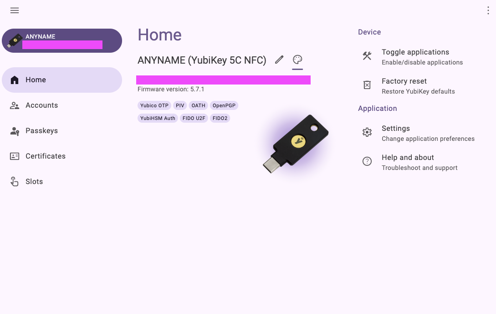
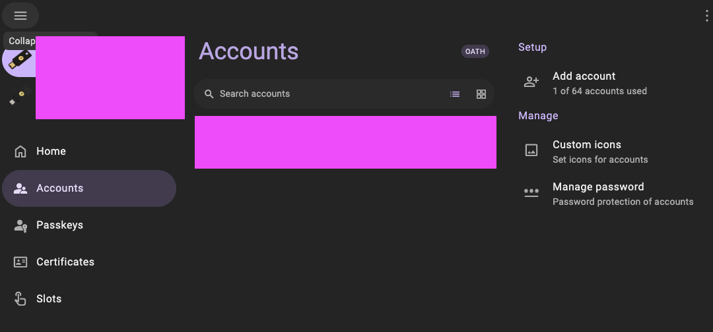

+++
title = 'The Ultimate Guide to WebAuthn & FIDO2'
subtitle = 'Securing Your Digital Life with YubiKey'
author = "0hlov3"
date = 2025-02-04T20:00:00-00:00
draft = false
image = "andy-kennedy-FO4CR0MnY_k-unsplash.jpg"
tags = ['YubiKey','Security Keys','Two-Factor Authentication (2FA)','FIDO2/WebAuthn','Passwordless Authentication']
toc = true

aliases = ['/posts/2025-02-5_The-Ultimate-Guide-to-YubiKey']

+++

Andy Kennedy on Unsplash" alt="a close up of a usb stick on a surface" >}}



In today’s digital world, security threats are everywhere. From password breaches to sophisticated phishing attacks, online accounts are constantly at risk. Despite the growing awareness of cybersecurity, many people still rely on weak or reused passwords, making them vulnerable to hacking attempts. Even two-factor authentication (2FA), a widely recommended security measure, isn’t always foolproof—especially when using SMS-based codes, which can be intercepted through SIM-swapping attacks.

This is where hardware security keys come into play. These small, physical devices provide an extra layer of security by requiring physical access for authentication. Unlike traditional passwords or mobile-based 2FA methods, security keys use cryptographic techniques to verify your identity, making them resistant to phishing and unauthorized access.

One of the most well-known and widely used security keys is the YubiKey, developed by Yubico. A YubiKey simplifies and strengthens authentication by enabling passwordless logins, securing online accounts, and protecting sensitive information with strong encryption.

In this article, we’ll explore:

- Why you need a security key and how it enhances your online security.
- What a YubiKey is, how it works, and its various features.
- The available alternatives to YubiKey and how they compare.
- How to get started with a YubiKey, from choosing the right model to setting it up for different use cases.

By the end, you'll have a clear understanding of how a YubiKey and other hardware security keys can help secure your digital identity and whether it’s the right choice for you.

## Why do you need a Security Key?
Passwords have long been the standard for securing online accounts, but they come with significant weaknesses:

- Easily guessed or cracked

  Many people use simple or common passwords, making them vulnerable to brute-force attacks.
- Reused across multiple accounts

  If one account is breached, attackers can try the same credentials on other platforms.
- Susceptible to phishing
  
  Attackers create fake login pages to steal passwords, even from tech-savvy users.

These security risks have led to the widespread adoption of two-factor authentication (2FA) and multi-factor authentication (MFA) as additional security layers.

### The Rise of Two-Factor Authentication (2FA) and Multi-Factor Authentication (MFA)
To enhance security, many online services now require a second verification step beyond a password. This is known as two-factor authentication (2FA) or when multiple steps are involved multi-factor authentication (MFA).

Common types of 2FA include:

- SMS-Based 2FA

  A verification code is sent via text message.
- App-Based authentication
  
  A time-based one-time password (TOTP) is generated by apps like Google Authenticator or Authy.
- Hardware security keys

  A physical device, such as a YubiKey, is used for authentication.

Each of these methods has its strengths and weaknesses, which we’ll compare below.

### Comparison of Authentication Methods
| Authentication Method                   | Security Level | Vulnerabilities                                                        | Convenience                                   |
|-----------------------------------------|----------------|------------------------------------------------------------------------|-----------------------------------------------|
| Passwords only                          | Low            | Easily stolen, guessed, or reused                                      | Easy but weak                                 |
| SMS-Based 2FA                           | Medium         | Susceptible to SIM-swapping attacks, phishing                          | Easy but not very secure                      |
| App-Based 2FA (TOTP)                    | High           | Phishing-resistant, but codes can be stolen via malware                | More secure, but mostly requires a smartphone |
| Hardware Security Keys (FIDO2/WebAuthn) | Very High      | Resistant to phishing, man-in-the-middle attacks, and credential theft | Most secure, requires a physical device       |

#### Technical Breakdown of Authentication Methods
1. Password-Only Authentication (Weakest)
   - Uses hashing algorithms (e.g., bcrypt, Argon2, PBKDF2) to store passwords securely.
   - Common attack vectors:
     - Brute-force attacks: Guessing passwords using automated tools.
     - Credential stuffing: Using leaked credentials from other sites.
     - Phishing: Tricking users into entering credentials on fake websites.
     - Keylogging: Malware that captures keystrokes.
2. SMS-Based 2FA (Moderate Security, but Vulnerable)
   - Works using Time-based One-Time Passwords (TOTP) or One-Time Passwords (OTP) sent via SMS.
   - Uses the SS7 protocol, which is outdated and prone to security risks.
   - Security weaknesses:
     - SIM-swapping: Attackers convince mobile carriers to transfer your phone number to their SIM card.
     - Man-in-the-middle (MITM) attacks: SMS messages can be intercepted by malware or rogue mobile network access points.
     - Phishing-resistant? No, attackers can trick users into revealing SMS codes.
3. App-Based 2FA (TOTP) (Strong, But Not Foolproof)
   - Uses RFC 6238 (TOTP: Time-based One-Time Passwords).
   - Codes are generated using HMAC-SHA1 (or SHA-256/SHA-512 in some implementations).
   - Security weaknesses:
     - Phishing-resistant? Yes, but not foolproof, attackers can steal codes using advanced phishing techniques.
     - Malware risks: If a device is compromised, an attacker can extract the TOTP seed (QR code) and generate valid codes.
     - No device binding: TOTP codes can be entered from any device, making them vulnerable if leaked.
4. Hardware Security Keys (FIDO2/WebAuthn) (Strongest Security)
   - Uses FIDO2 (Fast Identity Online) and WebAuthn (W3C standard).
   - Based on public-key cryptography (asymmetric encryption):
     - Private key is securely stored on the hardware key.
     - Public key is registered with the online service.
     - When authenticating, a cryptographic challenge is signed using the private key.
   - Security advantages:
     - Phishing-resistant? Yes, unlike TOTP, security keys cannot be tricked into revealing authentication codes.
     - Resistant to MITM attacks: Keys authenticate only with the original domain, preventing fake login pages from working.
     - No shared secrets: Unlike TOTP, the private key never leaves the device.
   - Additional Features:
     - Some security keys support NFC for mobile device authentication.
     - Can be used for SSH authentication (instead of password-based or TOTP 2FA).
     - Supports passwordless login (e.g., Microsoft, Google, GitHub).

### How a Security Key Enhances Security
A hardware security key like a YubiKey provides a phishing-resistant and tamper-proof authentication method. Instead of manually entering a code, you simply insert the key and tap it to authenticate.
Use Cases for Security Keys

1. Personal Accounts
   - Protect your Google, Microsoft, GitHub, and other online accounts from phishing.
   - Secure your email, social media, and cloud storage.
   - Use passwordless authentication where supported (e.g., Windows Hello, Apple Passkeys).
2. Enterprise Security
   - Enforce strong authentication in workplaces using FIDO2/WebAuthn standards.
   - Implement Zero Trust security by ensuring employees authenticate securely.
   - Reduce reliance on passwords and prevent credential-based attacks.
3. Developer and Admin Use Cases
   - Secure SSH access for remote server administration.
   - Sign Git commits with GPG to ensure code integrity.
   - Protect access to cloud infrastructure (AWS, Azure, Kubernetes, etc.).

Security keys provide the strongest protection against credential theft, phishing, and account takeovers. Unlike passwords and traditional 2FA methods, a YubiKey or other hardware security key ensures that only someone with the physical device can access an account.

In the next section, we’ll dive deeper into what a YubiKey is and how it works.

## What is a YubiKey?
Yubico is a Swedish company founded in 2007 that specializes in authentication solutions. Its flagship product, the YubiKey, is a small hardware security key that provides strong authentication for online accounts, enterprise security systems, and cryptographic operations.

YubiKey was one of the first devices to support the FIDO (Fast Identity Online) standard, which helps eliminate password-related security risks by enabling phishing-resistant authentication. Today, YubiKeys are used by individuals, businesses, and governments worldwide to enhance security.

### How a YubiKey Works
Unlike traditional passwords or app-based 2FA methods, a YubiKey stores cryptographic keys securely on a physical device and performs authentication without exposing private keys. Depending on the model, a YubiKey supports multiple authentication protocols, including:
1. One-Time Passwords (OTP)
   - Uses a Yubico OTP, a unique, time-based, single-use password.
   - The YubiKey generates the OTP when tapped and sends it as keyboard input.
   - Used for legacy applications that don’t support modern authentication protocols.
   - Technical detail: OTPs are validated by Yubico’s authentication servers or an enterprise self-hosted validation server.
2. FIDO2/WebAuthn (Passwordless & Phishing-Resistant Authentication)
   - Uses public-key cryptography to authenticate users without requiring passwords.
   - How it works:
   - The YubiKey generates a private-public key pair when registering with an online service.
   - The private key remains stored on the YubiKey, while the service stores the public key.
   - During authentication, the service challenges the user with a cryptographic request that the YubiKey signs with its private key.
   - Security advantage: Phishing-resistant, as it only works with the original registered domain.
   - Supported by Google, Microsoft, GitHub, AWS, Apple Passkeys, and other services.
3. Smart Card (PIV - Personal Identity Verification)
   - Acts as a hardware-based smart card for identity authentication.
   - Supports X.509 certificates for encrypting and signing emails, document signing, and secure login (e.g., Windows and macOS smart card authentication).
   - Use case: Used by enterprises and government agencies requiring high-assurance authentication.
   - Technical detail: Uses the PIV standard (NIST SP 800-73) and works with PKCS#11, OpenSC, and Active Directory for secure authentication.
4. OpenPGP Support (Encryption & Code Signing)
   - Stores PGP (Pretty Good Privacy) private keys securely for:
   - Signing Git commits (to verify authorship).
   - SSH authentication (secure server access).
   - Email encryption (via GPG/PGP email clients).
   - Unlike software-based key storage, the YubiKey prevents private keys from being extracted, reducing the risk of compromise.

### Different YubiKey Models and Form Factors
YubiKeys come in various models and connector types to fit different devices and use cases, here is a Table for some of them:
| Model              | Connector Type    | Features                          | Best For                              |
|--------------------|-------------------|-----------------------------------|---------------------------------------|
| YubiKey 5 NFC      | USB-A + NFC       | FIDO2, OTP, PIV, OpenPGP          | General users, mobile authentication  |
| YubiKey 5C NFC     | USB-C + NFC       | Same as YubiKey 5 NFC             | Mobile users, newer laptops           |
| YubiKey 5 Nano     | USB-A (compact)   | FIDO2, OTP, PIV, OpenPGP          | Permanently plugged into a laptop     |
| YubiKey 5C Nano    | USB-C (compact)   | Same as YubiKey 5 Nano            | Ultraportable security key            |
| YubiKey 5Ci        | USB-C + Lightning | FIDO2, OTP, PIV, OpenPGP          | iPhone users, cross-platform support  |
| Security Key NFC   | USB-A + NFC       | FIDO2/WebAuthn only (no OTP, PGP) | Cost-effective for passwordless login |
| Security Key C NFC | USB-C + NFC       | Same as Security Key NFC          | Mobile and newer laptops              |

- NFC support allows for contactless authentication with smartphones.
- Nano versions are designed for laptops where the key remains plugged in.
- Security Key models are affordable options for users who only need FIDO2/WebAuthn (no OTP or PGP support).

### Benefits of Using a YubiKey Over Other Authentication Methods

Using a YubiKey offers significant security and usability advantages over passwords and app-based 2FA methods:
1. Phishing-Resistant Security
   - FIDO2/WebAuthn ensures authentication is bound to the original domain, preventing credential theft from phishing attacks.
   - Unlike SMS-based 2FA and TOTP, security keys cannot be intercepted or stolen remotely.
2. No Shared Secrets
   - Unlike OTPs (which are stored on the server and can be compromised), private keys remain on the YubiKey and never leave the device.
3. No Dependence on a Phone or Network
   - Unlike SMS-based 2FA or app-generated codes, a YubiKey works offline, removing the risk of SIM-swapping or device malware attacks.
4. Fast and Convenient Authentication
   - No need to type codes manually; simply insert the key and tap.
   - Works across multiple services with the same device.
5. Multi-Protocol Support - A single YubiKey can be used for:
   - Web authentication (FIDO2/WebAuthn).
   - SSH and server authentication (via PGP and PIV).
   - Code signing (GPG-based Git commit signing).
   - Enterprise authentication (Active Directory, Windows logins).


The YubiKey is a powerful and versatile authentication tool that enhances security for individuals, developers, and enterprises. By using public-key cryptography, it offers phishing-resistant authentication, passwordless login, and strong encryption for digital identities.

In the next section, we’ll explore alternatives to YubiKey, including other hardware security keys and open-source options.

## Alternatives to YubiKey
While YubiKey is one of the most well-known and widely used security keys, it’s not the only option available. Several other hardware security keys provide strong authentication, each with unique features, price points, and compatibility options.

### Other Hardware Security Keys
1. Nitrokey – The Open-Source Smartcard-Based Alternative
    - Manufacturer: Nitrokey (Germany-based open-source security company)
    - Protocols Supported:
        - FIDO2/WebAuthn, U2F
        - OTP (TOTP, HOTP)
        - Smart Card (PIV, OpenPGP)
    - Security Features:
        - Fully open-source hardware and firmware, making it auditable by the security community.
        - Some models include encrypted storage for secure file storage.
        - No proprietary components; designed for maximum transparency.
    - Pros:
        - Fully open-source alternative to YubiKey.
        - Supports FIDO2/WebAuthn, PGP, and Smart Card authentication (similar to YubiKey).
        - More affordable than high-end YubiKeys.
    - Cons:
        - Less widely supported by online services compared to YubiKey.
        - Fewer form factor options (mostly USB-A and USB-C).
2. SoloKeys – The Open-Source Alternative
   - Manufacturer: SoloKeys (community-driven, open-source project)
   - Protocols Supported:
     - FIDO2/WebAuthn
     - U2F (Universal 2nd Factor)
   - Security Features:
     - First open-source security key with transparent firmware (users can audit the source code).
     - Hardware is built around STM32 secure elements.
   - Pros:
     - Open-source firmware (greater transparency).
     - Affordable compared to YubiKey.
   - Cons:
     - Limited feature set (no OTP, PIV, or OpenPGP support).
     - Smaller ecosystem and community compared to YubiKey.
3. Google Titan Security Key
   - Manufacturer: Google
   - Protocols Supported:
     - FIDO2/WebAuthn
     - U2F
   - Security Features:
     - Built-in Google-designed secure element for tamper resistance.
     - Works seamlessly with Google Accounts and Google Workspace.
   - Pros:
     - Backed by Google with strong security infrastructure.
     - Works seamlessly with Google's advanced protection program.
   - Cons:
     - Limited compatibility with non-Google services compared to YubiKey.
     - No support for OTP, PGP, or Smart Card (PIV).
4. Thetis & Kensington Security Keys
   - Manufacturer: Thetis, Kensington
   - Protocols Supported:
     - FIDO2/WebAuthn
     - U2F
   - Security Features:
     - Designed for general 2FA and passwordless authentication.
     - Kensington’s model offers a fingerprint-based biometric option.
   - Pros:
     - Budget-friendly alternatives to YubiKey.
     - Kensington’s biometric model provides fingerprint authentication.
   - Cons:
     - No support for OTP, Smart Card (PIV), or OpenPGP.
     - Limited ecosystem support compared to YubiKey.

| Security Key        | Price | Protocols Supported           | Open Source? | Additional Features               | Best For                                     |
|---------------------|-------|-------------------------------|--------------|-----------------------------------|----------------------------------------------|
| YubiKey 5 NFC       | $$$   | FIDO2, U2F, OTP, PIV, OpenPGP | ❌ No         | Smart Card, SSH, PGP, NFC support | Power users, enterprises                     |
| Nitrokey            | $$    | FIDO2, U2F, OTP, PGP, PIV     | ✅ Yes        | Secure storage on some models     | Privacy-focused users, open-source advocates |
| SoloKeys            | $     | FIDO2, U2F                    | ✅ Yes        | Open-source firmware              | Open-source enthusiasts                      |
| Google Titan        | $$    | FIDO2, U2F                    | ❌ No         | Google Secure Element             | Google users, Advanced Protection            |
| Thetis Security Key | $     | FIDO2, U2F                    | ❌ No         | Basic FIDO authentication         | Budget-conscious users                       |
| Kensington VeriMark | $$    | FIDO2, U2F                    | ❌ No         | Fingerprint authentication        | Users wanting biometric security             |

### Open-Source vs. Proprietary Solutions
- Open-source security keys like SoloKeys and Nitrokey allow users to audit the firmware, reducing trust issues. They are a great choice for privacy-focused users but may lack broad support in enterprise environments.
- Proprietary solutions like YubiKey, Titan, and Kensington generally offer more features, enterprise support, and software integrations, but require trust in the manufacturer’s security design.

### Why YubiKey Is Often Preferred
Despite the presence of open-source and budget-friendly alternatives, YubiKey remains the most widely used hardware security key for several reasons:

- Broader Protocol Support

  Unlike most alternatives, YubiKey supports OTP, PIV (Smart Card), OpenPGP, and FIDO2, making it useful for more applications.
- Strong Ecosystem & Software Support

  Yubico provides extensive documentation and integrations for services like Google, Microsoft, GitHub, AWS, and enterprise security platforms.
- Higher Security Standards

  Some YubiKey models are FIPS 140-2 validated, making them suitable for government and high-security environments.
- NFC and USB Variants

  Many alternatives, such as Nitrokey and SoloKeys, don’t support NFC, making YubiKey a better choice for mobile authentication.
- Durability and Longevity
  
  YubiKeys are water-resistant and crush-resistant, designed for long-term use, unlike some budget security keys.


While SoloKeys, Nitrokey, Google Titan, and Thetis/Kensington keys provide good security, YubiKey remains the most feature-rich, enterprise-ready, and widely supported option.

However, for users who prioritize open-source security, Nitrokey is an excellent alternative, offering FIDO2, PGP, and Smart Card (PIV) support while maintaining full transparency with open-source firmware and hardware.

In the next section, we’ll walk through how to get started with a YubiKey, including choosing the right model and setting it up for authentication.

## Getting Started with a YubiKey
Using a YubiKey enhances your security by providing phishing-resistant authentication, passwordless login options, and strong cryptographic signing. However, setting it up properly is crucial to ensuring a seamless experience.
### Buying the Right YubiKey
With multiple YubiKey models available, selecting the right one depends on your specific needs. Yubico offers a helpful quiz to find the best model for you:
Which YubiKeys are right for me?

### Setting Up Your YubiKey
Once you have your YubiKey, it's time to set it up for use with personal accounts, enterprise security, and passwordless login.

#### Applications
Since Yubico Authenticator 6.0+ for Desktop, there is no need to install the YubiKey Manager unless for advanced use cases.
1. Download the necessary applications:
   - For mobile → Install Yubico Authenticator on your phone.
   - For desktop → Install Yubico Authenticator 6.0+.
2. Why use Yubico Authenticator?
   - Everything is stored on the YubiKey, not your device.
   - Works seamlessly across devices, just plug in the key and authenticate!

#### Configuring Your YubiKey for the First Time
After installing the app, set up your YubiKey before registering it with accounts.

Steps on Desktop:
- Open the Yubico Authenticator app.
- Rename your YubiKey (optional).
- Enable/disable supported applications & protocols.



In the Yubico Authenticator app, navigate to:

- Accounts → Manage passwords
- Passkeys → Change PIN
- Certificates → Change PIN, Change PUK, Set Management Key
  -  Generating a Management Key:

     You can create your own key using the PIV certificate guide or simply click ‘Auto-generate’.



Once set up, you can start registering your YubiKey with online services.

#### Registering a YubiKey for Personal Accounts

Many online services support FIDO2/WebAuthn for stronger authentication. Here's how to register your YubiKey:

1. Google Accounts:
   - Go to Google Account Settings → Security → 2-Step Verification.
   - Click "Add Security Key" and insert your YubiKey.
   - Follow the on-screen instructions to register it.
2. GitHub:
   - Go to GitHub Settings → Security → 2FA.
   - Enable "Security Key" as a 2FA method.
   - Insert the YubiKey and tap to confirm.
3. Microsoft Accounts (Outlook, OneDrive, Windows Login):
   - Go to Microsoft Security → Advanced Security Options.
   - Click "Add a Security Key" and follow the setup process.

For a full list of supported services, visit: Works with YubiKey Directory

**Tip**: It’s recommended to register at least **two security keys** for redundancy.

####  Using YubiKey for Enterprise Security (Azure AD, Okta, etc.)
Organizations use YubiKey for Zero Trust security, phishing-resistant authentication, and Smart Card-based access control.
1. Azure AD (Microsoft Entra ID)
   - Enable FIDO2 Security Keys in Azure AD Conditional Access Policies.
   - Users can register their YubiKey in My Security Info (Microsoft Entra ID Portal).
   - YubiKeys can be enforced for passwordless sign-in on Windows.
2. Okta Authentication
   - Navigate to Okta Admin Console → Security → Authentication.
   - Add FIDO2 Security Key (WebAuthn) as an authentication method.
   - Users can register their YubiKey under Account Settings.

#### Configure GPG Key
Setting up your YubiKey for GPG (OpenPGP) enhances security by storing private keys securely on the device, preventing key theft and unauthorized access.

To get started, follow these in-depth guides:
- Official Yubico Guide
- Advanced Community Guide

If something goes wrong during the setup process or you may need to reset your GPG PINs.
These PINs cannot be managed from the Yubico Authenticator app, instead, you must use ykman (YubiKey Manager CLI) - Resetting the OpenPGP Application on the YubiKey.
```shell
ykman openpgp access change-admin-pin
ykman openpgp access change-pin
```
### Backup & Recovery
1. The Importance of Having a Backup Security Key
   - If your YubiKey is lost or damaged, you could be locked out of important accounts.
   - Solution: Register at least two YubiKeys with critical services.
2. What to Do If You Lose Your YubiKey
   - Google, GitHub, Microsoft and most services allow recovery via backup keys.
   - If you have a backup YubiKey, you can simply use it to regain access.
   - If no backup is available, you may need to use account recovery processes, which vary by provider.

**For PGP and SSH**: Keep backup copies of your keys (exported securely) to prevent being locked out of encrypted data.

A properly configured YubiKey provides unmatched security for authentication, encryption, and secure development workflows. By setting up passwordless login, SSH authentication, and GPG signing, users can significantly reduce their attack surface.

In the next section, we’ll summarize why using a security key like YubiKey is a game-changer for digital security.

## Conclusion

In an era where cyber threats are constantly evolving, securing your online identity is more important than ever. Passwords alone are no longer enough, as they are often weak, reused, and easily stolen through phishing attacks or data breaches. Two-factor authentication (2FA) has helped improve security, but not all 2FA methods are equally secure—SMS codes can be intercepted, and app-based OTPs can be stolen via malware or phishing.

This is where hardware security keys like YubiKey come in. By leveraging public-key cryptography, YubiKeys provide phishing-resistant, tamper-proof authentication, ensuring that only someone with physical access to the key can log in to an account. Unlike traditional 2FA methods, security keys offer:

- Phishing resistance – No passwords or OTPs to steal via fake login pages.
- Offline authentication – No reliance on SMS networks or phone-based authentication apps.
- Multi-Protocol support – Works for personal accounts, enterprise security, SSH access, and code signing.
- Convenience & speed – No need to manually enter codes, just tap and authenticate.

We've explored why security keys matter, how YubiKey works, and even alternative options like Nitrokey and SoloKeys. We've also walked through how to set up a YubiKey, whether for personal accounts, enterprise use, SSH authentication, or GPG key signing.
Take Action: Secure Your Accounts Today

If you haven't already, now is the perfect time to upgrade your digital security with a YubiKey or another hardware security key. Here’s what you can do today:

- Choose the right hardware security key for your devices and needs (USB, NFC, USB-C).
- Register your hardware security key with critical services like Google, Microsoft, and GitHub.
- Enable passwordless authentication where supported.
- Set up SSH authentication and GPG signing for enhanced security in development workflows.
- Keep a backup key in case of loss or damage.

By taking these steps, you'll significantly reduce the risk of phishing, credential theft, and account takeovers, ensuring that your online identity remains secure.

### Final Thoughts

The future of authentication is passwordless, and security keys like YubiKey play a major role in this transition. Whether you’re an individual looking to protect personal accounts or an organization securing enterprise infrastructure, a hardware security key is one of the best investments you can make in your digital security.

Don’t wait until a security breach happens—secure your accounts today and take control of your online safety.

## Appendix / Community Support
I received a comment from the Community pointing out that YubiKeys with firmware lower than 5.7 use Infineon libraries, which have been found to have a side-channel attack vulnerability. Since YubiKeys don’t support firmware updates, the only way to fix this issue is to purchase a new device.

Article discussing the issue: https://www.heise.de/en/news/Yubikey-cloning-attack-Apparently-possible-but-not-trivial-9857186.html

Yubico argues that cloning is difficult and requires specific conditions, but one of the core promises of hardware security keys is being non-clonable, so this is understandably disappointing for users who expected to be worry-free.

For most users, this won’t be a major concern, but it’s worth noting for those relying on YubiKey for high-security applications.

## Helpful Links & Sources
- YubiKey-Guide
- Works with YubiKey catalog
- Piv Certificates
- Using Your YubiKey with OpenPGP
- Yubico Main Website
- Which YubiKey is Right for Me? (Quiz)
- Yubico Authenticator for Desktop & Mobile
- YubiKey Manager (ykman CLI & GUI Tool) 
- YubiKey PIV Certificate Management Guide
- Google 2FA Setup with Security Key
- GitHub Security Key Authentication
- Microsoft Security Key Setup (FIDO2)
- Azure AD (Microsoft Entra ID) FIDO2 Configuration
- Okta Security Key Authentication Guide
- SoloKeys (Open-Source Alternative)
- Nitrokey (Open-Source Security Key)
- Google Titan Security Key
- Kensington Security Key (Fingerprint Authentication)
- FIDO2/WebAuthn Overview (W3C Standard)
- How U2F Security Keys Work
- OTP (Time-Based One-Time Password) RFC 6238
- FIDO2 vs. U2F vs. OTP Explained
- SSH Authentication with YubiKey (FIDO2 & PGP)
- Using YubiKey for GPG Key Management & Signing Git Commits
- Passkey Authentication (Apple, Google, Microsoft)
- Resetting the OpenPGP Application on the YubiKey

## Don’t Trust Me — Seriously

The author takes no responsibility for any mishaps, broken servers, or existential crises caused by following this information.

If you spot a mistake, have a better way of doing things, or just want to chat about tech, feel free to reach out.

Also, this isn’t an ad — unless my enthusiasm and advocacy for cool stuff count as advertising.