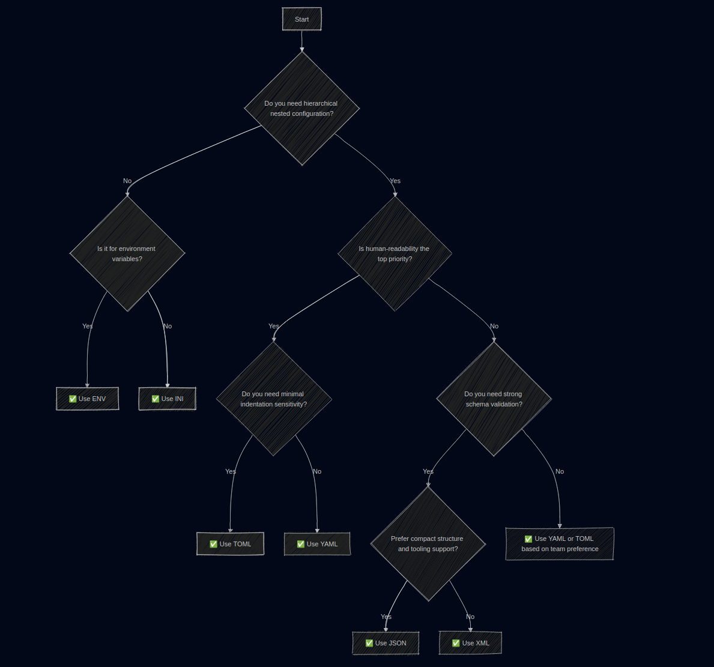

+++
title = "Configuration Format Comparison"
subtitle = "Understand INI, XML, JSON, YAML, TOML & ENV"
date = 2025-05-02T08:00:00
image = "huy-phan-yNBoyifsl5w-unsplash.jpg"
tags = ["configuration", "devops", "sre", "yaml", "json"]
+++

Huy Phan on Unsplash" alt="brown and white owl flying during daytime" >}}

In modern software development and operations, configuration files are everywhere. From defining how an application behaves to provisioning entire infrastructures via code, they are essential for making systems predictable, reproducible, and automated. They enable idempotent** **deployments, allowing teams to define the desired state once and have automation tools enforce it reliably, across environments and over time.

For DevOps engineers and Site Reliability Engineers (SREs), understanding different configuration formats is a core skill. Whether you're deploying containerized applications, fine-tuning Kubernetes manifests, setting up CI/CD pipelines, or managing cloud infrastructure, you encounter formats like INI, XML, JSON, YAML, TOML, and ENV almost daily. Each of these has its own strengths, limitations, and ideal use cases.

This article provides a practical overview of these formats, with syntax examples, a side-by-side comparison, and guidance on when to use which. Whether you’re editing a `.env` file for a Microservice or debugging a deeply nested YAML file in your Helm chart, this guide aims to help you navigate the config-file jungle.

## Choosing the Right Format: Key Considerations

Before jumping into specific formats, it’s worth highlighting a few factors that often influence the decision:

- **Audience: Clickers vs. Coders**  
  Who will be editing the configuration? If your users are business stakeholders, sysadmins, or less technical team members, they may prefer GUIs or wizards over hand-editing files. For more technical audiences, a plain-text config with version control is often the preferred solution.

- **Data Complexity**  
  If your configuration consists of simple key-value pairs (e.g., strings, booleans), flat formats like `.env` or INI might suffice. But as soon as you need structured data, lists, maps, or nested objects, you’ll benefit from formats that support hierarchical data like YAML, TOML, JSON, or XML.

- **Tooling and Language Support**  
  Favor formats that are well-supported by your application’s language or ecosystem. If a robust parser already exists, use it. Avoid creating your own parsing logic just to support a “cool” format, it’s usually not worth the effort and risk.

- **Human and Machine Usability**  
  Configuration files must serve two audiences:  
  – **Humans** need files that are easy to read, edit, and comment. Good syntax, clear error messages, and support for comments make maintenance easier.  
  – **Machines** need structured data in predictable formats that can be parsed into the right types (e.g., strings, integers, booleans, arrays) with minimal ambiguity.

- **Comment Support Matters**  
  Comments are critical for human maintainers: to explain values, toggle options, or leave future notes. Unfortunately, not all formats support them (looking at you, JSON). If inline documentation is important, this limitation can be a deal breaker.

## Quick-Reference Comparison of Configuration Formats

| Format                                                    | File Extension                                            | Human-readable                                            | Supports Comments                                         | Hierarchical Data                                         | Schema Validation                                         | Common Use Cases                                          | Drawbacks                                                 |
| --------------------------------------------------------- | --------------------------------------------------------- | --------------------------------------------------------- | --------------------------------------------------------- | --------------------------------------------------------- | --------------------------------------------------------- | --------------------------------------------------------- | --------------------------------------------------------- |
| **INI**                                                   | `.ini`                                                    | ✅ Yes                                                     | ✅ Yes                                                     | ⚠️ Limited                                                | ❌ No                                                      | Legacy apps, simple configs, Windows `.ini` files         | No nested structures, weak typing                         |
| **XML**                                                   | `.xml`                                                    | ⚠️ Verbose                                                | ✅ Yes                                                     | ✅ Yes                                                     | ✅ DTD/XSD                                                 | Java apps (Maven, Ant), config-heavy apps, SOAP           | Verbose syntax, harder to read                            |
| **JSON**                                                  | `.json`                                                   | ✅ Yes                                                     | ❌ No                                                      | ✅ Yes                                                     | ✅ JSON Schema                                             | APIs, config files for web apps, JavaScript ecosystem     | No comments, strict syntax                                |
| **YAML**                                                  | `.yaml` / `.yml`                                          | ✅ Yes                                                     | ✅ Yes                                                     | ✅ Yes                                                     | ✅ Via JSON Schema                                         | Kubernetes, Ansible, CI/CD tools (GitHub Actions, GitLab) | Whitespace-sensitive, easy to misindent                   |
| **TOML**                                                  | `.toml`                                                   | ✅ Yes                                                     | ✅ Yes                                                     | ✅ Yes                                                     | ⚠️ Limited (RFC)                                          | Rust (Cargo), Python (Poetry), Hugo sites                 | Less mature tooling, not as widely adopted                |
| **ENV**                                                   | `.env`                                                    | ✅ Yes                                                     | ⚠️ Limited (`#`)                                          | ❌ Flat only                                               | ❌ No                                                      | 12-factor apps, Docker Compose, secrets/config injection  | No nesting, no types, insecure if misused                 |

### Column Descriptions

- **Human-readable**: Is it easy for humans to read and write without special tools?

- **Supports Comments**: Can you annotate the config file for better understanding?

- **Hierarchical Data**: Does the format support nested or structured data?

- **Schema Validation**: Can it be formally validated (e.g., for correctness or structure)?

- **Common Use Cases**: Where is this format typically used today?

- **Drawbacks**: Major downsides or challenges associated with the format.

### Why This Matters

Choosing the right configuration format isn't just about personal preference, it's about tooling compatibility, team readability, and automation support. YAML, for instance, is ubiquitous in Kubernetes, while TOML is gaining traction in developer tooling thanks to Rust and Python communities. ENV files are perfect for simple environment-specific variables but quickly fall short for complex structures.

Understanding these trade-offs helps you write cleaner, safer, and more maintainable configurations.

## Format-by-Format Deep Dive

### 1\. **INI – Simple, Legacy-Friendly, but Limited**

The INI file format is one of the oldest configuration file styles in common use, dating back to MS-DOS in the early 1980s. It uses a basic key-value structure, optionally grouped into named sections, making it easy to read and edit by hand. While INI is still widely used, especially in Windows environments and simple tooling, it suffers from a lack of standardization.

Different parsers behave inconsistently: some treat all values as strings, while others attempt to auto-convert unquoted values to numbers, booleans, or nulls. There’s no built-in type safety or schema validation, and nesting beyond simple sections isn't supported, which can be limiting for complex applications.

```ini
[server]
host = localhost
port = 8080
; This is a comment
```

#### Key Traits

- Flat key-value pairs organized into optional named sections.

- Supports comments using `;` or `#`.

- No support for nested structures, arrays, or complex data types.

- Inconsistent parsing behavior across languages and libraries.

#### Use it when

- Your config is simple and flat, and readability is more important than structure.

- You're working with legacy systems, Windows applications, or tools like `git` and `.editorconfig`.

- Your application’s language has a mature INI parser, and you don’t need deep typing or nesting.

#### Avoid it if

- You need structured, nested config data.

- You require type safety or schema validation.

- Your application evolves toward more complex or machine-interpreted configuration.

### 2\. **XML – Strict, Verbose, but Powerful**

XML (Extensible Markup Language) was introduced in 1996 and quickly became the de facto standard for data interchange and configuration in enterprise systems. For over a decade, it dominated ecosystems like Java, .NET, and SOAP-based services. Although it's less fashionable today, especially with the rise of more lightweight formats like JSON and YAML, it remains relevant in domains that demand **r**igorous structure, formal validation, and tooling maturity.

Despite its capabilities, XML is often criticized for its verbosity and bloated syntax, especially when overly complex structures or deeply nested elements are used unnecessarily. That said, XML is not inherently bad, just frequently misused. When used correctly, it provides strict typing, namespaces, and schema validation (via DTD or XSD), making it a solid choice for machine-processed configurations.

```markup
<server>
  <host>localhost</host>
  <port>8080</port>
  <!-- This is a comment -->
</server>
```

#### Key Traits

- Fully supports nested, hierarchical structures.

- Offers formal schema validation via DTD or XSD.

- Includes support for comments and namespaces.

- Very strict and self-describing, ideal for machine-to-machine communication.

- Can use attributes or child elements to encode values (often a source of stylistic debates).

#### Use it when

- You need strong typing, schema validation, or document-style structure.

- You’re working in ecosystems that still rely on XML, such as Java (Maven, Ant, Spring) or SOAP-based APIs.

- You want clear, enforceable rules for configuration structure.

#### Avoid it if

- Human readability and conciseness are top priorities.

- You want simple, minimal, or developer-friendly configuration.

- Your tooling or runtime doesn't natively support XML (or requires additional parsing effort).

### 3\. **JSON – Lightweight, Structured, and Widely Used**

JSON (JavaScript Object Notation) was originally designed for data interchange, particularly in early AJAX-based web applications. Its syntax is simple, lightweight, and easily parsed by both browsers and backend services. Because of this, JSON has become a ubiquitous format, not just for APIs, but also for configuration in many modern tools and frameworks.

However, JSON has one significant limitation when used as a configuration format: it does not support comments. This might be acceptable for data exchange between systems, but it’s a serious drawback for human-maintained config files. Imagine writing application code without the ability to include inline comments, it would be frustrating, error-prone, and hard to maintain. The same applies to configuration files.

While some tools (like VS Code) support JSONC (JSON with Comments), this is not standardized and not widely supported outside specific environments.

```json
{
  "server": {
    "host": "localhost",
    "port": 8080
  }
}
```

#### Key Traits

- Clean and strict syntax with support for nested structures and arrays.

- Lightweight and easy to parse across many languages.

- No support for comments, making it harder to document configurations.

- Strict rules (e.g., no trailing commas) can trip up beginners.

- Supports schema validation via JSON Schema.

#### Use it when

- You're dealing with APIs, JavaScript/TypeScript projects, or platforms where JSON is the native config format (e.g., `package.json`, `tsconfig.json`).

- You need a machine-readable format that’s widely supported and tool-friendly.

- Your config is generated, not hand-written.

#### Avoid it if

- Your config files are maintained manually and need inline documentation or toggling options via comments.

- You want a format more human-friendly or tolerant of minor syntax issues.

- You work in environments where a lack of comment support causes maintainability issues.

### 4\. **YAML – Human-Friendly and Ubiquitous in DevOps**

YAML (YAML Ain’t Markup Language) was originally designed as a human-readable data serialization format. Though inspired by markup languages like XML, it quickly evolved into a favored format for configuration files, especially in the DevOps ecosystem.

YAML's biggest strength lies in its clean and minimal syntax, which makes it easy to read and write by hand. It supports complex, nested structures, lists, maps, and inline comments, making it extremely expressive and suitable for modern infrastructure definitions.

However, YAML can be error-prone due to its reliance on indentation for structure. Even a single misplaced space or tab can cause unexpected parsing errors, something that can be especially frustrating in large configurations. YAML also auto-converts values based on context (e.g., `yes` becomes a boolean, `2023-01-01` becomes a date), which can lead to surprising bugs if you're not careful.

```yaml
server:
  host: localhost
  port: 8080  # This is a comment
```

#### Key Traits

- Highly readable and clean syntax.

- Supports deeply nested structures, lists, and maps.

- Allows inline comments with `#`.

- Automatically converts unquoted values to native types (string, boolean, integer, float, date).

- Whitespace-sensitive, requiring consistent indentation (usually 2 or 4 spaces).

- Superset of JSON, JSON is valid YAML.

#### Use it when

- You're configuring tools like Kubernetes, Ansible, GitHub Actions, Docker Compose, or Helm.

- You want a human-friendly format for defining structured data.

- Readability and hand-editability are priorities.

#### Avoid it if

- You need strict type control or deterministic parsing behavior.

- Your config is machine-generated or machine-consumed only.

- You’re working in contexts where indentation errors could lead to outages or bugs (e.g., security-critical automation).

### 5\. **TOML – Clear Typing and Great for Developers**

TOML (Tom's Obvious, Minimal Language) was designed to be a configuration file format that is easy to read, unambiguous to parse, and friendly for both humans and machines. While it shares YAML’s goal of simplicity, TOML takes a stricter and more predictable approach: it avoids context-based surprises and does not rely on indentation for structure.

TOML emphasizes explicit typing and predictable parsing. Strings must be quoted, numbers and booleans are clearly distinguishable, and types like dates and arrays have defined, consistent syntax. This reduces ambiguity and avoids many of the "magic conversions" that can cause subtle bugs in formats like YAML.

Although it may require a few more keystrokes (e.g., always quoting strings), the result is a config format that’s easy to reason about and less prone to unexpected behavior. It’s especially popular in ecosystems that prioritize tooling and type safety, such as Rust, Python, and static site generators like Hugo.

```toml
[server]
host = "localhost"
port = 8080
# This is a comment

[database.connection]
user = "admin"
password = "secret"
```

#### Key Traits

- Designed for clarity, minimalism, and predictability.

- Supports sections, subsections (via dotted keys), arrays, and typed values like strings, integers, floats, booleans, and timestamps.

- Comments are supported using `#`.

- Indentation is ignored, allowing whitespace to be used freely for readability.

- No implicit type guessing, everything is explicit and type-safe.

#### Use it when

- You're working with developer-centric tools such as:

    - Rust’s `Cargo.toml`

    - Python’s `pyproject.toml`

    - Hugo’s site config

- You value type safety, explicitness, and human readability.

- You want a balance between minimalism and structure without YAML’s whitespace sensitivity.

#### Avoid it if

- Your toolchain or environment lacks first-class TOML support.

- You’re in a broader ecosystem (e.g., DevOps platforms) where YAML or JSON are the standard.

### 6\. **ENV – Simple and Ubiquitous for Runtime Config**

Environment variables have been a core part of operating systems and shells for decades, introduced in Unix in 1979 and DOS in 1982. They’re commonly used to externalize configuration from an application, allowing behavior to change without modifying the code or config files directly.

The `.env` file format builds on this concept by storing key-value pairs in a plain text file that can be loaded into the environment at runtime. This pattern is especially common in 12-Factor applications, containerized workloads, and tools like Docker Compose.

A typical setup involves using a shell script or `.env` loader to define variables and start the application. For example, Unix shells use `export`, while Windows uses `set`. Even if you don’t store all your configuration in environment variables, it’s common to use a single env variable to point to a config file path or toggle runtime options.

```env
HOST=localhost
PORT=8080
# This is a comment
```

#### Key Traits

- Flat structure: simple key-value pairs only, no nesting.

- String-based values (no typing or validation).

- Comments are supported using `#`.

- Often used with libraries like `dotenv` to automatically load values into the process environment.

- Common in container and cloud-native environments.

#### Use it when

- You’re building 12-Factor or cloud-native applications that externalize configuration.

- You’re using tools like Docker Compose, Heroku, or Vercel, which support `.env` files natively.

- You only need to inject simple, flat runtime values such as secrets, ports, or feature toggles.

#### Avoid it if

- You need hierarchical, typed, or structured configuration.

- Your config is complex or needs validation before runtime.

- You're managing configuration at scale across multiple services (a dedicated config service or secrets manager may be more appropriate).

### Configuration Format Decision Flowchart

```mermaid
flowchart TD
    A[Start] --> B{Do you need hierarchical (nested) configuration?}
    B -- No --> C{Is it for environment variables?}
    C -- Yes --> D[✅ Use ENV]
    C -- No --> E[✅ Use INI]
    B -- Yes --> F{Is human-readability the top priority?}
    F -- Yes --> G{Do you need minimal indentation sensitivity?}
    G -- Yes --> H[✅ Use TOML]
    G -- No --> I[✅ Use YAML]
    F -- No --> J{Do you need strong schema validation?}
    J -- Yes --> K{Prefer compact structure and tooling support?}
    K -- Yes --> L[✅ Use JSON]
    K -- No --> M[✅ Use XML]
    J -- No --> N[✅ Use YAML or TOML (based on team preference)]
```



| You need...                              | Use this format                          |
| ---------------------------------------- | ---------------------------------------- |
| Simple runtime env variables             | `.env`                                   |
| Basic legacy config                      | `.ini`                                   |
| Structured config with schema validation | `.json` or `.xml`                        |
| Human-readable config for DevOps tools   | `.yaml`                                  |
| Cleanly typed config for dev tools       | `.toml`                                  |

## Conclusion

Choosing the right configuration format is more than just picking a file extension, it's about aligning the format with your use case, team workflow, and technical requirements. Simpler formats like `.env` and INI are great for lightweight setups and legacy compatibility, while structured formats like YAML, TOML, JSON, and XML offer varying degrees of complexity, validation, and readability.

There’s no one-size-fits-all answer. YAML is a favorite in the DevOps world for its human-friendliness, TOML is gaining ground in modern development ecosystems, and XML, though verbose, still reigns in highly structured enterprise environments. JSON remains a reliable format for APIs and tooling, but its lack of comment support can be limiting for configuration. And `.env` files, while flat and type-agnostic, are the unsung heroes of runtime flexibility in containerized and 12-Factor apps.

In the end, the best configuration file is one that both humans can maintain safely and machines can process reliably. By understanding the trade-offs between readability, structure, tooling, and validation, you’ll be better equipped to make informed, maintainable choices in your projects.

Whichever format you choose, consistency, documentation, and validation are just as important as the syntax itself.

## Sources & Further Reading

- INI file – Wikipedia
- XML – W3C Specification
- JSON – Introducing JSON
- YAML – YAML 1.2 Spec
- TOML – Official TOML Language
- The Twelve-Factor App – Config

## Don’t Trust Me - Seriously

The author takes no responsibility for any mishaps, broken servers, or existential crises caused by following this information.

Found a mistake? Open an issue or PR on GitHub, or ping me on Mastodon/LinkedIn/Twitter. Let’s improve it together.

Also, this isn’t an ad - unless my enthusiasm and advocacy for cool stuff count as advertising.
