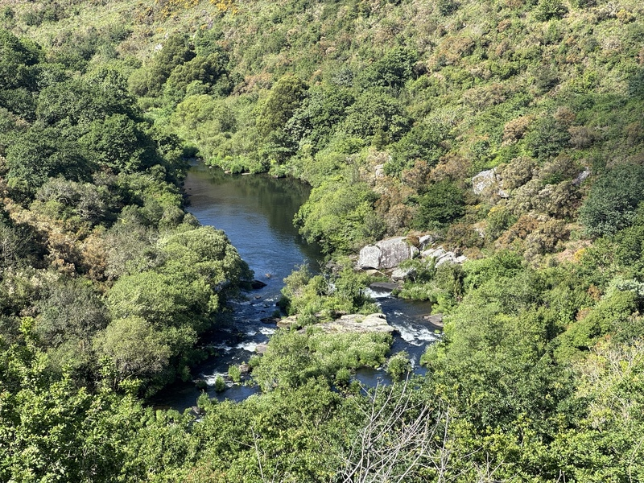
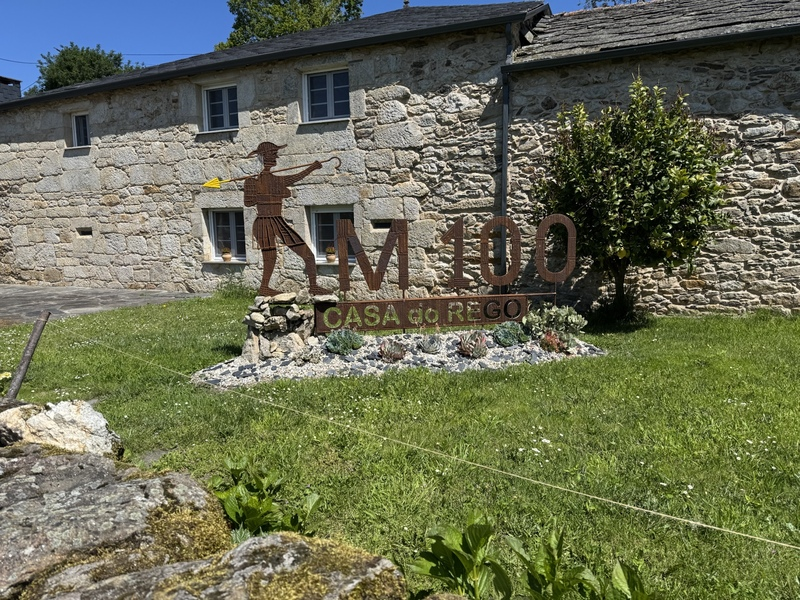

+++
title = "Walking the Camino Frances"
subtitle = "Reflections from the Way"
date = 2025-06-13T00:01:00
image = "forest.jpeg"
tags = ["camino de santiago", "camino frances", "long distance hiking", "personal growth", "digital detox"]
+++



In May 2025, I embarked on a journey I had been thinking about for quite some time: walking the Camino Frances or at least a part of it. From May 15th to May 25th 2025, I covered around 210 kilometers on foot, starting in Sarria and continuing all the way to Finisterre.

My motivation? After a stressful year working as a DevOps engineer, I felt the need to disconnect, not just from screens, meetings, and alerts, but from the constant mental noise that comes with being always online. The Camino was my chance to slow down, take a break from technology, and do something that was both physically challenging and mentally refreshing.

I wasn’t only looking for a digital detox, I was also curious to see if I could handle the physical demands of walking over 20 kilometers a day for more than a week. What followed was an experience that tested my endurance, calmed my mind, and gave me a new perspective on what it means to travel slowly and intentionally.

In this post, I’d like to share my personal impressions, the challenges I faced, the beauty I encountered, and a few lessons I learned along the way.

## Preparation and Expectations

Since I had started jogging and running the year before, I felt reasonably fit for the Camino. I didn’t follow a strict training plan, but I did a few 10 to 20 km hikes to break in my shoes and get a feel for walking longer distances with some weight on my back.

Packing was something I thought a lot about. I knew I wanted to keep things as light and minimal as possible, both for comfort and to stay mobile. In the end, I settled on one pair of long pants, two pairs of shorts, four t-shirts, hiking shoes, flip-flops, some underwear and hiking socks, and a 3-liter water bladder. Everything together added up to around 8 kg, plus the 3 liters of water, bringing my total pack weight to roughly 12 kg. Not ultralight, but manageable.

My expectations for the Camino were simple: I wanted to disconnect, slow down, and enjoy some solitude, a full mental reset. What surprised me, though, was how busy the route from Sarria to Santiago was. I hadn’t expected so many people to be walking that stretch. For me, the section from Santiago to Finisterre was actually more peaceful, more beautiful, and more in line with the kind of experience I had originally hoped for.

Another surprise: the people. I didn’t expect to meet so many kind, interesting, and genuinely helpful fellow pilgrims along the way. There was a real sense of community on the trail, a shared purpose and openness that made every encounter special.

## The Journey Day by Day

**Day 1: Sarria to Portomarín – ~26 km**

A beautiful start through green Galician countryside and rolling hills. Portomarín, rebuilt stone by stone after being flooded in the 20th century, surprised me with its charm, friendly locals, and fair prices.

**Day 2: Portomarín to Palas de Rei – ~25 km**

A steady walk through small villages and quiet forest paths. This stage felt calmer and more meditative, with fewer crowds and a good rhythm.

**Day 3: Palas de Rei to Melide – ~14 km**

A shorter but pleasant day. Melide is well known for its pulpo (octopus), a local specialty I didn’t want to miss.

**Day 4: Melide to O Pedrouzo (O Pino) – ~28 km**

A long but rewarding stretch. The terrain was gentle and the changing landscapes kept things interesting. I started to notice my body adapting to the daily distance.

**Day 5: O Pedrouzo (O Pino) to Santiago de Compostela – ~20 km**

Reaching Santiago felt surreal. The final kilometers flew by, and seeing the cathedral for the first time was emotional. Crowded, yes – but still a milestone I’ll never forget.

**Day 6: Santiago to Negreira – ~22 km**

Starting the extension to Finisterre brought a new kind of peace. The crowds thinned, the vibe changed, and the trail felt more intimate again.

**Day 7: Negreira to Mazaricos (near Lago or Santa Mariña) – ~30 km**

This day was long and physically demanding, with some steep sections, but also incredibly quiet and full of natural beauty. A real test of endurance.

**Day 8: Mazaricos to Cee – ~25 km**

The first glimpse of the ocean near the end of this stage gave me goosebumps. Walking downhill into Cee felt like arriving at the edge of the world.

**Day 9: Cee to Finisterre – ~13 km**

The last stretch to the “end of the world.” Standing at the lighthouse in Finisterre, looking out over the Atlantic, was both grounding and freeing. I had made it – and I could feel it in every step.

## Physical and Mental Challenges
The biggest challenge for me started after passing the 20 km mark each day. Around 20 to 25 km, my feet began to hurt, and after that, everything became tough, every step felt heavier. On Day 5, I developed two small blisters. I patched them up with blister plasters, but I’m pretty sure they happened because my hiking shoes hadn’t been broken in enough. They simply weren’t ready for the daily strain of long-distance walking.

One thing I didn’t expect: going downhill was often more painful than climbing up. The constant pressure on knees and toes, especially with a heavy backpack, really wore me out. Steep descents after a long day were brutal, physically harder than any uphill section I faced.

By Day 6, the digital detox had fully kicked in and with it came a kind of emotional crash. Without distractions, I had no choice but to confront myself. The physical exhaustion made it even more intense. I remember walking and asking myself: What have I been doing these past years? Who even am I when everything is stripped away?

But that’s where the Camino works its quiet magic. Thanks to the kind people I met along the way, people who shared stories, encouragement, and sometimes just a smile, I found my footing again, emotionally and mentally.

Now, writing this two weeks later, I can honestly say: I want to do another long-distance hike. Despite the pain, or maybe even because of it, this experience left something in me that’s hard to describe and impossible to forget.

## Lessons Learned and Personal Insights
One of the most important things I learned on the Camino was something about myself: I'm an emotional person and that's okay. In the quiet hours of walking, I realized how often I put others first, how often I say “yes” just to be helpful, to be considerate, or simply to avoid conflict. But over time, that takes a toll.

This journey reminded me that it’s not selfish to take time for myself. In fact, it's necessary. I need space to breathe, to recharge, to ask myself where I’m headed, not just professionally, but personally. Saying "no" doesn't mean I care less. It means I value my own energy and direction.

Walking day after day, with nothing but my thoughts and the trail, gave me the chance to reflect deeply on where I’ve been and where I want to go. It wasn’t always easy, sometimes it was raw, even painful, but it was real. And that’s what I had been missing in the noise of everyday life.

## Practical Tips for Future Pilgrims
If there’s one thing you should get right before setting out on the Camino, it’s your footwear. Good hiking shoes and proper hiking socks make all the difference. I saw many people struggling with blisters, bruised toenails, or worse, simply because they underestimated how critical it is to wear well-fitted, broken-in shoes. Don’t make that mistake. Test your shoes on long walks well before the Camino starts, and invest in quality hiking socks to avoid friction.

A secret weapon I highly recommend: deer tallow cream (Hirschtalg Creme). Start applying it to your feet daily at least a week before the hike and continue to use it every evening after each stage. It keeps the skin soft and reduces the chance of blisters and cracks, your feet will thank you. I also brought a cooling cream for sore knees and muscles, which was a lifesaver on longer days or after steep descents.

Looking back, I’d also reduce the weight of my backpack. Next time, I’d bring only one pair of long pants and one pair of shorts. I also carried a 3-liter water bladder, but realistically, 2 liters would have been more than enough, especially with plenty of cafés, fountains, and places to refill water along the way. Every extra kilogram really adds up when you're walking 20+ kilometers a day.

One digital tool I can highly recommend, even on a digital detox,  is the Camino Ninja app. It’s a fantastic companion for planning your stages, finding albergues (hostels), tracking distances, and navigating route options. Offline maps and elevation profiles are especially helpful when phone signal is weak.

Here are a few more tips that helped me or that I wish I had known earlier:

- Travel light: The golden rule is pack less than you think you'll need. Your body will thank you later.
- Start slow: Don’t push yourself too hard in the first days – let your body ease into the rhythm.
- Take care of your feet: Air them out during breaks, change socks if they get damp, and stop immediately if you feel a hotspot.
- Cash is king: Some small towns and cafés don’t accept cards, so always carry some euros.
- Earplugs and a sleep mask: Essential for getting decent rest in shared hostel dorms.
- Don't overplan: Leave some flexibility in your daily stages. The Camino is full of surprises, and sometimes the best experiences come when you least expect them.

Above all, remember that this isn’t a race. Everyone walks their own Camino. Respect your limits, take in the scenery, talk to fellow pilgrims – and let the journey unfold in its own way.

## Conclusion
Taking time for yourself, real time, away from screens, obligations, and constant pressure, is one of the most valuable gifts you can give yourself. The Camino gave me exactly that: space to breathe, to reflect, to connect with myself and others in a simple, honest way.

I truly believe everyone should experience a long-distance hike at least once in their life. It doesn’t have to be the Camino, any trail that lets you slow down and step away from your routine can be life-changing. But if I had the time, I’d walk the Camino again, this time the full Camino Francés, or maybe the Camino Portugués along the coast.

As the saying goes:
"You don't walk the Camino to find answers – you walk it to find the right questions."

So if you’re feeling stuck, burned out, or just curious what you might discover out there, maybe it’s time to lace up your boots and start walking. Your path is waiting.

