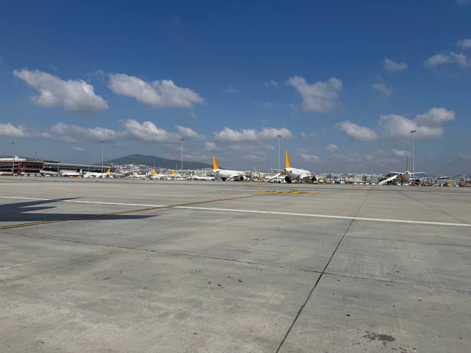

+++
title = "A weekend in Istanbul for a wedding"
date = 2025-09-13T00:01:00
image = "maltape.JPEG"
tags = ["Vacation", "Istanbul", "TurkishWedding", "TravelNotes"]
+++

Istanbul greets you in motion, ferries gliding across the Bosphorus, trams chiming past tea shops, and that steady city hum that never quite goes quiet. I based myself on the Asian side, in Maltepe, close enough to the shoreline that the sea breeze felt like a standing invitation to wander.

## Arrival

Landing at Sabiha Gökçen (SAW) was smooth: spotless terminal, friendly staff, no fuss. Outside, the taxi stand felt… lively. One driver quoted €60 to my hotel, another €40, a third €50. I phoned a friend to sanity‑check; he laughed and told me to install [bitaksi](<https://apps.apple.com/de/app/bitaksi-your-closest-taxi/id589500723?l=en-GB> "bitaksi"), ensure the meter is on, and, if I wanted quicker pickups, add a small default tip in the app. Five minutes later I had a metered ride to Maltepe for about €20.
> **Tip:** In Istanbul use bitaksi or official yellow taxis with the meter running. You can also toggle a small tip in the app to secure faster pickups.

## Location & Hotel

By the time I reached the hotel, the heat hit like an oven door opening, the kind of summer day that makes shade a sacred place. I’d flown in wearing long pants and a light shirt from Germany; stepping into blessed air‑conditioning felt like a small miracle.

Check‑in was straightforward. We bridged a small English–Turkish gap with smiles, a few words, and the universal language of Google Translate. Minutes later, I was in a clean, quiet, beautifully cool room, time to freshen up before the evening pickup.

I stayed in Maltepe, on Istanbul’s Asian side. The Maltepe Sahil Parkı (seaside park) was about a five‑minute walk away, miles of flat promenade along the Sea of Marmara, perfect for cycling, jogging at sunrise, or an easy evening stroll among families and fishermen. Cafés and the neighbourhood centre were just around the corner, so grabbing water, simit, or a quick espresso was effortless.

> **Tip:** Summer can be humid. A lightweight outfit and a refillable bottle make life easier; most parks have kiosks for cold water.

## Pickup and a night in Kadıköy

Two hours after I’d checked in, my best friend swung by. We had two evenings before the wedding, so we headed to Kadıköy, a lively tangle of markets, meyhanes, indie bars, record shops, and street food.

We started with the essentials: meze and grilled goodness, the kind of simple Turkish food that makes you wonder why tomatoes elsewhere don’t taste like tomatoes. Then we went looking for a dance floor. That’s when we learned a local lesson: many clubs on the Asian side run couples‑only policies on busy nights to keep the crowd balanced. One doorman offered to let us in if we bought a bottle for €200. Easy pass. Instead, we drifted through side streets toward Moda, trying a craft‑beer spot, a small meyhane, and finally tea by the water, our kind of bar hopping.

> **Tip:** For clubs in Istanbul (especially on weekends), go earlier, bring ID, and arrive as a mixed group. If you’d rather skip the door drama, Kadıköy’s meyhanes and live‑music bars are perfect for a long, easy night.

## The day before the wedding

With one night to go, my friend picked me up around lunchtime and we made for Bağdat Caddesi (Bağdat Cd.), a long, leafy shopping avenue on the Asian side. It’s kilometre after kilometre of boutiques, bakeries, and cafés. We crossed off the last errands: a small gift, cufflinks, and a quick shirt press. Lunch was simple and perfect, meze, çay, and something hot off the grill, then we called it early.

I headed back to Maltepe Sahil Parkı for a sunset walk. Runners and families drifted by, the Sea of Marmara went glassy, and the air cooled just enough to call it a night. Early to bed, ready for the big day.

> **Tip:** If you need last‑minute shirt pressing or small fixes, neighbourhood dry‑cleaners often do same‑day service.

## The wedding on Sedef Adası

I packed a small backpack for an island wedding at Sedef Adası Plajı. Our boat left around noon, so I wore light, breathable clothes, it was already warm and carried my suit. I’d brought it from Germany but forgot the garment bag, so the hotel kindly lent me a hanger. And yes, I tossed in swim trunks.

On arrival, we dropped our things in a storage room with changing cabins. First order of business: something cold to drink, a plate of snacks, and a quick swim. Then it was time for the groom’s photo session, I helped him into the suit, straightened a lapel, fixed a cufflink, before changing into mine. As guests kept arriving, we moved into the flow of group photos and hugs.

The ceremony took place right on the beach: soft surf, a steady breeze, and the kind of vows that make even the joking friends go quiet for a minute. Short, heartfelt, and beautiful.

Dinner followed at the restaurant just above the sand, meze, grilled plates, and the obligatory baklava. Then the music took over. The dance floor filled and never really emptied; family made sure you ate, then made sure you danced, then made sure you ate again.

We spilled into an outdoor after‑party with more music and laughter and, at one point, a surprise champagne shower. Time bent; somewhere around 1:00 a.m. we boarded the boat back to the city. A celebratory döner on the way to the hotel was the perfect full‑stop.

> **Tip:** For an island wedding, pack light but smart: sunscreen, flip‑flops, a small towel, and something breathable for the day. Check the boat times, and bring a little cash for extras.

### My toast (just for fun)

> Dear friends and family,
>
> I’ve known Dan since our school days and if you survive that together, you’re basically family for life. Back then we already knew that one day he would find the right woman… we just didn’t know how many stamps in his passport it would take until then.
>
> Daniel was always the one who traveled a lot, and no one ever really knew what his next step would be. That’s why it makes me so happy to see him today, not just finding the right woman, but also a home where he feels truly comfortable.
>
> And that woman is you, Ceyda. You’ve not only made Dan happier, but you’ve also managed to make him look a little more put together, which is quite an achievement.
>
> Daniel, today you married your better half and we’re all grateful that Ceyda sees it the same way.
>
> So let’s raise our glasses: to love, to friendship, and to a marriage that lasts at least as long as our friendship, just with fewer bad jokes.
>
> Cheers!

## The last day

On my last day I learned a simple lesson: staying in Maltepe was perfect for the island boat, but it's a trek to the big‑name sights on the European side - Hagia Sophia, Blue Mosque (Sultanahmet Mosque), Topkapı Palace, Grand Bazaar (Kapalı Çarşı), Galata Tower and more. With only two main bridges and one road tunnel, crossing by taxi can take a long time when traffic builds; ferries and the metro are almost always the better choice.

I picked up an Istanbulkart and topped it up at a station. It works on ferries, trams, metro and the Marmaray suburban line. My regular contactless card didn’t work on Marmaray, so having the Istanbulkart mattered.

> **Tip:** Summer sightseeing is easiest early morning or after sunset. Many shops and smaller museums open around **09:30–10:00**, so there’s no rush at dawn.

In the afternoon I headed to visit the bride’s family, I’d been invited and didn’t want to miss it. They were warm, generous, and funny; within an hour I felt like a cousin.

> **Tip:** Crossing continents? Take a ferry or Marmaray if you can, load a little extra onto your Istanbulkart, and build buffer into your schedule — the Bosphorus has its own idea of time.

## What i learned

- **Base yourself near the sights.** If you want to tick off the big‑name landmarks (Hagia Sophia, Blue Mosque, Topkapı Palace, Grand Bazaar, Galata Tower), staying on the European side cuts travel time. For mosque visits, dress modestly (covered shoulders/knees; headscarf for women).

- **Move smart.** Use an Istanbulkart for ferries/metro/Marmaray and [bitaksi](<https://apps.apple.com/de/app/bitaksi-your-closest-taxi/id589500723?l=en-GB> "bitaksi") for cabs. In taxis, make sure the meter is on; the app helps you avoid "tourist quotes."

- **People are kind.** A few Turkish words (*merhaba*, *teşekkürler*) open a lot of doors.

- **Traffic is assertive.** Cross at lights or overpasses and don’t assume cars will yield.

- **Plan your rhythm.** Three - four days is a sweet spot for Istanbul. Next time I’ll pair it with a few days on the coast (Bodrum, Çeşme, or Datça).

- **Confirm prices up front.** Ask for a menu with prices, agree on costs before tours or activities and feel free to walk away from pushy offers.

## Conclusion

I came for a wedding and left with a city under my skin. Istanbul is motion and hospitality, salt air, late‑night laughter, and a dance circle that keeps pulling you back in. My friends and both of your families, thank you for folding me into the celebration, *misafirperverlik* at its finest.

I didn’t see everything; I don’t want to. It gives me a reason to return: a ferry at sunset, a slow morning in Sultanahmet, another long walk in Maltepe and, if I’m lucky, one more circle dance under string lights. If you get the invitation, whether to a wedding or simply to visit, say yes. Istanbul will take good care of you.