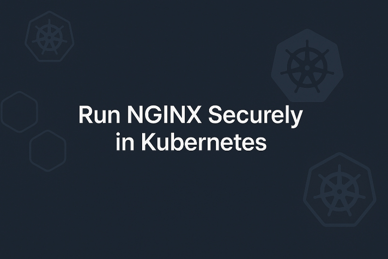

+++
title = "Run NGINX Securely in Kubernetes"
subtitle = "Why You Should Stop Using the Default Image"
date = 2025-10-07T04:00:00
image = "runnginx-small.jpg"
tags = ["Kubernetes", "nginx", "Container", "Podman", "Security"]
+++



When deploying NGINX in Kubernetes, many teams still use the default `nginx` image from Docker Hub, it’s what most quick-start examples show, so it feels natural.  

But there’s a hidden problem: that image runs as `root` by default.  
  
That might not sound dangerous at first, after all, containers are isolated, right?  
Not exactly. Root inside a container is still root inside the pod, and if that container is compromised, the attacker can have elevated privileges within your Kubernetes node.  
  
Let’s unpack why this matters and how to fix it properly.

# Why Running as Root Is a Problem

Even though Kubernetes provides a strong isolation model, it doesn’t make root privileges inside containers harmless. Running workloads as root leads to multiple issues:

- **Privilege escalation risks** – if someone exploits a vulnerability or breaks out of the container, they can access the underlying node with root privileges.
- **Policy violations** – clusters enforcing Pod Security Standards (PSS) or using policy engines like Kyverno, OPA Gatekeeper, or runtime tools like Falco will flag or block root containers.
- **Principle of least privilege violation** – security best practice dictates that each workload should run with only the permissions it needs. Running as root violates this fundamental concept.

There’s also a practical issue that appears in hardened environments:  
The default NGINX image expects write access to `/var/run/nginx.pid`, a root-owned path.  
This makes it incompatible with security features like a read-only root filesystem, which many production clusters enforce.

## The Safer Alternative: `nginxinc/nginx-unprivileged`

The NGINX team maintains an alternative image built specifically for containerized, restricted environments:

- https://hub.docker.com/r/nginxinc/nginx-unprivileged

This image runs NGINX as a non-root user (UID 101) and plays nicely with Kubernetes security contexts.
It’s a drop-in replacement for most use cases and immediately resolves the issues above.

### Key Differences

| Feature                         | Default `nginx`                 | `nginxinc/nginx-unprivileged`   |
| ------------------------------- | ------------------------------- | ------------------------------- |
| Default user                    | root                            | UID 101 (non-root)              |
| Default port                    | 80 (privileged)                 | 8080 (unprivileged)             |
| PID file path                   | `/var/run/nginx.pid`            | `/tmp/nginx.pid`                |
| Temp directories                | `/var/cache/nginx`, `/var/run/` | `/tmp/`                         |
| `user` directive in config      | Present                         | Removed                         |

These differences allow the unprivileged image to comply with strict PodSecurity, Kyverno, or Falco rules, without extra workarounds.

## Example: Secure NGINX Deployment in Kubernetes

Here’s a simple Deployment manifest using the secure image:

```yaml
apiVersion: apps/v1
kind: Deployment
metadata:
  name: nginx
spec:
  replicas: 1
  selector:
    matchLabels:
      app: nginx
  template:
    metadata:
      labels:
        app: nginx
    spec:
      containers:
        - name: nginx
          # Replace with actual version
          image: nginxinc/nginx-unprivileged:alpine-slim
          ports:
            # Note: port 8080 is used instead of 80 because binding to ports <1024 requires root
            - containerPort: 8080
          securityContext:
            runAsNonRoot: true
            runAsUser: 101
            readOnlyRootFilesystem: true
            allowPrivilegeEscalation: false
```

In this setup:

- NGINX runs as UID 101, not root.
- It listens on port 8080, avoiding privileged port binding.
- It works with a read-only root filesystem out of the box.
- It passes strict PodSecurityAdmission** and Kyverno policies automatically.

No initContainers.
No hacks.
No policy violations.
Just safer defaults.

## Why This Matters for Kubernetes Security

Running containers as non-root isn’t just a “nice-to-have”, it’s a critical step in Kubernetes hardening.  

It reduces the blast radius of a potential compromise and aligns with widely accepted security benchmarks, such as the CIS Kubernetes Benchmark and the NSA/CISA Kubernetes Hardening Guide.

When you adopt the unprivileged NGINX image, you:
- Eliminate the need for special PodSecurity exemptions
- Simplify your compliance posture
- Prevent writable root filesystems
- Strengthen your defense-in-depth model

## Final Thoughts

If you’re deploying NGINX in Kubernetes, stop using the default image — it’s not designed for modern, secure cluster environments.
Instead, use `nginxinc/nginx-unprivileged`.

It’s a minimal change that delivers maximum benefit:  
**a safer, policy-compliant, and production-ready NGINX deployment.**

## Conclusion

The default nginx image might work fine for quick demos, but it’s not built for production-grade Kubernetes environments.
Running as root introduces unnecessary risk, breaks modern PodSecurity policies, and conflicts with best practices like read-only filesystems.

Switching to nginxinc/nginx-unprivileged solves all of that: it runs as a non-root user (UID 101), listens on port 8080, and aligns perfectly with Kubernetes security features such as runAsNonRoot, readOnlyRootFilesystem, and restricted admission policies.

It’s a tiny change in your manifests, yet it brings a huge improvement in security, compliance, and maintainability.
If you’re running NGINX in Kubernetes, make the unprivileged image your default — your cluster (and your security team) will thank you.

If you found this helpful, consider sharing it with your team and let’s keep making Kubernetes workloads a little safer, one container at a time.

# Sources & Further Reading
- Official NGINX Unprivileged Image
- NGINX Documentation: Running as a Non-Root User
- Kubernetes Pod Security Standards (PSS)
- CIS Kubernetes Benchmark
- Kubernetes Documentation: Container Security Contexts
- NSA, CISA release Kubernetes Hardening Guidance

## Don’t Trust Me - Seriously

The author takes no responsibility for any mishaps, broken servers, or existential crises caused by following this information.

Found a mistake? Open an issue or PR on GitHub, or ping me on Mastodon/LinkedIn/Twitter. Let’s improve it together.

Also, this isn’t an ad - unless my enthusiasm and advocacy for cool stuff count as advertising.
