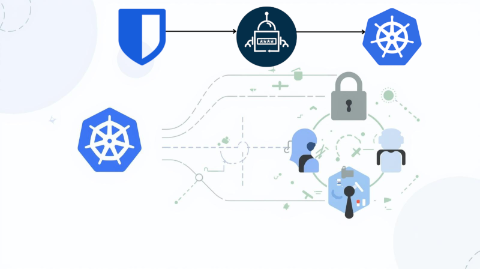

+++
title = "Using Bitwarden Secrets Manager with Kubernetes"
subtitle = "Lessons Learned"
date = 2026-01-17T04:00:00
image = "kubeenetes-secrets-manager2.png"
tags = ["Kubernetes", "DevOps", "Security", "Secrets"]
+++



Managing secrets in Kubernetes is one of those topics that looks simple at first and slowly becomes more opinionated the 
deeper you go. Over time, tooling choices start to matter less in theory and much more in day-to-day operations.

Recently, I spent some time evaluating how well Bitwarden Secrets Manager 
integrates with Kubernetes and what actually works well in practice.

This post documents my experience testing the Bitwarden sm-kubernetes 
operator, why I ultimately didn’t use it (for now), and why External Secrets Operator
turned out to be a better fit for my setup.

I deliberately approached this from a pragmatic angle. I wasn’t looking for the most feature-rich solution, 
but for something that integrates cleanly into Kubernetes without adding unnecessary operational complexity, especially 
in smaller clusters and homelab environments.

## Context: Bitwarden, Kubernetes, and real-world constraints

I’m using Bitwarden Secrets Manager as my central secrets backend. It’s simple, reliable, and does exactly what I need, 
without the operational overhead of running a full-fledged secrets management platform.

In Kubernetes environments, the obvious question becomes:  
**How do I get those secrets into my workloads safely and maintainably?**

I deliberately wanted to avoid:

- running HashiCorp Vault in my homelab
- introducing complex bootstrap dependencies
- maintaining yet another critical control-plane component

Because of that, the Bitwarden Secrets Manager Kubernetes operator (sm-kubernetes) 
was the first thing I looked at.

On paper, it looked like the most direct and native way to integrate Bitwarden Secrets Manager with Kubernetes.

## Testing the Bitwarden sm-kubernetes operator

The sm-kubernetes operator is well-designed and easy to get started with. From a functional point of view, it does what it promises:

- native integration with Bitwarden Secrets Manager
- clear CRDs
- predictable reconciliation behavior
- no unnecessary abstractions

From a feature perspective, I actually like the operator. It feels clean and focused.

However, once you move beyond a single namespace or toy cluster, a structural issue becomes apparent.

## The problem: Token per namespace

With the Bitwarden Secrets Manager Kubernetes operator, a Bitwarden access token must be deployed as a Kubernetes Secret 
in **every namespace** that consumes secrets.

There is a long-standing open issue in the project (#117) 
that boils down to this:

> Each Kubernetes namespace requires its own Bitwarden access token.

At first glance, this may not sound dramatic. In practice, it introduces several problems:

### 1. Operational overhead

Every namespace needs:

- a Bitwarden token Secret (even if the same token is reused)
- lifecycle management (rotation, revocation, documentation)

As the number of namespaces grows, this quickly becomes repetitive and error-prone.

### 2. Increased security surface area

More tokens and Secrets mean:

- more credentials to rotate
- more sensitive data stored in-cluster
- more opportunities for misconfiguration

Ironically, a setup intended to improve secrets management can end up increasing the number of sensitive artifacts that 
need to be handled carefully.

### 3. Poor scalability characteristics

In multi-tenant or more structured environments, the token-per-namespace model does not scale well, especially 
when namespaces are created dynamically.

None of this is a dealbreaker for very small clusters, but it becomes a noticeable friction point in real-world setups.

This shifts complexity from the platform layer to application namespaces, where it is harder to reason about and enforce consistently.

## Switching to External Secrets (with Bitwarden)

Because of that limitation, I decided to try the External Secrets Operator with Bitwarden Secrets Manager.

And honestly, it works really well.

What immediately stood out:

- a single, centralized Bitwarden integration
- no per-namespace token sprawl
- a clear separation between secret backend access and namespace consumption
- mature reconciliation and refresh semantics

External Secrets effectively acts as an abstraction layer between Kubernetes and the secrets backend. Bitwarden remains the single source of truth, 
while Kubernetes does not need to care how secrets are fetched or refreshed internally.

From an operational perspective, this setup feels noticeably calmer:

- fewer moving parts
- fewer credentials to manage
- clearer ownership boundaries

This aligns well with environments where operational simplicity and predictability matter more than maximizing feature depth.

## Why this matters (especially in homelabs and small clusters)

A lot of Kubernetes advice is written with large enterprises in mind, often assuming dedicated platform and security teams. 
In reality, many of us operate:

- homelabs
- small or personal clusters
- consulting or side projects
- environments where you are the SRE, security team, and incident responder at the same time

In those setups, simplicity is not a limitation, it’s a feature.

Bitwarden Secrets Manager combined with External Secrets hits a practical sweet spot:

- no Vault to maintain
- no heavy bootstrap or operational dependencies
- no namespace-level credential explosion

That tradeoff is absolutely worth it for me.

For my use cases, this balance between security, simplicity, and maintainability matters more than adopting the most feature-rich solution available.

## Final thoughts

To be clear: this is not a criticism of the Bitwarden sm-kubernetes operator.

It’s a solid project, and once the namespace-level token limitation is addressed, I’d be happy to reevaluate it.

For now, however, the combination of:

- Bitwarden Secrets Manager
- External Secrets Operator
- Kubernetes-native workflows

is the most pragmatic solution for my needs.

Sometimes the best architecture isn’t the most “correct” one, it’s the one that stays boring in production.

# Sources & Further Reading

- External Secrets
- Bitwarden support using webhook provider
- Bitwarden Secrets Manager Kubernetes Operator
- Feature request: add secretNamespace in BitwardenSecret spec.authToken #117
- bitwarden.com/
- Secrets Manager Overview

## Don’t Trust Me - Seriously

The author takes no responsibility for any mishaps, broken servers, or existential crises caused by following this information.

Found a mistake? Open an issue or PR on GitHub, or ping me on Mastodon/LinkedIn/Twitter. Let’s improve it together.

Also, this isn’t an ad - unless my enthusiasm and advocacy for cool stuff count as advertising.