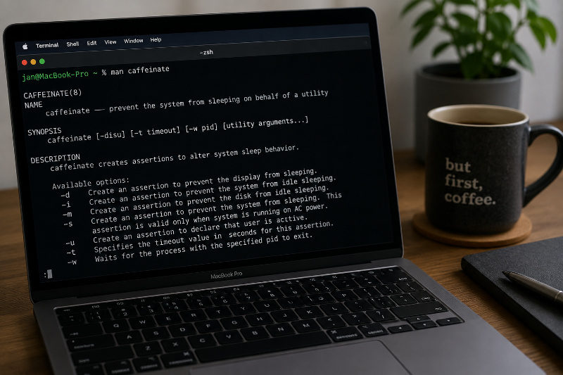

+++
title = "Keeping your Mac awake with caffeinate"
subtitle = "A Small macOS Command Worth Remembering"
date = 2026-07-25T04:00:00
image = "caffeinate.jpg"
tags = ["Apple", "macOS", "Terminal", "CLI", "Productivity"]
+++





Sometimes a long-running command needs more time than expected. You start a build, download, backup or migration, 
leave your desk for a coffee and return only to discover that your Mac went to sleep somewhere along the way.

Of course, you could temporarily change the sleep settings in macOS. But then you also have to remember to change them back afterward.

macOS already includes a small command-line utility for exactly this situation:

```shell
caffeinate
```

As the name suggests, `caffeinate` gives your Mac a temporary virtual coffee and prevents it from going to sleep.

> caffeinate prevents the selected idle sleep behavior. It does not generally override manually putting the Mac to sleep or closing a MacBook’s lid.

In this article, we’ll look at:

- What `caffeinate` does
- How its different assertion flags work
- How to keep the Mac awake for a specific duration
- How to keep it awake while another command is running
- Which form I would use for most terminal workflows

## What does `caffeinate` do?

`caffeinate` creates power-management assertions that temporarily change the sleep behavior of macOS.

An assertion is essentially a request to the operating system:

> Please do not enter this particular sleep state while I am still working.

When you run `caffeinate` without any options, it prevents the Mac from entering idle system sleep:

```shell
caffeinate
```

The command continues running in the foreground. Its assertion remains active until the process exits.

To stop it, press:

```text
Ctrl+C
```

This is useful when you simply want to keep the Mac awake for an unknown amount of time. However, there are more precise ways to use it.

## The basic Syntax

The command follows this general structure:

```shell
caffeinate [options] [utility arguments...]
```

There are three common ways to use it:

```shell
# Keep the Mac awake until caffeinate is stopped
caffeinate

# Keep the Mac awake for a fixed duration
caffeinate -i -t 3600

# Keep the Mac awake while another command runs
caffeinate -i <command>
```

The third form is usually the most convenient for builds, backups and other long-running terminal commands.

## Understanding the Assertion Flags

The available flags control which type of sleep behavior should be prevented.

### Prevent Display Sleep with `-d`

The `-d` flag prevents the display from sleeping:

```shell
caffeinate -d
```

This can be useful when you need to watch a dashboard, terminal output or presentation without interacting with the Mac.

It does not automatically mean that every other kind of sleep is prevented. It specifically creates an assertion for the display.

### Prevent Idle System Sleep with `-i`

The `-i` flag prevents idle system sleep:

```shell
caffeinate -i
```

This is the option I would use for most long-running terminal tasks.

It allows the display to turn off while keeping the system awake, so the build, download or backup can continue in the background.

Running `caffeinate` without an assertion flag has the same default behavior:

```shell
caffeinate
```

Being explicit can still make a command easier to understand when you return to your shell history several months later:

```shell
caffeinate -i
```

### Prevent Disk Idle Sleep with `-m`

The `-m` flag prevents disks from entering idle sleep:

```shell
caffeinate -m
```

This may be useful for disk-intensive operations, although for most modern workflows, preventing system idle sleep with `-i` is usually the more relevant option.

### Prevent System Sleep on AC Power with `-s`

The `-s` flag creates an assertion that prevents system sleep while the Mac is connected to AC power:

```shell
caffeinate -s
```

However, this assertion is only valid while the Mac is connected to AC power.

That makes it useful for a MacBook running a long task while connected to its charger:

```shell
caffeinate -s make
```

If the machine is running on battery, this assertion does not provide the same protection.

### Declare User Activity with `-u`

The `-u` flag tells macOS that the user is currently active:

```shell
caffeinate -u
```

If the display is off, this can turn it back on and temporarily prevent display idle sleep.

Without an explicit timeout, this assertion only lasts for five seconds. It is therefore commonly combined with `-t`:

```shell
caffeinate -u -t 30
```

This declares user activity for 30 seconds.

Unlike `-i`, this is not the option I would normally choose for long builds. Its purpose is closer to simulating recent user activity.

## Combining Multiple Assertions

The flags can be combined when you want to prevent more than one type of sleep behavior.

For example, the following command keeps both the display and the system awake:

```shell
caffeinate -di
```

You can also write the flags separately:

```shell
caffeinate -d -i
```

Both commands create the same assertions.

Another example would be:

```shell
caffeinate -dims
```

This prevents display sleep, idle system sleep and disk idle sleep, while also preventing system sleep when connected to AC power.

In practice, enabling every assertion is rarely necessary. I prefer selecting only the behavior that the task actually requires.

## Keep the Mac Awake for a Specific Duration

The `-t` option specifies how long the assertion should remain active.

The timeout is provided in seconds:

```shell
caffeinate -i -t 3600
```

This prevents idle system sleep for one hour.

Some useful durations are:

```shell
# 15 minutes
caffeinate -i -t 900

# 30 minutes
caffeinate -i -t 1800

# 1 hour
caffeinate -i -t 3600

# 2 hours
caffeinate -i -t 7200
```

Instead of calculating larger values manually, the shell can do the calculation:

```shell
# Keep the Mac awake for three hours
caffeinate -i -t $((3 * 60 * 60))
```

This is easier to read than remembering that three hours equals 10,800 seconds.

One important detail is that the timeout is not used when `caffeinate` starts another utility. In that case, the assertion follows the lifetime of the command instead.

## Keep the Mac Awake While a Command Runs

This is probably the most useful way to use `caffeinate`.

Place the command that you want to run after `caffeinate`:

```shell
caffeinate -i make
```

`caffeinate` starts `make` and keeps the idle-sleep assertion active for as long as the command is running.

When `make` exits, the assertion is automatically released.

That means there is no timeout to estimate and no separate `caffeinate` process to stop afterward.

### Nix Build

For a long-running Nix build:

```shell
caffeinate -i nix build .#darwinConfigurations.my-mac.system
```

The Mac remains awake until the Nix build finishes or fails.

### Nix-Darwin Rebuild

For a system rebuild:

```shell
caffeinate -i darwin-rebuild switch --flake .
```

This can be useful when a large dependency tree needs to be compiled locally.

### File Copy with `rsync`

For a larger backup or file transfer:

```shell
caffeinate -i rsync -avh --progress ~/Documents/ /Volumes/Backup/Documents/
```

The assertion ends automatically when `rsync` exits.

### Watching Kubernetes Logs

For a longer debugging session:

```shell
caffeinate -i kubectl logs --follow deployment/my-application
```

In this example, the Mac remains awake until the log-following process is stopped with `Ctrl+C`.

### Running a Shell Script

You can also wrap an entire script:

```shell
caffeinate -i ./backup.sh
```

Everything executed by the script can continue while the Mac is otherwise idle.

## Wait for an Existing Process

Sometimes a command is already running before you remember to use `caffeinate`.

The `-w` option accepts a process ID and keeps the assertion active until that process exits:

```shell
caffeinate -i -w 12345
```

In this example, `12345` is the process ID.

You can find process IDs with tools such as `pgrep`:

```shell
pgrep -fl nix
```

After identifying the correct process, pass its PID to `caffeinate`:

```shell
caffeinate -i -w 12345
```

For a command with exactly one matching process, this can also be combined:

```shell
caffeinate -i -w "$(pgrep -n nix)"
```

Be careful with broad `pgrep` patterns. When several matching processes exist, it is better to inspect the result first instead of attaching `caffeinate` to the wrong process.

The `-w` option is ignored when you also provide a utility directly. These are therefore two separate usage patterns:

```shell
# Start a new command through caffeinate
caffeinate -i make
```

```shell
# Attach the assertion to an existing process
caffeinate -i -w 12345
```

## Checking Active Power Assertions

macOS provides the `pmset` command for inspecting power-management settings and assertions.

To see the currently active assertions, run:

```shell
pmset -g assertions
```

While `caffeinate -i` is running, the output should contain an active idle-sleep assertion associated with the `caffeinate` process.

This is useful when you want to verify why a Mac is not sleeping or confirm that your command is still protected.

## My Preferred Usage

For most long-running terminal commands, I would wrap the command directly:

```shell
caffeinate -i <command>
```

For example:

```shell
caffeinate -i nix build .#package
```

This has several advantages:

- The Mac stays awake only while the command is running.
- The assertion is released automatically.
- No timeout needs to be estimated.
- There is no separate background process to remember.
- The intention remains visible in the shell history.

When I do not have a specific command to wrap, I use a fixed timeout:

```shell
caffeinate -i -t $((2 * 60 * 60))
```

Keeping the display awake with `-d` is only necessary when I actually need to see it:

```shell
caffeinate -di
```

Otherwise, allowing the display to sleep saves energy while the system continues working.

## Useful Commands at a Glance

```shell
# Prevent idle system sleep until stopped
caffeinate
```

```shell
# Explicitly prevent idle system sleep
caffeinate -i
```

```shell
# Keep the system and display awake
caffeinate -di
```

```shell
# Keep the system awake for one hour
caffeinate -i -t 3600
```

```shell
# Keep the system awake for three hours
caffeinate -i -t $((3 * 60 * 60))
```

```shell
# Keep the system awake while a command runs
caffeinate -i <command>
```

```shell
# Keep the system awake until an existing process exits
caffeinate -i -w <pid>
```

```shell
# Inspect active power assertions
pmset -g assertions
```

## Conclusion

`caffeinate` is one of those small macOS commands that is easy to overlook but useful once you know it exists.

You do not need to install anything, change your global power settings or remember to undo a configuration change later. The utility is already included in macOS and can tie its sleep assertion directly to the command that needs it.

For most cases, the only form worth remembering is:

```shell
caffeinate -i <command>
```

It keeps the Mac awake for exactly as long as necessary and releases the assertion automatically when the command exits.

A small command, but a useful addition to the macOS terminal toolbox.

## Sources & Further Reading

- The local `caffeinate(8)` manual page:

  ```shell
  man caffeinate
  ```

- The local `pmset(1)` manual page:

  ```shell
  man pmset
  ```

## Don’t Trust Me — Seriously

The author takes no responsibility for any missed sleep, over-caffeinated Macs, broken builds or existential crises caused 
by following this information.

If you spot a mistake, have a better way of doing things, or just want to chat about tech, feel free to reach out.

Also, this isn’t an ad — unless my enthusiasm and advocacy for useful built-in commands count as advertising.