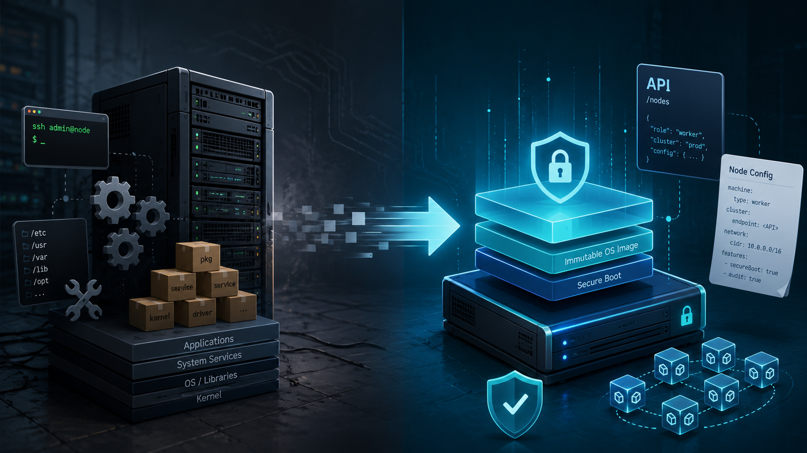

+++
title = "From Hardened Ubuntu Nodes to Talos Linux"
subtitle = "What Actually Changes?"
date = 2026-07-26T04:00:00
image = "talos-linux.png"
tags = ["Kubernetes", "Talos Linux", "Platform Engineering", "Security", "Linux"]
+++





For a long time, Ubuntu was my default operating system for self-managed Kubernetes nodes.

That decision was not particularly unusual. Ubuntu is widely supported, familiar to most Linux engineers, well documented, and compatible with almost every Kubernetes component, hardware platform, monitoring agent, security tool and storage integration you might need.

But running Kubernetes on a general-purpose Linux distribution also means that the operating system becomes part of the platform you have to design, secure, patch, monitor and troubleshoot.

Over time, my Kubernetes nodes accumulated much more than just Kubernetes:

- SSH access and user management
- package repositories and operating-system updates
- systemd services
- audit and logging configuration
- kernel parameters
- container runtime configuration
- security-hardening rules
- configuration-management code
- monitoring and security agents
- emergency debugging tools
- exceptions for specific hardware or workloads
- cleanup of packages and services installed by default

None of these things are inherently wrong. A carefully maintained Ubuntu-based Kubernetes platform can be secure, reliable and highly automated.

But it raises an important question:

> How much general-purpose Linux does a Kubernetes node actually need?

This is where Talos Linux takes a fundamentally different approach.

Talos does not try to be a better general-purpose server distribution. It is a minimal operating system built specifically for running Kubernetes. There is no SSH server, no interactive shell, no package manager and no conventionally mutable host user space.
Node administration happens through an authenticated API, usually accessed with `talosctl`.

After working with both approaches, my main conclusion is:

> Talos reduces the number of things I need to manage on Kubernetes nodes. It does not replace Platform Engineering or Kubernetes security.

That distinction matters.

## Why I Used Ubuntu in the First Place

Ubuntu is a reasonable foundation for Kubernetes. It supports a wide range of hardware, drivers, storage systems, networking tools and operational workflows.
Most administrators also know how to inspect and troubleshoot an Ubuntu server:

```bash
ssh node-01
systemctl status kubelet
journalctl -u containerd
ip addr
ss -tulpn
lsblk
dmesg
apt list --upgradable
```

When something goes wrong, you log in and investigate.

This operational model is flexible and familiar. It is also one of Ubuntu’s greatest strengths: almost anything can be changed, extended, installed or repaired directly on the machine.

But that flexibility comes at a cost.

Every additional package, user account, daemon, repository, configuration file and SSH key increases the amount of state the platform team has to manage. Even when all changes are automated through Ansible, cloud-init, Packer or another configuration-management system, the node remains a general-purpose Linux server with a Kubernetes role layered on top.

In smaller environments, this may be perfectly acceptable.

In larger or security-sensitive environments, however, the platform team eventually has to answer questions such as:

- Which packages are installed on every node?
- Are all nodes configured identically?
- Which SSH keys are authorized?
- Which services are listening on the network?
- Have kernel parameters drifted?
- Are unattended operating-system updates enabled?
- Does a patch require a reboot?
- Can a package update change container runtime behaviour?
- Which changes were made manually during the last incident?
- Is the current machine state still reproducible?

These are not Kubernetes questions. They are operating-system lifecycle questions.

But because the operating system is part of the platform, they inevitably become the platform team’s responsibility.

## The Hardening Work Behind Traditional Kubernetes Nodes

Running Kubernetes securely on Ubuntu involves more than installing `kubelet` and a container runtime.

A production-ready setup often includes some combination of:

- disabling password-based SSH authentication
- restricting or disabling direct root login
- managing SSH host and user keys
- configuring `sudo`
- removing unnecessary packages and services
- maintaining host firewall rules
- hardening kernel parameters
- configuring audit logging
- protecting sensitive filesystem paths
- managing package repositories and signing keys
- defining update and reboot procedures
- monitoring file integrity
- restricting kernel modules
- applying relevant CIS recommendations
- configuring time synchronisation
- forwarding system logs
- managing container runtime configuration
- detecting configuration drift between nodes

All of this can be automated. But automation does not remove the underlying surface area! It only makes that surface area more manageable.

A hardened Ubuntu node is still an Ubuntu server. It still contains tools and interfaces designed for general-purpose and interactive system administration. SSH, shells, package management, system services and mutable configuration remain available because they are fundamental features of a general-purpose Linux distribution.

Talos starts from the opposite assumption.

Instead of taking a general-purpose operating system and hardening it until it becomes suitable for Kubernetes, Talos removes most general-purpose operating-system functionality from the design in the first place.

## What Talos Does Differently

The easiest way to understand Talos is not as “Linux without SSH", but as an API-managed operating system for Kubernetes nodes.

The conceptual differences look roughly like this:

| Traditional Linux node                       | Talos Linux                       |
| -------------------------------------------- | --------------------------------- |
| SSH and shell access                         | API-based administration          |
| Package-based operating system               | Immutable system image            |
| OS hardening applied after installation      | Minimal and specialised by design |
| systemd and traditional administration tools | Talos services and API resources  |
| Configuration-management runs                | Declarative machine configuration |
| Individual package updates                   | Image-based upgrades              |
| Interactive host debugging                   | API-based diagnostics             |

Talos exposes node state through its API. Instead of logging into a node and reading local files, I query services, logs, processes, mounts, disks, network interfaces, routes and kernel messages remotely.

For example:

```shell
talosctl health
talosctl services
talosctl logs kubelet
talosctl get disks
talosctl get mounts
talosctl get links
talosctl dmesg
```

This is not simply a different command syntax. It changes the administrative model.

With Ubuntu, the machine is a server that an administrator can enter, inspect, and modify.

With Talos, the machine is a system whose intended state is described through configuration and managed through an API.

That constraint is one of its main benefits.

## What Actually Disappears

The strongest argument for Talos is not that every individual task becomes easier.

It is that entire categories of traditional Linux administration disappear or are replaced by a narrower operational model.

### SSH Management

There are no SSH users, SSH daemon settings, `authorized_keys` files, bastion-host workflows or emergency SSH credentials to maintain on the nodes.

Talos deliberately provides neither SSH access nor a conventional interactive shell. Administrative operations are performed through the authenticated Talos API instead.

This removes a significant access path, but it also changes how the platform team must prepare for incidents. Talos API access, certificate management, endpoint reachability, and documented recovery procedures become critical parts of the operational model.

SSH has not simply been removed without replacement. It has been replaced by a dedicated control plane with a narrower and more explicit interface.

### Package Management

There is no `apt update`, no package repository configuration and no need to coordinate individual package versions across the node fleet.

Instead, the operating system is treated as a versioned image rather than as a collection of independently updated packages.

This significantly reduces one common source of configuration drift. A node is not expected to accumulate months of package updates, dependency changes and local modifications. Its operating-system state is much closer to a single, identifiable artifact that can be tested, rolled out and replaced consistently across the fleet.

### Traditional Configuration Management

With conventional Linux nodes, I might use Ansible, Puppet, Chef, Salt, cloud-init or custom scripts to converge the system toward a desired configuration.

These tools often describe a sequence of actions:

1. install a package
2. write a configuration file
3. restart a service
4. verify that the service is running

With Talos, the machine configuration becomes the primary interface. Instead of describing the individual steps required to configure the node, I describe its intended state and apply that configuration through the Talos API.

This is a more declarative model, but it does not remove every operational concern. Machine configurations still need to be generated, versioned, reviewed, protected, tested and rolled out safely.

The platform team still owns the design and lifecycle of that configuration.

What changes is not the responsibility, but the mechanism used to fulfil it.

### Much of the OS Hardening

Talos removes many of the components that conventional hardening guides are designed to secure.

Its architecture includes no SSH server, no conventional interactive shell, no package manager, an immutable root filesystem and API-based administration.

As a result, the platform team no longer has to harden services and interfaces that are simply not present.

There is no SSH daemon to configure if the operating system does not ship one. There is no package manager to restrict if software cannot be installed interactively. There are also fewer administrative utilities available to an attacker because those tools are not part of the host environment in the first place.

This represents a meaningful reduction in attack surface.

It does not, however, mean that the entire Kubernetes platform is secure by default. Talos hardens and simplifies the node operating system, but workload security, access control, network policy, secrets management and runtime protection remain separate responsibilities.

## What Talos Does Not Take Over

Talos simplifies and hardens the node operating system, but Kubernetes remains Kubernetes.

The platform team is still responsible for areas such as:

- Kubernetes version lifecycle and upgrade coordination
- workload security and admission control
- network policy and traffic isolation
- secrets and certificate management
- cluster access control and auditability
- container image security
- runtime threat detection
- backup, restore and disaster recovery
- storage architecture
- observability and capacity management
- hardware and driver compatibility

A minimal node operating system does not prevent an application team from deploying an overly privileged pod. It does not automatically require resource limits, restrict images to trusted registries, create namespace isolation, detect every suspicious runtime action or decide which workloads should be allowed to communicate with each other.

Those concerns exist above the operating-system layer.

Talos secures and simplifies an important part of the stack: the Kubernetes node itself.

The layers above it still require explicit platform controls, security policies, and operational ownership.

## Debugging Without SSH

The absence of SSH is usually one of the first concerns engineers raise when discussing Talos.

That concern is understandable.

Most Linux troubleshooting habits are built around logging into a machine and exploring it interactively:

```shell
ssh node
journalctl
ps aux
top
ls -la
cat /etc/some-config
nsenter
tcpdump
```

Talos requires a different workflow.

Instead of opening a shell and inspecting the system directly, I query the node through the Talos API.

Service state can be inspected with:

```shell
talosctl services
```

Service logs are available through:

```shell
talosctl logs kubelet
talosctl logs containerd
```

Kernel messages can be inspected with:

```shell
talosctl dmesg
```

Talos resources can be queried with commands such as:

```shell
talosctl get disks
talosctl get mounts
talosctl get addresses
talosctl get routes
talosctl get members
```

The commands are different, but the information is still available. Services, logs, processes, disks, mounts, network state and kernel messages can all be inspected remotely through `talosctl`.

At first, this can feel restrictive.

On a conventional server, I can install a missing utility, write a temporary script, modify a file or run an arbitrary command directly on the host. Talos deliberately avoids this kind of spontaneous node mutation.

As a result, troubleshooting becomes more structured:

1. Identify whether the problem is related to Kubernetes, the container runtime, a Talos service, the kernel, the network, storage or the underlying infrastructure.
2. Query the relevant state through the Talos API.
3. Collect diagnostics in a consistent and reproducible way.
4. Apply changes through the declared machine configuration instead of repairing a single node manually.
5. Reboot, reset, or replace a node when its state can no longer be trusted.

This approach discourages temporary fixes that are difficult to document or reproduce later. A correction made through the machine configuration can be reviewed, versioned, and applied consistently to other nodes.

There are still exceptional cases where lower-level tooling is necessary. Starting with Talos 1.13, `talosctl debug` can launch a privileged debugging container from a supplied image, providing access to additional tools without permanently installing them on the host operating system.

This is an important distinction.

Debugging remains possible, but debugging tools do not have to become permanent parts of every node. The operational model shifts from unrestricted host access toward controlled, API-based diagnostics and reproducible configuration changes.

### The Real Trade-off

Debugging without SSH is neither inherently better nor inherently worse.

It prioritises consistency, controlled access and reproducibility over unrestricted flexibility.

For routine Kubernetes and node operations, I find the API-based approach clean and predictable. The available interfaces are explicit, the diagnostic workflow is consistent and changes are more likely to remain reproducible.

The trade-off becomes more visible in exceptional situations. Unusual hardware failures, low-level networking problems, early boot issues, or integrations that assume a traditional filesystem layout can require more preparation and a deeper understanding of Talos and its resource model.

The absence of SSH removes a familiar escape hatch.

That can be a real advantage because it discourages undocumented changes and one-off repairs. But it only works well when API access, recovery procedures, diagnostic tooling and replacement workflows have been tested before an incident occurs.

## Upgrades and Rollbacks

One of the biggest conceptual changes is that Talos upgrades are image-based.

Instead of updating hundreds of individual packages on a running system, the node is upgraded to a defined Talos image.

A production rollout still requires the usual operational safeguards:

- verify version and component compatibility
- validate the target image and required system extensions
- drain workloads where appropriate
- upgrade nodes in a controlled order
- monitor node and cluster health
- verify networking and storage
- confirm that workloads recover successfully
- maintain and test a rollback path

Talos upgrades are performed through its API and can be initiated and observed with `talosctl`. Talos uses an A/B image scheme that retains the previously installed kernel and operating-system image. If the new image fails to boot, Talos can automatically return to the previous version. A rollback can also be initiated manually through the API when an upgrade introduces a regression.

This makes the operating-system lifecycle more predictable, but it does not make upgrades risk-free.

A new Talos release may include:

- a new Linux kernel
- changed hardware drivers
- updated system extensions
- container runtime changes
- altered defaults
- compatibility changes affecting networking or storage

The operating-system image may be deployed as a single versioned unit, but the node still depends on the surrounding platform. CNI and CSI components, kernel modules, hardware support, storage systems and Kubernetes workloads must continue to function with the new version.

Image-based upgrades reduce the number of moving parts inside the operating system. They do not remove the need for compatibility testing, staged rollouts, health checks and recovery planning.

### Talos and Kubernetes Are Separate Lifecycles

A particularly important detail is that upgrading Talos Linux and upgrading Kubernetes are separate operations.

Talos uses `talosctl upgrade` for the operating system and `talosctl upgrade-k8s` for the Kubernetes components. The Kubernetes upgrade process updates the control-plane and node components in a coordinated manner.

This separation is useful because the two lifecycles do not always need to move at the same time.

The platform team can upgrade Talos to receive kernel, operating-system or security improvements without necessarily changing the Kubernetes minor version. Likewise, Kubernetes can be upgraded independently while the underlying Talos version remains unchanged, as long as the selected versions are compatible.

But this also means that Talos does not reduce cluster lifecycle management to a single automatic action.

The team still needs:

- a supported-version strategy
- a compatibility matrix
- upgrade and maintenance procedures
- staged rollouts
- health and readiness checks
- rollback criteria
- clear documentation
- explicit ownership

Tools such as Omni can simplify and coordinate these workflows across a fleet, but they do not remove the underlying responsibility. Talos and Kubernetes remain separate upgrade paths and the platform team still has to decide when and how each one should move forward.

## Talos Together with Kyverno, Falco, and Cilium

Talos is strongest when treated as one layer in a broader Kubernetes security architecture.

It reduces and hardens the node operating-system layer, but it does not replace controls at the Kubernetes API, workload, runtime or network layers.

That is where tools such as Kyverno, Falco, and Cilium remain important. Each addresses a different part of the platform and their responsibilities complement rather than overlap with Talos.

### Kyverno

Talos controls and hardens the node operating system.

Kyverno operates at the Kubernetes API layer. It can validate, mutate, generate or audit Kubernetes resources before they are admitted to the cluster.

For example, Kyverno can enforce or audit policies such as:

- disallowing privileged containers
- requiring workloads to run as a non-root user
- preventing privilege escalation
- requiring resource requests and limits
- rejecting the `latest` image tag
- restricting images to trusted registries
- requiring standard labels
- enforcing a default seccomp profile
- preventing access to host namespaces

These policies address workload configuration rather than the node operating system.

Talos cannot enforce them because they concern the Kubernetes resources submitted by users and application teams. Kyverno complements Talos by applying security and governance controls at the point where workloads enter the cluster.

### Falco

Talos reduces the number of processes, services and administrative tools available on the host, but runtime threats can still occur inside the cluster.

A container might:

- start an unexpected process
- write to a sensitive path
- access credentials
- open an unusual network connection
- attempt a container escape
- execute tools that are not expected for the workload

Falco provides runtime threat detection by observing system activity and evaluating it against defined rules.

Talos reduces the attack surface of the node operating system. Falco helps detect suspicious behaviour while containers and workloads are running.

These controls address different stages of the security model and complement each other.

### Cilium

Talos provides the node operating system and the environment in which the Kubernetes networking components run.

Cilium provides the Kubernetes networking data plane. It can enforce network policies, expose network observability, implement service routing and provide features such as Gateway API integration.

A minimal operating system does not define which application may communicate with which database or which workloads may accept ingress traffic.

Those decisions remain part of the cluster’s network architecture and policy model.

Talos, Kyverno, Falco, and Cilium therefore solve different problems:

| Component   | Primary responsibility                                |
| ----------- | ----------------------------------------------------- |
| Talos Linux | Node operating system and machine lifecycle           |
| Kyverno     | Kubernetes admission and configuration policy         |
| Falco       | Runtime threat detection                              |
| Cilium      | Networking, network policy, and network observability |

Using Talos does not eliminate the need for these controls.

Instead, it gives them a smaller, more consistent and more predictable host platform on which to operate.

## Where Talos Fits Well

Talos is particularly attractive when Kubernetes nodes are intended to behave like dedicated appliances rather than general-purpose servers.

It fits well in environments where:

- Kubernetes is the only intended workload
- nodes should be reproducible and consistent
- operating-system drift must be minimised
- SSH access is undesirable
- the machine lifecycle is automated
- configuration is stored, reviewed and applied declaratively
- clusters are managed as a fleet
- image-based upgrades fit the operational model
- the required hardware and system extensions are supported
- the team is prepared to adopt API-based troubleshooting

Talos fits especially well with a platform model in which broken nodes are recovered through configuration, reinstallation or replacement rather than through long-lived manual intervention.

This aligns with the broader principle of treating infrastructure as replaceable.

But replaceable does not mean unimportant or disposable without preparation.

Before relying on this model, the surrounding platform must actually be capable of replacing a node:

- machine configuration must be available
- secrets and certificates must be recoverable
- storage must tolerate node loss
- networking must converge correctly
- workloads must have appropriate disruption budgets
- control-plane quorum must be understood
- provisioning must be repeatable
- hardware-specific extensions and dependencies must be documented

Immutability delivers the most value when the automation, recovery procedures and operational processes around it are already mature.

## When I Would Still Use Ubuntu

Talos is not the right answer for every Linux system or even every Kubernetes cluster.

I would still consider Ubuntu or another general-purpose distribution when the nodes need to run significant software outside Kubernetes or depend on hardware that Talos does not support out of the box.

Examples might include:

- legacy agents that assume systemd and a conventional filesystem
- vendor software installed directly on the host
- specialised debugging or performance tools
- unusual kernel-module workflows
- hardware devices that require specific drivers or user-space utilities
- USB devices that depend on drivers not included in Talos
- hardware support that cannot be provided through an existing Talos system extension
- environments where the team cannot reasonably build and maintain the required custom Talos system extensions
- environments where administrators require interactive host access
- mixed-purpose servers
- early proof-of-concept environments where flexibility matters more than consistency
- organisational environments not yet prepared for declarative node lifecycle management

Talos system extensions can add firmware, drivers and other components that are not part of the base operating system. Depending on the extension, these components must be included in the relevant boot assets or installer image and become active during installation or upgrade. The resulting Talos root filesystem remains immutable and read-only.

However, this assumes that a suitable extension already exists or that the team is prepared to build, test, maintain and upgrade a custom one.

For specialised USB devices, uncommon network adapters, accelerator cards, hardware security devices or vendor-specific management tools, Ubuntu may therefore be easier to operate. A general-purpose distribution provides more flexibility to install kernel modules, packages, firmware, udev rules and diagnostic utilities directly on the host.

That flexibility also makes it easier to experiment while determining exactly what a device requires. With Talos, the required driver and supporting components should ideally be understood and packaged before the node is treated as production-ready.

A general-purpose distribution can also be the more practical choice when a team already has mature and proven Linux automation.

If an organisation has:

- fully reproducible machine images
- reliable configuration management
- strong SSH access controls
- automated patch management
- comprehensive compliance checks
- a well-tested node replacement process
- extensive Linux operational expertise

then moving to Talos may still provide benefits, but the difference will be less dramatic than in an environment where nodes are maintained manually.

The question should not be:

> Is Talos more secure than Ubuntu?

A more useful question is:

> Which operating model gives this team the smallest manageable platform while still supporting its workloads, hardware and operational requirements?

For a Kubernetes-only node with supported hardware, Talos often provides a compelling answer.

For a server that runs additional host-level software, depends on specialised hardware or requires drivers that cannot reasonably be delivered as Talos extensions, a general-purpose distribution may remain the more practical choice.

## What Changed for Me as a Platform Engineer

The main change was not replacing `apt` commands with `talosctl` commands.

It was reducing the scope of node management.

With Ubuntu, I was effectively managing two things:

1. a Linux server fleet
2. a Kubernetes node fleet

Those responsibilities overlapped, but they were not the same.

With Talos, much of the traditional server-management layer is absorbed into a specialised system image and a constrained API.

I still need to understand the kernel, networking, disks, container runtime, certificates and Kubernetes components. Talos does not make those layers disappear, nor does it remove the need to troubleshoot them.

But I no longer need to build and maintain a complete general-purpose Linux administration model around every Kubernetes node.

That changes where the platform team spends its time.

Less effort is required for:

- package inventory and repository management
- SSH access and user administration
- hardening general-purpose services
- investigating node-specific configuration drift
- coordinating distribution-level package updates
- maintaining administrative tools on the host

More attention can move toward:

- cluster lifecycle automation
- Kubernetes policy and governance
- workload isolation
- observability
- backup and recovery
- networking and storage
- software supply-chain security
- upgrade and compatibility testing
- platform APIs and self-service capabilities for application teams

That is the real value I see in Talos.

It is not that Kubernetes operations suddenly become effortless. It is that the node operating system becomes smaller, more explicit and more closely aligned with the actual purpose of the machine.

For me, Talos does not remove Platform Engineering work. It shifts that work away from maintaining general-purpose Linux servers and toward designing and operating the Kubernetes platform itself.

## Conclusion

Talos Linux is not simply Ubuntu with a few features removed.

It represents a different operating model.

Traditional Kubernetes nodes are general-purpose Linux servers that are configured, hardened and maintained to run Kubernetes.

Talos nodes are purpose-built Kubernetes systems managed through an API.

That difference removes several recurring responsibilities:

- SSH lifecycle management
- package and repository management
- much of the traditional operating-system hardening
- configuration drift caused by mutable node state
- individual package patching
- dependence on interactive host access for routine operations

But it does not remove the need for Platform Engineering.

Someone still has to design the cluster, protect its APIs, manage upgrades, validate hardware compatibility, operate networking and storage, define policies, detect runtime threats, monitor the platform and prepare for failure.

Talos reduces the number of things I need to manage on Kubernetes nodes.

It does not replace Kubernetes security.

It does not replace operational discipline.

And it does not replace the platform team.

What it provides is a smaller, more predictable, and more purpose-built foundation for that team to operate.

For Kubernetes-only infrastructure, that can be a very worthwhile trade.

## Related Articles

This article focuses on the change in operating model rather than providing a step-by-step implementation guide.

For more background on the topics discussed here:

- [Hardening Kubernetes Nodes on Ubuntu](https://schoenwald.aero/posts/2025-03-09_hardening-kubernetes-nodes-on-ubuntu/) — a practical look at the operating-system hardening work required for traditional Kubernetes nodes.
- [Falco for Kubernetes Threat Detection](https://schoenwald.aero/posts/2025-03-29_falco-for-kubernetes-threat-detection/) — why runtime detection remains relevant even when the underlying node operating system has a smaller attack surface.

## Don’t Trust Me — Seriously

The author takes no responsibility for any mishaps, broken servers, or existential crises caused by following this information.

Found a mistake? Open an issue or PR on GitHub, or ping me on Mastodon/LinkedIn/Twitter. Let’s improve it together.

Also, this isn’t an ad — unless my enthusiasm for cool technology counts as advertising.