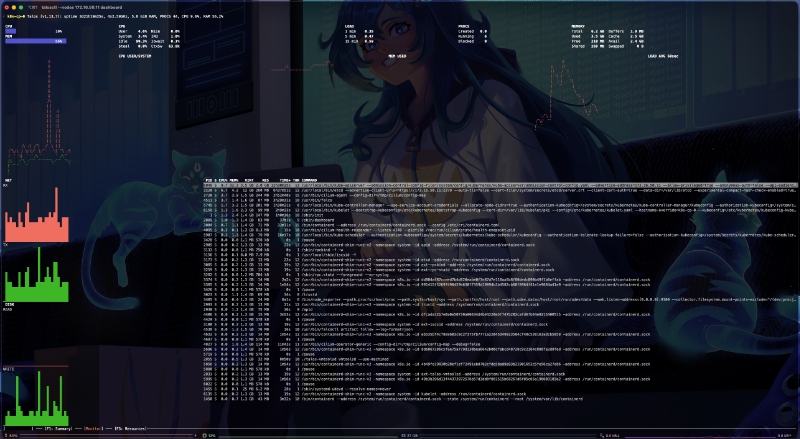

+++
title = "Debugging Talos Linux Without SSH"
subtitle = "How to Troubleshoot Kubernetes Nodes Through the Talos API"
date = 2026-07-28T04:00:00
image = "debugging-talos-without-ssh.png"
tags = ["Kubernetes", "Talos Linux", "Troubleshooting", "Platform Engineering", "Linux"]
+++





When engineers first hear that Talos Linux does not provide SSH access, the reaction is often predictable:

> What happens when something breaks?

On a traditional Kubernetes node, troubleshooting often starts with an SSH session.

You log in, inspect the system with familiar Linux tools, read files under `/var/log`, check systemd services, examine network interfaces and possibly modify something directly until the node works again.

With Talos Linux, that workflow does not exist.

There is no SSH daemon, no persistent host shell, no package manager and no collection of administrative utilities installed for operators to use directly on the node.

At first, this can feel like losing one of the most important tools available to a Linux administrator.

In practice, Talos does not remove the ability to inspect or operate the node. It replaces an unrestricted shell session with a structured management API.

Instead of logging into the machine, you interact with it through `talosctl`.

This changes the troubleshooting workflow, but it does not necessarily make troubleshooting more difficult. In many cases, it makes the process more consistent, reproducible and easier to audit.

## SSH Is More Than a Debugging Tool

SSH access is useful, but it also introduces an additional management interface that must be secured and maintained.

A conventional Linux node typically requires:

- SSH configuration
- user and group management
- authorized keys or another authentication mechanism
- privilege escalation through `sudo`
- shell utilities and administrative packages
- auditing of interactive access
- controls to prevent configuration drift caused by manual changes

Once engineers can log into a machine, it can also become tempting to fix problems directly on that machine.

A configuration file is edited.

A service is restarted manually.

A package is installed for troubleshooting.

A temporary workaround is added and never removed.

The immediate incident may be resolved, but the node no longer necessarily matches the configuration stored in Git, Terraform, Ansible or another source of truth.

Talos Linux intentionally removes this operating model.

The machine is managed through its API, while persistent changes are applied through the Talos machine configuration.

## The Talos API Replaces the Administrative Shell

Talos Linux exposes a management API that is typically accessed using `talosctl`.

The API allows operators to inspect and manage the operating system without opening an interactive session on the machine.

Among other things, `talosctl` can be used to:

- inspect service states
- retrieve service and kernel logs
- view processes and container statistics
- inspect network connections
- capture network packets
- examine mounts and disk usage
- query Talos system resources
- restart services or reboot nodes
- generate a support bundle

The Talos API listens on TCP port `50000` and access is authenticated using certificates stored in the Talos client configuration.

By default, `talosctl` uses `$HOME/.talos/config`. A different path can be specified through the `TALOSCONFIG` environment variable or the `--talosconfig` command-line option.

For example:

```shell
talosctl \
  --talosconfig "$HOME/.talos/my-cluster" \
  --nodes 192.0.2.10 \
  version
```

A simplified `talosconfig` looks like this:

```yaml
context: my-cluster
contexts:
  my-cluster:
    endpoints:
      - 192.0.2.10
      - 192.0.2.11
      - 192.0.2.12
    ca: <base64-encoded-ca-certificate>
    crt: <base64-encoded-client-certificate>
    key: <base64-encoded-client-key>
```

A typical command explicitly targets one or more nodes:

```shell
talosctl --nodes 192.0.2.10 version
```

```shell
Client:
	Tag:         v1.13.7
	SHA:         undefined
	Built:
	Go version:  go1.26.5
	OS/Arch:     darwin/arm64
Server:
	NODE:        192.0.2.10
	Tag:         v1.13.7
	SHA:         b0039b71
	Built:
	Go version:  go1.26.5
	OS/Arch:     linux/amd64
	Enabled:     RBAC
```

The distinction between an endpoint and a node is important.

An endpoint is a Talos API server to which `talosctl` establishes its initial connection. Endpoints should normally be reachable control-plane nodes. They can forward requests to other members of the cluster.

A node is the machine on which the requested operation should be performed.

For example, this command connects through one of the configured control-plane endpoints but retrieves the version from the specified worker node:

```shell
talosctl --nodes 192.0.2.20 version
```

Default target nodes can also be stored in the `talosconfig`, but I prefer to specify them explicitly using `--nodes`. This makes it immediately clear which machines a command will affect.

For normal operation, I configure several reachable control-plane nodes as endpoints. This avoids depending on a single Talos API endpoint during an incident.

## Start with the Cluster Overview

One of the easiest ways to get an initial overview of a Talos cluster is the built-in dashboard:

```shell
talosctl dashboard
```

The dashboard provides a terminal-based view of node information, service logs, processes, resource usage and real-time metrics.

To inspect a specific node:

```shell
talosctl dashboard --nodes 192.0.2.10
```

This is often my first step when I know that a node is reachable but do not yet know which component is causing the problem.

The dashboard can quickly help answer questions such as:

- Is the node under unusual CPU or memory pressure?
- Are important services running?
- Is a service repeatedly restarting?
- Are errors appearing in the system logs?
- Is the problem isolated to a single node?

It is not a replacement for observability platforms such as Grafana, Loki or Prometheus-compatible monitoring.

Instead, it provides a direct operational view of the node and remains useful even when parts of the Kubernetes observability stack are unavailable.

## Check the Overall Cluster Health

Talos provides a built-in health check:

```shell
talosctl health
```

The command checks whether the expected cluster members and important Kubernetes components are healthy.

By default, Talos can use cluster discovery information to identify the control-plane and worker nodes. The node lists can also be provided explicitly:

```shell
talosctl health \
  --control-plane-nodes 192.0.2.10,192.0.2.11,192.0.2.12 \
  --worker-nodes 192.0.2.20,192.0.2.21,192.0.2.22
```

This is particularly useful after:

- bootstrapping a cluster
- adding or replacing a node
- changing the network configuration
- upgrading Talos Linux
- upgrading Kubernetes
- recovering from a control-plane failure

A successful health check does not guarantee that every workload is functioning correctly, but it provides a useful baseline for the overall cluster state.

If the check fails, the reported failure usually indicates which component or layer should be inspected next.

## Inspect Talos Services

The closest equivalent to inspecting systemd units is checking Talos services:

```shell
talosctl service
```

To inspect a specific service:

```shell
talosctl service kubelet
```

Or to query it on a specific node:

```shell
talosctl --nodes 192.0.2.10 service kubelet
```

Depending on the node role and configuration, relevant services may include:

- `etcd`
- `kubelet`
- `containerd`
- `apid`
- `machined`
- `trustd`

The output shows whether the service is running and provides information about its current state.

For example, if a worker node does not join the Kubernetes cluster, I would usually start by inspecting the kubelet:

```shell
talosctl --nodes 192.0.2.20 service kubelet
talosctl --nodes 192.0.2.20 logs kubelet
```

If the problem affects a control-plane node, I would also inspect `etcd`:

```shell
talosctl --nodes 192.0.2.10 service etcd
talosctl --nodes 192.0.2.10 logs etcd
```

When investigating control-plane or quorum problems, it is also useful to inspect the `etcd` membership and active alarms in addition to the service state and logs.

## Retrieve Service Logs

Service logs can be queried directly through the Talos API:

```shell
talosctl logs kubelet
```

To follow the logs in real time:

```shell
talosctl logs kubelet --follow
```

To limit the output to the most recent entries:

```shell
talosctl logs kubelet --tail 100
```

To query the logs on a specific node:

```shell
talosctl --nodes 192.0.2.20 logs kubelet
```

This serves a similar purpose to commands such as:

```shell
journalctl -u kubelet
```

The difference is that the logs are retrieved remotely through the Talos API rather than from a local shell session.

Talos can also list containers and retrieve their logs from the Kubernetes containerd namespace by using the `--kubernetes` or `-k` option.

First, list the containers running on the node:

```shell
talosctl --nodes 192.0.2.10 containers --kubernetes
```

After identifying the relevant container, retrieve its logs through Talos:

```shell
talosctl --nodes 192.0.2.10 logs --kubernetes <container>
```

This is particularly useful when the Kubernetes API is unavailable and `kubectl logs` can no longer be used.

That is an important operational distinction:

> The Kubernetes API and the Talos API are separate management paths.

A failed Kubernetes control plane does not automatically prevent you from inspecting the underlying nodes and control-plane containers through the Talos API.

## Inspect Kernel Logs

Kernel messages can be retrieved through the Talos API:

```shell
talosctl dmesg
```

To inspect a specific node:

```shell
talosctl --nodes 192.0.2.20 dmesg
```

To follow new kernel messages in real time:

```shell
talosctl --nodes 192.0.2.20 dmesg --follow
```

Kernel logs are useful when investigating problems involving:

- disks and storage devices
- network interfaces
- drivers
- filesystem errors
- out-of-memory conditions
- hardware faults
- container runtime failures
- system extensions

During cluster bootstrap, kernel logs can also reveal repeated image-pull failures or service-start retries.

For example, if a service such as `etcd` remains in a pre-start state, `dmesg` may show whether Talos is repeatedly waiting for a dependency, retrying an image pull or encountering a lower-level system problem.

## Query the Talos Resource Model

One of the most powerful Talos debugging tools is also one of the least familiar to engineers coming from conventional Linux systems:

```shell
talosctl get <resource>
```

Talos represents operating-system state as resources managed by controllers.

The command feels similar to `kubectl get`, but it queries Talos resources rather than Kubernetes resources.

To list the available resource definitions:

```shell
talosctl get resourceDefinitions
```

The shorter alias also works:

```shell
talosctl get rd
```

You can then inspect resources such as:

```shell
talosctl get members
talosctl get addresses
talosctl get links
talosctl get routes
talosctl get services
talosctl get mounts
```

The relevant resources depend on the problem being investigated.

For a networking problem, I might inspect the links, addresses and routes on the affected node:

```shell
talosctl --nodes 192.0.2.20 get links
talosctl --nodes 192.0.2.20 get addresses
talosctl --nodes 192.0.2.20 get routes
```

For a cluster discovery problem:

```shell
talosctl get members
```

For a service reconciliation problem:

```shell
talosctl get services
```

This resource model is more structured than collecting information from files and unrelated command outputs in an interactive shell.

It also exposes an important part of how Talos works internally: controllers continuously reconcile resources toward their desired state. Instead of only showing the final result, these resources can reveal which state Talos currently observes and where reconciliation may be blocked.

## Inspect Processes and Resource Usage

Talos provides several commands for examining processes and runtime resource usage:

```shell
talosctl processes
talosctl memory
talosctl stats
talosctl cgroups
```

These commands can help determine whether a node, service or container is consuming an unexpected amount of CPU, memory or other system resources.

For example:

```shell
talosctl --nodes 192.0.2.20 processes
talosctl --nodes 192.0.2.20 memory
talosctl --nodes 192.0.2.20 stats
```

For disk usage and mount-related problems:

```shell
talosctl mounts
talosctl usage
```

These commands cover many of the situations in which I would previously have used tools such as `ps`, `top`, `free`, `mount`, `df` or `du` through an SSH session.

The interface is different, but the relevant information remains available through the Talos API.

## Debug Network Problems

Network problems are among the most common reasons engineers want direct access to a node.

Talos provides several useful commands for inspecting the node’s network state:

```shell
talosctl get links
talosctl get addresses
talosctl get routes
talosctl netstat
```

For deeper analysis, Talos can capture packets directly on the node:

```shell
talosctl pcap
```

By default, `talosctl pcap` decodes captured packets and prints them to the terminal:

```shell
talosctl --nodes 192.0.2.20 pcap --interface eth0
```

The raw packet capture can also be written to a local file and opened in Wireshark:

```shell
talosctl \
  --nodes 192.0.2.20 \
  pcap \
  --interface eth0 \
  --output capture.pcap
```

Alternatively, the raw capture can be streamed directly into `tcpdump`:

```shell
talosctl \
  --nodes 192.0.2.20 \
  pcap \
  --interface eth0 \
  --output - |
  tcpdump -vvv -r -
```

This pipeline is also documented in the official Talos CLI reference.

However, it did not work with the version of `tcpdump` included with macOS on my system:

```text
tcpdump version 4.99.1 -- Apple version 158
libpcap version 1.10.1
LibreSSL 3.3.6
```

I was able to use the same command successfully after starting a temporary Nix shell with a newer upstream version of `tcpdump`:

```shell
nix-shell -p tcpdump --run "zsh -l"
```

This provided:

```text
tcpdump version 4.99.6
libpcap version 1.10.6 (64-bit time_t)
64-bit build, 64-bit time_t
```

Inside that shell, the packet stream could be read as expected:

```shell
talosctl \
  --nodes 192.0.2.20 \
  pcap \
  --interface eth0 \
  --output - |
  tcpdump -vvv -r -
```

I have not yet identified the exact incompatibility in Apple’s build of `tcpdump`, but using the newer upstream version provided by Nix resolved the problem for me.

This is one of the clearest examples of the difference between “no shell” and “no debugging access.”

I do not need to install `tcpdump` on the node. Instead, I request the packet capture through the Talos API and analyze it on my workstation, where my normal diagnostic tools are available.

Depending on the situation, packet captures can help investigate:

- Talos and Kubernetes API connectivity
- DNS queries
- CNI traffic
- load balancer communication
- BGP sessions
- storage traffic
- communication between control-plane nodes
- connectivity to container registries or external services

## Advanced Diagnostics with `talosctl debug`

Talos does not expose a persistent administrative shell on the host.

For advanced diagnostics, however, Talos 1.13 can launch a privileged debug container through the Talos API. The operator must provide either a container image reference or a local image archive:

```shell
talosctl \
  --nodes 192.0.2.20 \
  debug docker.io/library/alpine:latest
```

A custom image containing additional diagnostic tools can also be supplied as a local archive:

```shell
talosctl \
  --nodes 192.0.2.20 \
  debug ./debug-tools.tar \
  --args /bin/sh
```

The image architecture must match the architecture of the target node.

The debug container runs with elevated privileges and shares the host PID and network namespaces. The host filesystem is mounted at `/host`, and host devices are available through `/dev`.

This makes the debug environment useful when the built-in `talosctl` commands are insufficient and additional tools are required to investigate networking, storage, hardware or container-runtime problems.

The debug container does not change the general Talos operating model. It is launched through the Talos API and is intended for diagnostics rather than persistent administration.

Any permanent fix should still be applied through the Talos machine configuration or the declarative source that manages the affected component.

## When Kubernetes Is Unavailable

A useful troubleshooting habit is to separate the system into layers.

I usually work through a Talos Kubernetes node in this order:

1. Is the node reachable over the network?
2. Is the Talos API reachable?
3. Are the Talos services healthy?
4. Is the container runtime operational?
5. Is the kubelet running?
6. Are the control-plane components healthy?
7. Is the Kubernetes API available?
8. Are the cluster add-ons and workloads functioning?

When `kubectl` stops working, jumping directly to workload-level troubleshooting is rarely productive.

I first verify that the Talos API is reachable:

```shell
talosctl --nodes 192.0.2.10 version
```

If the command succeeds, I inspect the overall node state:

```shell
talosctl --nodes 192.0.2.10 dashboard
talosctl --nodes 192.0.2.10 service
talosctl --nodes 192.0.2.10 dmesg
```

On a control-plane node, I then inspect `etcd`:

```shell
talosctl --nodes 192.0.2.10 service etcd
talosctl --nodes 192.0.2.10 logs etcd
talosctl --nodes 192.0.2.10 etcd members
talosctl --nodes 192.0.2.10 etcd status
talosctl --nodes 192.0.2.10 etcd alarm list
```

Next, I check the kubelet and the Kubernetes containers running on the node:

```shell
talosctl --nodes 192.0.2.10 service kubelet
talosctl --nodes 192.0.2.10 logs kubelet
talosctl --nodes 192.0.2.10 containers --kubernetes
```

This creates a structured path from the operating system toward Kubernetes instead of treating the entire node as a single black box.

It also helps narrow the failure domain: a broken Kubernetes API does not necessarily mean that `etcd`, the kubelet, the container runtime or the Talos operating system itself has failed.

## Generate a Support Bundle

When a problem is complex or affects several nodes, collecting individual command outputs quickly becomes inefficient.

Talos can generate a support bundle:

```shell
talosctl support
```

To collect diagnostics from selected nodes:

```shell
talosctl support \
  --nodes 192.0.2.10,192.0.2.11,192.0.2.12
```

The generated archive can include diagnostic information such as:

- kernel logs
- Talos service logs
- logs from `kube-system` pods
- Talos resources with secrets omitted
- process information
- I/O pressure information
- mounts
- PCI device information
- Talos version information
- Kubernetes node and system-pod manifests

This makes the support bundle useful for internal incident analysis as well as when working with Sidero Labs support.

It also creates a reproducible diagnostic artifact.

Instead of manually collecting command output during an undocumented SSH session, the archive can be attached to an incident, shared with another engineer or examined offline.

A support bundle still contains detailed information about the cluster and its infrastructure. It should therefore be treated as sensitive operational data, even though secrets are omitted from the collected Talos resources.

## Recovery Actions Without a Shell

Inspection is only one part of troubleshooting. Sometimes an operator must also take recovery action.

Talos provides controlled commands for operations such as restarting services, rebooting nodes and shutting them down:

```shell
talosctl service <service> restart
talosctl reboot
talosctl shutdown
```

For example, to restart the kubelet on a specific node:

```shell
talosctl --nodes 192.0.2.20 service kubelet restart
```

To reboot the node:

```shell
talosctl --nodes 192.0.2.20 reboot
```

These operations should still be used carefully.

Restarting a service may restore availability, but it does not explain why the service failed.

Similarly, rebooting a node may remove the immediate symptom while also destroying useful runtime evidence.

My preferred order is therefore:

1. capture the current state
2. retrieve the relevant logs
3. inspect the resource and service states
4. generate a support bundle when necessary
5. perform the recovery action
6. verify the cluster health afterward
7. fix the underlying problem in the declarative source of truth

The final step matters most.

Talos should not be operated as an immutable system until something breaks and then treated like a traditional server.

Persistent fixes belong in the Talos machine configuration, the Kubernetes or GitOps configuration or whichever declarative source manages the affected component.

## What Happens When the Talos API Is Unreachable?

Removing SSH does not eliminate every failure mode.

If a node has no working network configuration, the Talos API cannot be reached remotely.

This is similar to a traditional Linux server with broken networking: SSH would not be reachable either.

Talos provides an interactive dashboard on the machine’s physical video console. It can display node status, kernel logs, hardware information, network resources, disks and other non-sensitive system state even when `talosctl` is unavailable.

This local interactive dashboard is separate from the `talosctl dashboard` command used earlier in the article.

The dashboard is not an administrative shell, and it is not available through a serial console. It requires access to the machine’s physical video output, either directly or through an out-of-band management interface that provides remote video console access.

Depending on the environment, this access may be provided through:

- a physical monitor and keyboard
- a baseboard management controller
- a BMC-provided remote KVM console, commonly managed through IPMI, Redfish, or a vendor-specific interface
- a hypervisor video console
- a cloud provider console, where the platform exposes the graphical machine console

For bare-metal environments, tested out-of-band management therefore remains important.

Talos removes the in-band SSH management interface. It does not remove the need for a recovery path when a machine is no longer reachable over the production network.

This is why a well-designed platform should provide:

- multiple reachable Talos API endpoints
- tested out-of-band console access
- documented network recovery procedures
- securely stored Talos machine configurations
- a backup of the administrative `talosconfig`
- regular `etcd` snapshots
- a tested node replacement procedure

The final point is especially important. Because Talos nodes are intended to be reproducible, replacing a failed or unreachable node may be safer and more predictable than repairing it manually.

## The Mindset Change

The biggest adjustment is not learning a new command.

It is changing how you think about the node.

On a conventional Linux system, the shell is the universal escape hatch. If the automation does not cover a situation, an administrator can log in and improvise.

Talos replaces that improvisation with explicit APIs and declarative configuration.

At first, this can feel restrictive.

However, those restrictions also make the platform easier to reason about:

- every administrator uses the same management interface
- access is certificate-based
- operations can be performed remotely across multiple nodes
- troubleshooting commands are purpose-built
- packages cannot be installed manually
- persistent fixes cannot be hidden inside a shell session
- nodes are less likely to drift from their declared configuration

After working with Talos for a while, I no longer see the absence of SSH as a missing feature.

It is a deliberate boundary.

Talos exposes the operations required to run and troubleshoot Kubernetes nodes without exposing a general-purpose administrative environment.

## Frequently Used Troubleshooting Commands

The commands below cover the checks I use most frequently. Most should be combined with `--nodes` to make the target explicit:

```shell
talosctl --nodes 192.0.2.20 <command>
```

### Initial Overview

```shell
talosctl health
talosctl dashboard
talosctl service
talosctl get members
```

### Service Problem

```shell
talosctl service <service>
talosctl logs <service>
talosctl logs <service> --tail 100
talosctl logs <service> --follow
```

Common services include:

```shell
talosctl service kubelet
talosctl service containerd
talosctl service etcd
```

### Kernel or Hardware Problem

```shell
talosctl dmesg
talosctl dmesg --follow
talosctl processes
talosctl memory
talosctl stats
talosctl cgroups
talosctl mounts
talosctl usage
talosctl get disks
```

### Network Problem

```shell
talosctl get links
talosctl get addresses
talosctl get routes
talosctl netstat --all
```

To inspect the network connections of a particular pod:

```shell
talosctl netstat <namespace>/<pod>
```

To capture packets on an interface:

```shell
talosctl pcap --interface eth0
```

To save the raw capture for Wireshark:

```shell
talosctl pcap \
  --interface eth0 \
  --output capture.pcap
```

To stream the capture into `tcpdump`:

```shell
talosctl pcap \
  --interface eth0 \
  --output - |
  tcpdump -vvv -r -
```

### Kubernetes API Unavailable

```shell
talosctl service kubelet
talosctl logs kubelet
talosctl service containerd
talosctl logs containerd
talosctl containers --kubernetes
```

On a control-plane node:

```shell
talosctl service etcd
talosctl logs etcd
talosctl etcd members
talosctl etcd alarm list
```

To retrieve the logs of an individual Kubernetes container through the Talos API:

```shell
talosctl containers --kubernetes
talosctl logs --kubernetes <container>
```

### Inspect Talos Resources

List the available resource definitions:

```shell
talosctl get resourceDefinitions
```

The shorter alias also works:

```shell
talosctl get rd
```

Useful resources include:

```shell
talosctl get members
talosctl get services
talosctl get links
talosctl get addresses
talosctl get routes
talosctl get disks
talosctl get mounts
```

### Collect Complete Diagnostics

```shell
talosctl support
```

For selected nodes and an explicit output file:

```shell
talosctl support \
  --nodes 192.0.2.10,192.0.2.11,192.0.2.12 \
  --output talos-support.zip
```

## Conclusion

Debugging Talos Linux without SSH requires a different workflow, but not a less capable one.

Instead of opening a shell and exploring the node manually, you inspect services, resources, logs, processes, network state and kernel information through the Talos API.

This creates a troubleshooting model that is:

- remote
- structured
- authenticated
- reproducible
- consistent across nodes
- less likely to introduce configuration drift

There are still situations in which out-of-band access is required, particularly when a node has lost network connectivity.

For most Kubernetes and operating-system incidents, however, `talosctl` provides the information and recovery operations I would previously have accessed through SSH.

The question therefore changes from:

> How can I debug a node without a shell?

to:

> Which Talos resource or API operation exposes the state I need to inspect?

Once that mental model becomes familiar, the absence of SSH no longer feels like a limitation. It becomes part of a more controlled and predictable operating model.

## Sources & Further Reading

- Companion wiki: `talosctl` command reference and examples
- Official Talos 1.13 `talosctl` CLI reference
- Talos interactive dashboard
- Using the Talos debug shell for advanced diagnostics
- Talos Linux getting started guide

## Don’t Trust Me — Seriously

This article reflects my own experience and understanding. Although I try to keep the information accurate, commands, behavior and best practices may change between Talos versions.

Test commands in a safe environment before using them on production systems and make sure you understand their impact.

Found a mistake or something that could be improved? Open an issue or pull request on GitHub or contact me on Mastodon or LinkedIn. Contributions and corrections are always welcome.

This article is not sponsored. I am simply enthusiastic about Talos Linux and the way it approaches Kubernetes node management.